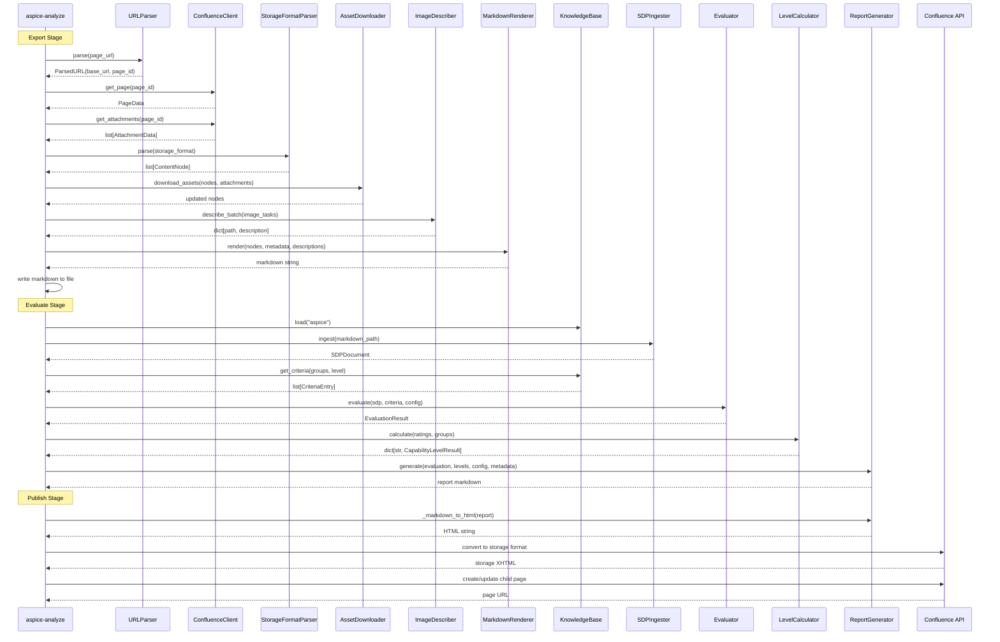

# Design Document — Single-Command ASPICE Analysis Pipeline (`aspice-analyze`)

## Overview

The `aspice-analyze` command is an orchestration layer that composes existing components from the `confluence-exporter` and `aspice-eval` packages into a single CLI invocation. It executes a three-stage pipeline:

1. **Export Stage** — Retrieve a Confluence SDP page, download images, generate AI descriptions, produce Markdown
2. **Evaluate Stage** — Load the ASPICE knowledge base, ingest the exported Markdown, run AI gap analysis, calculate capability levels, generate a report
3. **Publish Stage** — Convert the report to Confluence storage format and create/update a child page under the source SDP page

The command lives in the `aspice-eval` package as a new module (`analyze.py`) alongside the existing `cli.py`. It reuses every existing component without modification — the new code is purely orchestration, CLI wiring, progress reporting, and error mapping.

### Design Rationale

- **No new abstractions over existing components.** The pipeline calls existing classes directly (URLParser, ConfluenceClient, StorageFormatParser, etc.) rather than wrapping them in adapter layers. This keeps the orchestration transparent and avoids indirection.
- **Single module.** The entire command fits in one module (`analyze.py`) because it is glue code — no business logic warrants separate classes or files.
- **Shared ConfluenceClient.** The Export and Publish stages share a single `ConfluenceClient` instance (from `confluence-exporter`) for page retrieval and a separate `atlassian-python-api` `Confluence` instance for publishing (since the exporter's client doesn't expose page creation).
- **Token tracking across stages.** A simple `TokenTracker` dataclass accumulates token counts from both the image describer (Export) and the evaluator (Evaluate) to produce the AI Cost Summary.

## Architecture

The command follows a linear pipeline architecture with fail-fast semantics: each stage must complete successfully before the next begins. There is no retry at the pipeline level — retries happen within individual components (e.g., the evaluator's exponential backoff).

```mermaid
flowchart TD
    CLI["aspice-analyze CLI<br/>(Click command)"]
    VAL["Parameter Validation<br/>& Credential Resolution"]
    EXP["Export Stage"]
    EVAL["Evaluate Stage"]
    PUB["Publish Stage"]
    SUM["Summary Output"]

    CLI --> VAL
    VAL --> EXP
    EXP --> EVAL
    EVAL --> PUB
    PUB --> SUM

    subgraph "Export Stage"
        E1["URLParser.parse()"]
        E2["ConfluenceClient.get_page()"]
        E3["ConfluenceClient.get_attachments()"]
        E4["StorageFormatParser.parse()"]
        E5["AssetDownloader.download_assets()"]
        E6["ImageDescriber.describe_batch()"]
        E7["MarkdownRenderer.render()"]
        E8["Write .md file"]
        E1 --> E2 --> E3 --> E4 --> E5 --> E6 --> E7 --> E8
    end

    subgraph "Evaluate Stage"
        V1["KnowledgeBase.load()"]
        V2["SDPIngester.ingest()"]
        V3["KnowledgeBase.get_criteria()"]
        V4["GapAnalysisEvaluator.evaluate()"]
        V5["CapabilityLevelCalculator.calculate()"]
        V6["ReportGenerator.generate()"]
        V1 --> V2 --> V3 --> V4 --> V5 --> V6
    end

    subgraph "Publish Stage"
        P1["ReportGenerator._markdown_to_html()"]
        P2["Confluence API: convert to storage"]
        P3["Create or update child page"]
        P1 --> P2 --> P3
    end
```



### Key Architectural Decisions

1. **Single entry point, no sub-commands.** Unlike `aspice-eval` which uses `@click.group()` with sub-commands (`evaluate`, `validate-kb`, `version`), `aspice-analyze` is a standalone `@click.command()`. This keeps the UX simple — one command, one purpose.

2. **Output directory as workspace.** All intermediate artifacts (exported Markdown, images, report) are written to a local directory. This serves as both a cache and an audit trail. The directory is preserved after completion.

3. **Shared AI provider configuration.** Both the Export Stage (image descriptions) and Evaluate Stage (gap analysis) use the same `--provider`, `--model`, and `--region` settings. The provider-specific config objects (`ImageDescriberConfig` and `ModelConfig`) are constructed from the same CLI parameters.

4. **Progress to stderr, results to stdout.** Progress messages and logs go to stderr. The final summary (and `--no-publish` report output) goes to stdout. This follows Unix conventions and enables piping.

## Components and Interfaces

### New Components

#### 1. `analyze.py` — CLI Command Module

The single new module containing:

- **`analyze` function** — The Click command handler that orchestrates the pipeline
- **`_run_export_stage()` function** — Encapsulates Export Stage logic, returns `ExportStageResult`
- **`_run_evaluate_stage()` function** — Encapsulates Evaluate Stage logic, returns `EvaluateStageResult`
- **`_run_publish_stage()` function** — Encapsulates Publish Stage logic, returns the child page URL
- **`_configure_logging()` function** — Sets up logging to stderr with appropriate level
- **`_resolve_credentials()` function** — Resolves CLI options vs environment variables for credentials
- **`_resolve_ai_config()` function** — Resolves AI provider, model, and region with defaults
- **`_sanitize_title()` function** — Sanitizes page title for directory/file names (reuses pattern from confluence-exporter CLI)
- **`_format_summary()` function** — Formats the final pipeline summary for stdout

```python
@click.command("aspice-analyze")
@click.argument("page_url")
@click.option("--target-level", required=True, type=int, help="ASPICE capability level (1–5)")
@click.option("--groups", required=True, type=str, help="Comma-separated process group codes")
@click.option("--email", envvar="CONFLUENCE_EMAIL", default=None)
@click.option("--api-token", envvar="CONFLUENCE_API_TOKEN", default=None)
@click.option("--provider", envvar="ASPICE_EVAL_PROVIDER", default=None)
@click.option("--model", default=None)
@click.option("--region", envvar="AWS_DEFAULT_REGION", default=None)
@click.option("--report-title", default=None)
@click.option("--output-dir", default=None)
@click.option("--output", default=None, type=click.Path())
@click.option("--output-format", default="markdown", type=click.Choice(["markdown", "html"]))
@click.option("--no-publish", is_flag=True, default=False)
@click.option("--verbose", is_flag=True, default=False)
@click.option("--quiet", is_flag=True, default=False)
def analyze(page_url, target_level, groups, email, api_token, provider, model,
            region, report_title, output_dir, output, output_format,
            no_publish, verbose, quiet):
    """Run a full ASPICE gap analysis pipeline on a Confluence SDP page."""
```

#### 2. `TokenTracker` — Dataclass for Cross-Stage Token Accounting

A lightweight dataclass that accumulates token usage across pipeline stages:

```python
@dataclass
class TokenTracker:
    export_input_tokens: int = 0
    export_output_tokens: int = 0
    export_calls: int = 0
    eval_input_tokens: int = 0
    eval_output_tokens: int = 0
    eval_calls: int = 0

    @property
    def total_input_tokens(self) -> int: ...
    @property
    def total_output_tokens(self) -> int: ...
    @property
    def total_tokens(self) -> int: ...
    @property
    def total_calls(self) -> int: ...
```

#### 3. Stage Result Dataclasses

```python
@dataclass
class ExportStageResult:
    markdown_path: str
    page_title: str
    page_id: str
    space_key: str
    images_downloaded: int
    descriptions_generated: int
    warnings: list[str]

@dataclass
class EvaluateStageResult:
    report_markdown: str
    report_html: str
    levels: dict[str, CapabilityLevelResult]
    total_gaps: int
    criteria_assessed: int
```

### Reused Components (No Modifications)

| Component | Package | Used In | Interface Called |
|---|---|---|---|
| `URLParser` | confluence-exporter | Export | `parse(url) → ParsedURL` |
| `ConfluenceClient` | confluence-exporter | Export | `get_page(id)`, `get_attachments(id)` |
| `StorageFormatParser` | confluence-exporter | Export | `parse(xhtml) → list[ContentNode]` |
| `AssetDownloader` | confluence-exporter | Export | `download_assets(nodes, attachments) → nodes` |
| `ImageDescriber` | confluence-exporter | Export | `describe_batch(images) → dict[str, str]` |
| `MarkdownRenderer` | confluence-exporter | Export | `render(nodes, metadata, descriptions) → str` |
| `KnowledgeBase` | aspice-eval | Evaluate | `load()`, `get_criteria()`, `get_metadata()` |
| `SDPIngester` | aspice-eval | Evaluate | `ingest(path) → SDPDocument` |
| `GapAnalysisEvaluator` | aspice-eval | Evaluate | `evaluate(sdp, criteria, config) → EvaluationResult` |
| `CapabilityLevelCalculator` | aspice-eval | Evaluate | `calculate(ratings, groups) → dict` |
| `ReportGenerator` | aspice-eval | Evaluate/Publish | `generate()`, `_markdown_to_html()` |
| `create_evaluator` | aspice-eval | Evaluate | Factory: `ModelConfig → GapAnalysisEvaluator` |
| `create_describer` | confluence-exporter | Export | Factory: `ImageDescriberConfig → ImageDescriber` |

### External Dependencies (New)

| Dependency | Purpose | Already in Project? |
|---|---|---|
| `atlassian-python-api` | Confluence page creation/update in Publish Stage | Used by confluence-exporter, needs to be added to aspice-eval dependencies |
| `confluence-exporter` | Export Stage components | Needs to be declared as aspice-eval dependency |

### Component Interaction Sequence



## Data Models

### New Dataclasses (in `analyze.py`)

```python
@dataclass
class TokenTracker:
    """Accumulates AI token usage across pipeline stages."""
    export_input_tokens: int = 0
    export_output_tokens: int = 0
    export_calls: int = 0
    eval_input_tokens: int = 0
    eval_output_tokens: int = 0
    eval_calls: int = 0

    @property
    def total_input_tokens(self) -> int:
        return self.export_input_tokens + self.eval_input_tokens

    @property
    def total_output_tokens(self) -> int:
        return self.export_output_tokens + self.eval_output_tokens

    @property
    def total_tokens(self) -> int:
        return self.total_input_tokens + self.total_output_tokens

    @property
    def total_calls(self) -> int:
        return self.export_calls + self.eval_calls


@dataclass
class ExportStageResult:
    """Result of the Export Stage."""
    markdown_path: str
    page_title: str
    page_id: str
    space_key: str
    images_downloaded: int
    descriptions_generated: int
    warnings: list[str] = field(default_factory=list)


@dataclass
class EvaluateStageResult:
    """Result of the Evaluate Stage."""
    report_markdown: str
    report_html: str
    levels: dict[str, CapabilityLevelResult] = field(default_factory=dict)
    total_gaps: int = 0
    criteria_assessed: int = 0
```

### Data Flow Between Stages

```
┌─────────────────────────────────────────────────────────────────┐
│ CLI Parameters                                                   │
│  page_url, target_level, groups, email, api_token,              │
│  provider, model, region, report_title, output_dir, ...         │
└──────────────────────────┬──────────────────────────────────────┘
                           │
                           ▼
┌─────────────────────────────────────────────────────────────────┐
│ Export Stage                                                     │
│  Input:  page_url, credentials, AI config                       │
│  Output: ExportStageResult                                      │
│    - markdown_path: str (path to exported .md file)             │
│    - page_title, page_id, space_key: str (for Publish Stage)    │
│    - images_downloaded, descriptions_generated: int             │
│  Side effects: TokenTracker updated with export token counts    │
└──────────────────────────┬──────────────────────────────────────┘
                           │
                           ▼
┌─────────────────────────────────────────────────────────────────┐
│ Evaluate Stage                                                   │
│  Input:  markdown_path, target_level, groups, AI config         │
│  Output: EvaluateStageResult                                    │
│    - report_markdown: str (full report content)                 │
│    - report_html: str (HTML version for Confluence)             │
│    - levels: dict[str, CapabilityLevelResult]                   │
│    - total_gaps, criteria_assessed: int                         │
│  Side effects: TokenTracker updated with eval token counts      │
└──────────────────────────┬──────────────────────────────────────┘
                           │
                           ▼
┌─────────────────────────────────────────────────────────────────┐
│ Publish Stage                                                    │
│  Input:  report_html, page_id, space_key, report_title, creds  │
│  Output: child_page_url: str                                    │
└──────────────────────────┬──────────────────────────────────────┘
                           │
                           ▼
┌─────────────────────────────────────────────────────────────────┐
│ Summary Output (stdout)                                          │
│  - Published page URL                                           │
│  - Capability levels per group                                  │
│  - Total gaps identified                                        │
│  - Output directory path                                        │
│  - Total token usage                                            │
└─────────────────────────────────────────────────────────────────┘
```

### Credential Resolution Order

For each credential, the resolution follows this precedence:

| Credential | CLI Option | Environment Variable | Fallback |
|---|---|---|---|
| Email | `--email` | `CONFLUENCE_EMAIL` | Error |
| API Token | `--api-token` | `CONFLUENCE_API_TOKEN` | Error |
| AI Provider | `--provider` | `ASPICE_EVAL_PROVIDER` | `"bedrock"` |
| AI Model | `--model` | — | `"us.anthropic.claude-sonnet-4-20250514-v1:0"` |
| AWS Region | `--region` | `AWS_DEFAULT_REGION` | Error (when provider=bedrock) |

### Knowledge Base Path Resolution

The KB YAML files are bundled as package data in `aspice-eval`. The command resolves the KB path using `importlib.resources` (or `pkg_resources` as fallback) to locate the installed `knowledge_base/` directory, rather than relying on a relative filesystem path. This ensures the command works when installed via `pip install` from a GitLab URL.

```python
import importlib.resources as pkg_resources

def _resolve_kb_path() -> str:
    """Resolve the knowledge base path from installed package data."""
    # The knowledge_base directory is at the package root level
    # When installed, it's in the aspice-eval package data
    kb_candidates = [
        Path(pkg_resources.files("aspice_eval")).parent.parent / "knowledge_base",
        Path(__file__).resolve().parent.parent.parent / "knowledge_base",
    ]
    for candidate in kb_candidates:
        if candidate.exists():
            return str(candidate)
    raise FileNotFoundError("Knowledge base not found in package data or local path.")
```

### Publish Stage: Page Creation/Update Logic

The Publish Stage uses `atlassian-python-api` directly (not through the exporter's `ConfluenceClient`) because the exporter client is read-only. The logic:

1. Convert report Markdown → HTML via `ReportGenerator._markdown_to_html()`
2. Strip emoji characters that the Confluence Fabric editor rejects (same sanitization as `publish_to_confluence.py`)
3. Call the Confluence `/rest/api/contentbody/convert/storage` endpoint to convert HTML to storage format
4. Search for an existing child page with the same title under the source page
5. If found → update the existing page
6. If not found → create a new child page

```python
def _run_publish_stage(
    report_html: str,
    page_id: str,
    space_key: str,
    report_title: str,
    base_url: str,
    email: str,
    api_token: str,
    quiet: bool,
) -> str:
    """Publish the report as a child page. Returns the page URL."""
```


## Correctness Properties

*A property is a characteristic or behavior that should hold true across all valid executions of a system — essentially, a formal statement about what the system should do. Properties serve as the bridge between human-readable specifications and machine-verifiable correctness guarantees.*

### Property 1: Output directory path is correctly derived from page title

*For any* page title string (including titles with spaces, special characters, unicode, and empty strings), the `_sanitize_title()` function SHALL produce a string containing only alphanumeric characters, underscores, and hyphens, and the resulting output directory path SHALL be `./aspice-output/{sanitized_title}/`.

**Validates: Requirements 1.3**

### Property 2: Pipeline summary contains all required fields

*For any* combination of published page URL, capability level results (varying numbers of process groups, achieved levels 0–5), gap counts (0 to N), and output directory path, the formatted summary string SHALL contain: the page URL, each process group with its achieved level, the total gap count, the output directory path, and the total token usage.

**Validates: Requirements 1.5, 13.4**

### Property 3: CLI option takes precedence over environment variable

*For any* credential parameter (email, api-token, provider, region) where both a CLI option value and an environment variable value are provided, the resolved value SHALL equal the CLI option value. When only the environment variable is set, the resolved value SHALL equal the environment variable value.

**Validates: Requirements 2.5, 12.1, 12.2, 12.3, 12.4, 12.5**

### Property 4: Invalid target-level values are rejected

*For any* integer outside the range 1–5 (including 0, negative numbers, and values > 5), the parameter validation SHALL reject the value and produce an error message that identifies the valid range (1 through 5).

**Validates: Requirements 4.6**

### Property 5: Invalid process group codes are rejected

*For any* string that is not a valid process group code (not in the set defined by KB metadata), the parameter validation SHALL reject the value and produce an error message that lists the valid group codes.

**Validates: Requirements 4.7**

### Property 6: Stage failure identification in error messages

*For any* pipeline stage (Export, Evaluate, Publish) that raises an exception, the error output SHALL identify which stage failed, and the command SHALL exit with a non-zero exit code.

**Validates: Requirements 10.5, 1.6**

### Property 7: Token tracker accumulation is correct

*For any* combination of export-stage token counts (input, output, calls) and evaluate-stage token counts (input, output, calls), the `TokenTracker` SHALL report `total_input_tokens` equal to the sum of export and eval input tokens, `total_output_tokens` equal to the sum of export and eval output tokens, `total_tokens` equal to the sum of all tokens, and `total_calls` equal to the sum of export and eval calls.

**Validates: Requirements 13.1, 13.3**

## Error Handling

### Error Mapping Strategy

The `aspice-analyze` command catches exceptions from both packages and maps them to user-friendly error messages with stage identification. Each stage is wrapped in a try/except block that catches stage-specific exceptions and re-raises them with stage context.

### Error Hierarchy by Stage

#### Parameter Validation (before any stage)

| Error Condition | Exception Source | User Message |
|---|---|---|
| Missing `--email` / `CONFLUENCE_EMAIL` | CLI validation | "Confluence email is required. Use --email or set CONFLUENCE_EMAIL." |
| Missing `--api-token` / `CONFLUENCE_API_TOKEN` | CLI validation | "Confluence API token is required. Use --api-token or set CONFLUENCE_API_TOKEN." |
| Missing `--target-level` | Click required option | Click's built-in "Missing option '--target-level'" |
| Missing `--groups` | Click required option | Click's built-in "Missing option '--groups'" |
| Invalid `--target-level` (outside 1–5) | `InvalidConfigError` | "Target level {N} is out of range. Must be 1–5." |
| Unknown process group code | `InvalidConfigError` | "Unknown process group(s): {codes}. Valid groups: {valid}." |
| Missing AWS region (bedrock provider) | CLI validation | "AWS region is required for Bedrock provider. Use --region or set AWS_DEFAULT_REGION." |

#### Export Stage Errors

| Error Condition | Exception Source | User Message |
|---|---|---|
| Invalid Confluence URL | `InvalidURLError` | "Export failed: Invalid Confluence Cloud URL: {url}. Expected format: ..." |
| Authentication failure | `AuthenticationError` | "Export failed: Authentication failed. Check your email and API token." |
| Connection failure | `ConfluenceConnectionError` | "Export failed: Could not connect to {url}." |
| Page not found | `PageNotFoundError` | "Export failed: Page {id} not found." |
| Parse error | `ParseError` | "Export failed: Failed to parse page content." |
| AWS credentials expired | `botocore.ClientError` | "Export failed: AWS session expired. Run 'aws sso login' or refresh your credentials." |

#### Evaluate Stage Errors

| Error Condition | Exception Source | User Message |
|---|---|---|
| KB not found | `FileNotFoundError` | "Evaluation failed: Knowledge base not found." |
| KB validation failure | `KBValidationError` | "Evaluation failed: Knowledge base validation error: {details}." |
| AI model failure | `AIModelError` | "Evaluation failed: AI model error: {details}." |
| AI response parse failure | `AIResponseParseError` | "Evaluation failed: Could not parse AI response." |

#### Publish Stage Errors

| Error Condition | Exception Source | User Message |
|---|---|---|
| Permission denied | `HTTPError` (403) | "Publishing failed: Permission denied. Check that your account has create/edit permissions in space {key}." |
| API error | `HTTPError` (other) | "Publishing failed: Confluence API error (HTTP {code})." |
| Connection failure | `ConnectionError` | "Publishing failed: Could not connect to Confluence." |

### Exit Codes

| Code | Meaning |
|---|---|
| 0 | Pipeline completed successfully |
| 1 | Parameter validation error |
| 2 | Export Stage failure |
| 3 | Evaluate Stage failure |
| 4 | Publish Stage failure |

### Partial Failure Handling

- **Image download failures** in the Export Stage are non-fatal — the pipeline continues with a warning (handled by existing `AssetDownloader` and `ImageDescriber.describe_batch`).
- **Individual criteria parse failures** in the Evaluate Stage are non-fatal — the evaluator returns partial results (handled by existing `GapAnalysisEvaluator._parse_response`).
- **Publish Stage failures** are fatal but safe — if page creation fails, no partial page is left because the Confluence API is atomic (create either succeeds or fails entirely).

## Testing Strategy

### Testing Approach

This feature is primarily an orchestration layer — it wires together existing, well-tested components. The testing strategy reflects this:

1. **Property-based tests** for the new pure logic (sanitization, credential resolution, token tracking, summary formatting, input validation)
2. **Unit tests** with mocks for stage orchestration, error mapping, and CLI behavior
3. **Integration tests** (manual/CI) for end-to-end pipeline execution with real services

### Property-Based Testing

**Library:** Hypothesis (already in dev dependencies)
**Configuration:** Minimum 100 iterations per property test (ci profile)

Each property test references its design document property:

| Property | Test File | What It Tests |
|---|---|---|
| Property 1 | `test_prop01_sanitize_title.py` | `_sanitize_title()` produces valid directory names |
| Property 2 | `test_prop02_summary_format.py` | `_format_summary()` includes all required fields |
| Property 3 | `test_prop03_credential_resolution.py` | `_resolve_credentials()` CLI-over-env precedence |
| Property 4 | `test_prop04_target_level_validation.py` | Invalid target levels are rejected |
| Property 5 | `test_prop05_group_validation.py` | Invalid group codes are rejected |
| Property 6 | `test_prop06_stage_failure.py` | Error messages identify failing stage |
| Property 7 | `test_prop07_token_tracker.py` | `TokenTracker` arithmetic is correct |

Tag format: `Feature: aspice-analyze-command, Property N: {property_text}`

### Unit Tests

| Test Area | What It Covers |
|---|---|
| CLI options | All options are registered, defaults are correct, required options enforced |
| `_run_export_stage()` | Calls components in correct order, returns `ExportStageResult` |
| `_run_evaluate_stage()` | Calls components in correct order, returns `EvaluateStageResult` |
| `_run_publish_stage()` | Create vs update logic, storage format conversion |
| Error mapping | Each exception type maps to correct user message and exit code |
| `--no-publish` flag | Publish Stage is skipped, report goes to stdout |
| `--output` flag | Report is written to specified path |
| `--quiet` / `--verbose` | Logging level is set correctly |
| Progress messages | Stage start/complete messages go to stderr |

### Integration Tests

Integration tests require Confluence and AWS credentials and are run manually or in CI with appropriate environment setup:

| Test | What It Covers |
|---|---|
| Full pipeline (mock AI) | Export → Evaluate → Publish with mock evaluator and mock describer |
| Full pipeline (real AI) | End-to-end with Bedrock provider (CI only, requires AWS credentials) |
| Existing page update | Publish Stage updates an existing child page instead of creating a duplicate |

### Test Organization

```
aspice-eval/tests/
├── unit/
│   ├── test_analyze_cli.py          # CLI option tests
│   ├── test_analyze_export.py       # Export Stage unit tests
│   ├── test_analyze_evaluate.py     # Evaluate Stage unit tests
│   ├── test_analyze_publish.py      # Publish Stage unit tests
│   └── test_analyze_errors.py       # Error mapping tests
├── property/
│   ├── test_prop01_sanitize_title.py
│   ├── test_prop02_summary_format.py
│   ├── test_prop03_credential_resolution.py
│   ├── test_prop04_target_level_validation.py
│   ├── test_prop05_group_validation.py
│   ├── test_prop06_stage_failure.py
│   └── test_prop07_token_tracker.py
└── integration/
    └── test_analyze_integration.py  # End-to-end with mocked/real services
```
