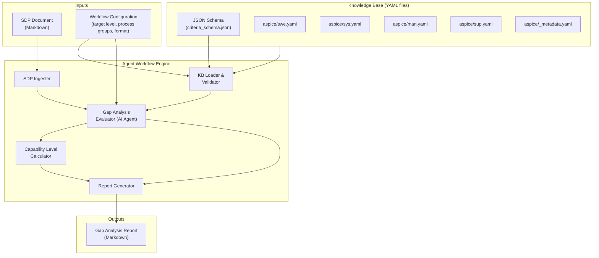
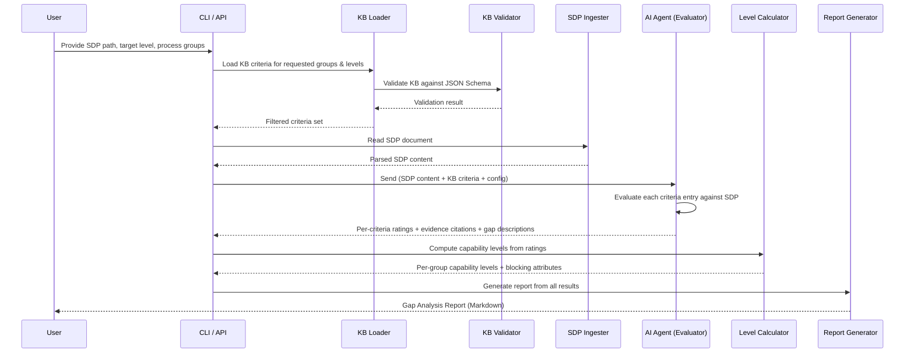
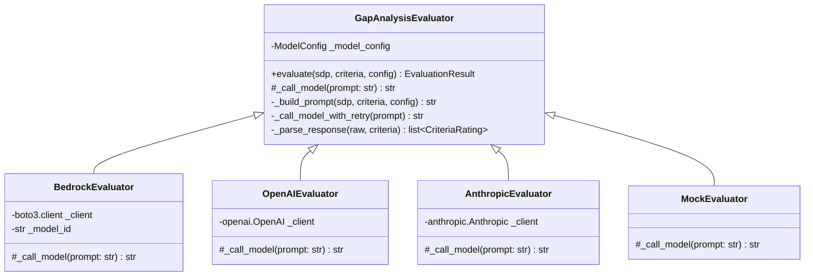

# Design Document — ASPICE Knowledge Base & Agent Workflow

## Overview

This design describes a system composed of two core components:

1. **ASPICE Knowledge Base (KB)** — A structured, machine-readable collection of ASPICE evaluation criteria organized hierarchically by process group, capability level, and process attribute. Stored as YAML files with a JSON Schema for validation.

2. **Agent Workflow Engine** — A configurable AI agent pipeline that ingests an SDP document (Markdown), loads relevant KB criteria as context, performs qualitative gap analysis, determines capability levels, and produces a structured Markdown report.

The system is designed for open-source distribution, extensibility to other standards (CMMI, ISO 26262, IEC 62304), and integration into existing engineering workflows. It does not attempt deterministic parsing of SDP documents — instead, it leverages the structured KB as grounding context for an AI agent that performs qualitative assessment mirroring human assessor reasoning.

### Design Decisions

| Decision | Rationale |
|---|---|
| **YAML for KB storage** | Human-readable, supports comments, widely tooled, easy to diff in version control. JSON Schema validates structure. |
| **Hierarchical file layout** (one file per process group per standard) | Keeps individual files manageable, enables selective loading, supports independent contribution per process group. |
| **AI agent with structured context** (not rule-based engine) | SDP documents are natural-language artifacts with varying structure. Qualitative judgment outperforms brittle pattern matching. |
| **Markdown output for reports** | Universal, version-controllable, renderable in any documentation system. |
| **Schema-first extensibility** | New standards reuse the same schema structure, so the agent workflow needs no modification to support them. |
| **Python as implementation language** | Rich ecosystem for YAML/JSON processing, AI/LLM integrations, CLI tooling, and open-source distribution (PyPI). |

---

## Architecture

### System Architecture Diagram



### Data Flow



---

## Components and Interfaces

### 1. Knowledge Base (KB)

**Responsibility:** Store, organize, and serve structured ASPICE evaluation criteria.

**Interface:**

```python
class KnowledgeBase:
    """Loads, validates, and queries ASPICE criteria from YAML files."""

    def __init__(self, kb_path: str):
        """Initialize KB from a directory of YAML files.
        
        Args:
            kb_path: Path to the knowledge base root directory.
        
        Raises:
            KBValidationError: If any YAML file fails schema validation.
            FileNotFoundError: If kb_path does not exist.
        """

    def load(self, standard: str = "aspice") -> None:
        """Load all criteria files for a given standard.
        
        Args:
            standard: The standard identifier (e.g., "aspice", "cmmi").
        """

    def validate(self) -> ValidationResult:
        """Validate loaded criteria against JSON Schema and completeness rules.
        
        Returns:
            ValidationResult with is_valid flag, errors list, and warnings list.
        """

    def get_criteria(
        self,
        process_groups: list[str],
        max_capability_level: int,
    ) -> list[CriteriaEntry]:
        """Retrieve criteria filtered by process groups and capability level.
        
        Args:
            process_groups: List of process group codes (e.g., ["SWE", "MAN"]).
            max_capability_level: Include criteria up to and including this level (1-5).
        
        Returns:
            List of CriteriaEntry objects matching the filter.
        """

    def get_metadata(self) -> KBMetadata:
        """Return metadata for the loaded standard (name, version, source refs)."""
```

### 2. KB Validator

**Responsibility:** Validate KB files against JSON Schema and check completeness.

**Interface:**

```python
class KBValidator:
    """Validates knowledge base structure and completeness."""

    def __init__(self, schema_path: str):
        """Initialize with path to JSON Schema file."""

    def validate_schema(self, criteria_file: dict) -> list[ValidationError]:
        """Validate a single parsed YAML file against the JSON Schema.
        
        Returns:
            List of validation errors (empty if valid).
        """

    def validate_completeness(
        self,
        criteria: list[CriteriaEntry],
        process_groups: list[str],
        max_level: int,
    ) -> CompletenessReport:
        """Check that every process attribute for every group at every level has criteria.
        
        Returns:
            CompletenessReport listing any missing criteria entries.
        """
```

### 3. SDP Ingester

**Responsibility:** Read and prepare SDP documents for agent consumption.

**Interface:**

```python
class SDPIngester:
    """Reads and prepares SDP documents for evaluation."""

    def ingest(self, sdp_path: str) -> SDPDocument:
        """Read an SDP document from a Markdown file.
        
        Args:
            sdp_path: Path to the SDP Markdown file.
        
        Returns:
            SDPDocument containing the raw content and structural metadata.
        
        Raises:
            UnsupportedFormatError: If the file is not Markdown.
            FileNotFoundError: If the file does not exist.
        """
```

### 4. Gap Analysis Evaluator (AI Agent)

**Responsibility:** Evaluate an SDP document against KB criteria using an AI model.

**Interface:**

```python
class GapAnalysisEvaluator:
    """AI-powered evaluator that assesses SDP compliance against KB criteria."""

    def __init__(self, model_config: ModelConfig):
        """Initialize with AI model configuration.
        
        Args:
            model_config: Configuration for the AI model (provider, model name, etc.).
        """

    def evaluate(
        self,
        sdp: SDPDocument,
        criteria: list[CriteriaEntry],
        config: EvaluationConfig,
    ) -> EvaluationResult:
        """Evaluate the SDP against all provided criteria.
        
        The evaluator sends the SDP content and criteria to the AI model,
        which returns per-criteria ratings with evidence citations and gap descriptions.
        
        Args:
            sdp: The parsed SDP document.
            criteria: List of criteria to evaluate against.
            config: Evaluation configuration (target level, groups, etc.).
        
        Returns:
            EvaluationResult containing per-criteria ratings.
        """
```

### 5. Capability Level Calculator

**Responsibility:** Determine achieved capability levels from per-criteria ratings.

**Interface:**

```python
class CapabilityLevelCalculator:
    """Computes capability levels from process attribute ratings."""

    def calculate(
        self,
        ratings: list[CriteriaRating],
        process_groups: list[str],
    ) -> dict[str, CapabilityLevelResult]:
        """Calculate the highest achieved capability level per process group.
        
        Applies ASPICE rules:
        - A level is achieved when ALL process attributes at that level are
          rated Largely achieved or Fully achieved.
        - All lower levels must also be achieved.
        
        Args:
            ratings: Per-criteria ratings from the evaluator.
            process_groups: Process groups to calculate for.
        
        Returns:
            Dict mapping process group code to CapabilityLevelResult.
        """
```

### 6. Report Generator

**Responsibility:** Produce the final Gap Analysis Report in Markdown.

**Interface:**

```python
class ReportGenerator:
    """Generates structured Markdown gap analysis reports."""

    def generate(
        self,
        evaluation: EvaluationResult,
        levels: dict[str, CapabilityLevelResult],
        config: EvaluationConfig,
        kb_metadata: KBMetadata,
    ) -> str:
        """Generate a complete Gap Analysis Report.
        
        Args:
            evaluation: Per-criteria evaluation results.
            levels: Per-group capability level results.
            config: The evaluation configuration used.
            kb_metadata: Knowledge base metadata for report header.
        
        Returns:
            Complete report as a Markdown string.
        """
```

### 7. CLI Entry Point

**Responsibility:** Parse user arguments and orchestrate the workflow.

**Interface:**

```python
# CLI commands:
# aspice-eval evaluate --sdp <path> --target-level <1-5> --groups <SWE,MAN,...> --output <path>
# aspice-eval validate-kb --kb-path <path>
# aspice-eval version
```

---

## AI Agent Integration

This section details how the Gap Analysis Evaluator integrates with LLM providers to perform AI-driven SDP evaluation. The evaluator uses a provider-agnostic architecture that supports multiple LLM backends through a common interface.

### Provider Architecture



The base `GapAnalysisEvaluator` handles prompt construction, retry logic, response parsing, and the gap-recommendation invariant. Subclasses only implement `_call_model(prompt) -> str` for their specific provider.

### Supported Providers

| Provider | Class | Dependency | Model Examples |
|----------|-------|------------|----------------|
| Amazon Bedrock | `BedrockEvaluator` | `boto3` | `anthropic.claude-3-5-sonnet-20241022-v2:0`, `anthropic.claude-3-haiku-20240307-v1:0` |
| OpenAI | `OpenAIEvaluator` | `openai` | `gpt-4o`, `gpt-4o-mini` |
| Anthropic (direct) | `AnthropicEvaluator` | `anthropic` | `claude-sonnet-4-20250514`, `claude-3-5-haiku-20241022` |
| Mock (testing) | `MockEvaluator` | *(none)* | Deterministic ratings, no API calls |

Provider dependencies are optional — only the chosen provider's package needs to be installed.

### ModelConfig

```python
@dataclass
class ModelConfig:
    provider: str = ""          # "bedrock", "openai", "anthropic", "mock"
    model_name: str = ""        # Provider-specific model identifier
    temperature: float = 0.0    # Low temperature for consistent assessments
    max_tokens: int = 4096      # Max response tokens
    api_key: str | None = None  # API key (OpenAI/Anthropic); not needed for Bedrock
    region: str = ""            # AWS region (Bedrock only)
```

### Provider Implementations

#### Amazon Bedrock

```python
class BedrockEvaluator(GapAnalysisEvaluator):
    """Evaluator using Amazon Bedrock's Converse API."""

    def __init__(self, model_config: ModelConfig) -> None:
        super().__init__(model_config)
        import boto3
        self._client = boto3.client(
            "bedrock-runtime",
            region_name=model_config.region or "us-east-1",
        )
        self._model_id = model_config.model_name

    def _call_model(self, prompt: str) -> str:
        response = self._client.converse(
            modelId=self._model_id,
            messages=[{"role": "user", "content": [{"text": prompt}]}],
            inferenceConfig={
                "temperature": self._model_config.temperature,
                "maxTokens": self._model_config.max_tokens,
            },
        )
        return response["output"]["message"]["content"][0]["text"]
```

#### OpenAI

```python
class OpenAIEvaluator(GapAnalysisEvaluator):
    """Evaluator using the OpenAI Chat Completions API."""

    def __init__(self, model_config: ModelConfig) -> None:
        super().__init__(model_config)
        from openai import OpenAI
        self._client = OpenAI(api_key=model_config.api_key)

    def _call_model(self, prompt: str) -> str:
        response = self._client.chat.completions.create(
            model=self._model_config.model_name,
            messages=[{"role": "user", "content": prompt}],
            temperature=self._model_config.temperature,
            max_tokens=self._model_config.max_tokens,
            response_format={"type": "json_object"},
        )
        return response.choices[0].message.content
```

#### Anthropic (Direct)

```python
class AnthropicEvaluator(GapAnalysisEvaluator):
    """Evaluator using the Anthropic Messages API."""

    def __init__(self, model_config: ModelConfig) -> None:
        super().__init__(model_config)
        import anthropic
        self._client = anthropic.Anthropic(api_key=model_config.api_key)

    def _call_model(self, prompt: str) -> str:
        response = self._client.messages.create(
            model=self._model_config.model_name,
            max_tokens=self._model_config.max_tokens,
            temperature=self._model_config.temperature,
            messages=[{"role": "user", "content": prompt}],
        )
        return response.content[0].text
```

### Provider Selection

The CLI resolves the provider from the `--provider` flag (or `ASPICE_EVAL_PROVIDER` environment variable):

```python
def _create_evaluator(config: ModelConfig) -> GapAnalysisEvaluator:
    """Factory function to create the appropriate evaluator."""
    providers = {
        "bedrock": "aspice_eval.providers.bedrock.BedrockEvaluator",
        "openai": "aspice_eval.providers.openai.OpenAIEvaluator",
        "anthropic": "aspice_eval.providers.anthropic.AnthropicEvaluator",
        "mock": "aspice_eval.evaluator.MockEvaluator",
    }
    if config.provider not in providers:
        raise InvalidConfigError(
            f"Unknown provider '{config.provider}'. "
            f"Valid providers: {', '.join(sorted(providers))}",
            parameter="provider",
            actual_value=config.provider,
            expected_values=sorted(providers.keys()),
        )
    # Lazy import to avoid requiring all provider dependencies
    module_path, class_name = providers[config.provider].rsplit(".", 1)
    module = importlib.import_module(module_path)
    evaluator_class = getattr(module, class_name)
    return evaluator_class(config)
```

### Prompt Strategy

The evaluator constructs a structured prompt with three sections:

1. **System instructions** — Role definition (ASPICE assessor), output format (JSON array), rating scale, and the gap-recommendation invariant
2. **KB criteria context** — All matching criteria serialized as a JSON array with `criteria_id`, `process_group`, `process_id`, `description`, `expected_evidence`, and `evaluation_guidance`
3. **SDP document** — The full Markdown content of the SDP document

The prompt instructs the model to return a JSON array where each element has:
- `criteria_id` — matching the input criteria
- `rating` — one of the four ASPICE values
- `evidence_found` — specific SDP sections/quotes
- `gaps` — what's missing or insufficient
- `recommendations` — remediation actions (required when gaps is non-empty)
- `sdp_sections_assessed` — which SDP headers were evaluated

#### Chunking Strategy for Large SDPs

When the SDP document + criteria exceed the model's context window:

1. **Criteria batching** — Split criteria into batches by process group, evaluate each batch separately, merge results
2. **SDP sectioning** — For very large SDPs, extract relevant sections per criteria batch using the section headers from the ingester
3. **Token estimation** — Use a conservative 4 chars/token estimate to determine if chunking is needed

### Error Handling and Retry

```
Attempt 1 → _call_model(prompt)
    ↓ AIModelError
Attempt 2 → wait 1s → _call_model(prompt)
    ↓ AIModelError
Attempt 3 → wait 2s → _call_model(prompt)
    ↓ AIModelError
→ Raise AIModelError with attempt count
```

- **Retryable errors**: Timeouts, rate limits (429), server errors (5xx), network errors
- **Non-retryable errors**: Authentication failures (401/403), invalid model ID, malformed request
- **Partial results**: If the JSON response parses partially (some entries valid, some malformed), the valid entries are returned and malformed entries are logged as warnings

### Configuration via Environment Variables

| Variable | Description | Example |
|----------|-------------|---------|
| `ASPICE_EVAL_PROVIDER` | Default provider | `bedrock` |
| `ASPICE_EVAL_MODEL` | Default model name | `anthropic.claude-3-5-sonnet-20241022-v2:0` |
| `ASPICE_EVAL_TEMPERATURE` | Model temperature | `0.0` |
| `ASPICE_EVAL_MAX_TOKENS` | Max response tokens | `4096` |
| `OPENAI_API_KEY` | OpenAI API key | `sk-...` |
| `ANTHROPIC_API_KEY` | Anthropic API key | `sk-ant-...` |
| `AWS_REGION` | AWS region for Bedrock | `us-east-1` |

CLI flags override environment variables. Environment variables override defaults.

### File Layout for Providers

```
src/aspice_eval/
├── evaluator.py              # Base GapAnalysisEvaluator + MockEvaluator
└── providers/
    ├── __init__.py            # Provider factory (_create_evaluator)
    ├── bedrock.py             # BedrockEvaluator
    ├── openai.py              # OpenAIEvaluator
    └── anthropic.py           # AnthropicEvaluator
```

---

## Data Models

### CriteriaEntry

Represents a single evaluable criterion in the knowledge base.

```yaml
# Schema: criteria_entry
process_group: "SWE"                    # Process group code
process_id: "SWE.1"                     # Specific process identifier
process_name: "Software Requirements Analysis"
capability_level: 2                      # 0-5
process_attribute: "PA 2.1"             # Process attribute identifier
process_attribute_name: "Performance Management"
criteria_id: "SWE.1-PA2.1-001"         # Unique identifier
description: >
  The software requirements analysis process is planned
  and its execution is managed.
expected_evidence:
  - type: "plan"
    description: "Software requirements analysis plan with schedule and milestones"
  - type: "record"
    description: "Progress tracking records showing planned vs actual"
evaluation_guidance: >
  Look for evidence of a documented plan for requirements analysis activities,
  including schedule, responsibilities, and resource allocation. Check for
  records showing that progress was monitored against the plan.
example_evidence:
  - "Requirements management plan in Confluence"
  - "Sprint/iteration tracking in Jira with requirements-linked stories"
  - "Status reports showing requirements analysis progress"
```

### KB File Structure

```
knowledge_base/
├── schema/
│   └── criteria_schema.json          # JSON Schema for validation
├── aspice/
│   ├── _metadata.yaml                # Standard metadata (name, version, sources)
│   ├── swe.yaml                      # SWE process group criteria
│   ├── sys.yaml                      # SYS process group criteria
│   ├── man.yaml                      # MAN process group criteria
│   └── sup.yaml                      # SUP process group criteria
└── [future_standard]/
    ├── _metadata.yaml
    └── [process_group].yaml
```

### _metadata.yaml

```yaml
standard:
  name: "Automotive SPICE"
  short_name: "ASPICE"
  version: "4.0"
  release_date: "2023-12"
  source_references:
    - title: "VDA Automotive SPICE Guidelines"
      url: "https://www.automotivespice.com"
    - title: "Wikipedia — Automotive SPICE"
      url: "https://en.wikipedia.org/wiki/Automotive_SPICE"
  license_note: >
    Criteria descriptions are derived from publicly available summaries.
    No proprietary VDA content is included.
kb_version: "1.0.0"
last_updated: "2025-01-15"
process_groups:
  - code: "SWE"
    name: "Software Engineering"
    processes: ["SWE.1", "SWE.2", "SWE.3", "SWE.4", "SWE.5", "SWE.6"]
  - code: "SYS"
    name: "System Engineering"
    processes: ["SYS.1", "SYS.2", "SYS.3", "SYS.4", "SYS.5"]
  - code: "MAN"
    name: "Project Management"
    processes: ["MAN.3"]
  - code: "SUP"
    name: "Support Processes"
    processes: ["SUP.1", "SUP.8", "SUP.9", "SUP.10"]
capability_levels:
  - level: 0
    name: "Incomplete"
    process_attributes: []
  - level: 1
    name: "Performed"
    process_attributes: ["PA 1.1"]
  - level: 2
    name: "Managed"
    process_attributes: ["PA 2.1", "PA 2.2"]
  - level: 3
    name: "Established"
    process_attributes: ["PA 3.1", "PA 3.2"]
  - level: 4
    name: "Predictable"
    process_attributes: ["PA 4.1", "PA 4.2"]
  - level: 5
    name: "Optimizing"
    process_attributes: ["PA 5.1", "PA 5.2"]
rating_scale:
  - rating: "Fully achieved"
    abbreviation: "F"
    range: "86-100%"
  - rating: "Largely achieved"
    abbreviation: "L"
    range: "51-85%"
  - rating: "Partially achieved"
    abbreviation: "P"
    range: "16-50%"
  - rating: "Not achieved"
    abbreviation: "N"
    range: "0-15%"
```

### JSON Schema (criteria_schema.json)

```json
{
  "$schema": "http://json-schema.org/draft-07/schema#",
  "title": "ASPICE Knowledge Base Criteria File",
  "type": "object",
  "required": ["process_group", "criteria"],
  "properties": {
    "process_group": {
      "type": "object",
      "required": ["code", "name"],
      "properties": {
        "code": { "type": "string", "pattern": "^[A-Z]{2,4}$" },
        "name": { "type": "string" }
      }
    },
    "criteria": {
      "type": "array",
      "items": {
        "type": "object",
        "required": [
          "process_id", "process_name", "capability_level",
          "process_attribute", "criteria_id", "description",
          "expected_evidence", "evaluation_guidance"
        ],
        "properties": {
          "process_id": { "type": "string" },
          "process_name": { "type": "string" },
          "capability_level": { "type": "integer", "minimum": 0, "maximum": 5 },
          "process_attribute": { "type": "string", "pattern": "^PA \\d\\.\\d$" },
          "process_attribute_name": { "type": "string" },
          "criteria_id": { "type": "string" },
          "description": { "type": "string" },
          "expected_evidence": {
            "type": "array",
            "items": {
              "type": "object",
              "required": ["type", "description"],
              "properties": {
                "type": { "type": "string" },
                "description": { "type": "string" }
              }
            },
            "minItems": 1
          },
          "evaluation_guidance": { "type": "string" },
          "example_evidence": {
            "type": "array",
            "items": { "type": "string" }
          }
        }
      }
    }
  }
}
```

### EvaluationConfig

```python
@dataclass
class EvaluationConfig:
    """Configuration for an evaluation run."""
    sdp_path: str                          # Path to SDP document
    target_capability_level: int = 3       # Default: Level 3 (Established)
    process_groups: list[str] = field(     # Default: all four core groups
        default_factory=lambda: ["SWE", "SYS", "MAN", "SUP"]
    )
    kb_path: str = "knowledge_base"        # Path to KB directory
    standard: str = "aspice"               # Standard to evaluate against
    output_path: str | None = None         # Output file path (None = stdout)
```

### CriteriaRating

```python
@dataclass
class CriteriaRating:
    """Result of evaluating a single criteria entry against the SDP."""
    criteria_id: str                       # References CriteriaEntry.criteria_id
    process_group: str                     # e.g., "SWE"
    process_attribute: str                 # e.g., "PA 2.1"
    capability_level: int                  # e.g., 2
    rating: str                            # "Fully achieved" | "Largely achieved" | "Partially achieved" | "Not achieved"
    evidence_found: list[str]              # Sections/quotes from SDP that serve as evidence
    gaps: list[str]                        # Specific gaps identified (empty if Fully achieved)
    recommendations: list[str]             # Remediation recommendations (empty if Fully achieved)
    sdp_sections_assessed: list[str]       # SDP section headers that were assessed
```

### CapabilityLevelResult

```python
@dataclass
class CapabilityLevelResult:
    """Capability level determination for a single process group."""
    process_group: str                     # e.g., "SWE"
    achieved_level: int                    # Highest fully achieved level (0-5)
    target_level: int                      # The target level requested
    attribute_ratings: dict[str, str]      # PA -> aggregated rating per attribute
    blocking_attributes: list[str]         # PAs that prevented next level achievement
```

### EvaluationResult

```python
@dataclass
class EvaluationResult:
    """Complete result of an evaluation run."""
    ratings: list[CriteriaRating]          # All per-criteria ratings
    sdp_metadata: dict                     # SDP document info (title, sections found)
    evaluation_timestamp: str              # ISO 8601 timestamp
    config: EvaluationConfig               # Configuration used
```

### ValidationResult

```python
@dataclass
class ValidationResult:
    """Result of KB validation."""
    is_valid: bool
    schema_errors: list[str]               # JSON Schema violations
    completeness_gaps: list[str]           # Missing criteria entries
    warnings: list[str]                    # Non-blocking issues
```

### Gap Analysis Report Structure

The generated report follows this Markdown structure:

```markdown
# ASPICE Gap Analysis Report

## Metadata
- **SDP Document:** [filename]
- **Target Capability Level:** [level]
- **Process Groups Evaluated:** [list]
- **Knowledge Base Version:** [version]
- **Evaluation Date:** [timestamp]

## Executive Summary
[High-level summary of findings: overall compliance posture, key strengths, critical gaps]

## Capability Level Summary
| Process Group | Target Level | Achieved Level | Status |
|---|---|---|---|
| SWE | 3 | 2 | ⚠️ Below target |
| MAN | 3 | 3 | ✅ Meets target |

## Detailed Findings

### SWE — Software Engineering

#### Capability Level 1 — Performed
##### PA 1.1 — Process Performance
- **Rating:** Fully achieved
- **Evidence:** [citations from SDP]

#### Capability Level 2 — Managed
##### PA 2.1 — Performance Management
- **Rating:** Partially achieved
- **Evidence found:** [what was found]
- **Gaps:** [what is missing]
- **Recommendations:** [what to add/change]

[...continue for each PA and level...]

### [Next Process Group...]

## Remediation Roadmap
[Prioritized list of recommendations grouped by impact]

## Traceability Matrix
| Criteria ID | SDP Section(s) Assessed | Rating |
|---|---|---|
| SWE.1-PA1.1-001 | Section 6: Activities | Fully achieved |
| SWE.1-PA2.1-001 | Section 3: Performance | Partially achieved |
```


---

## Correctness Properties

*A property is a characteristic or behavior that should hold true across all valid executions of a system — essentially, a formal statement about what the system should do. Properties serve as the bridge between human-readable specifications and machine-verifiable correctness guarantees.*

### Property 1: Criteria filtering returns exactly matching entries

*For any* set of criteria entries and any filter specifying a list of process groups and a maximum capability level, `get_criteria` SHALL return exactly those entries whose `process_group` is in the requested groups AND whose `capability_level` is less than or equal to the maximum level — no more, no less.

**Validates: Requirements 1.1, 4.1**

### Property 2: Schema validation accepts complete entries and rejects incomplete entries

*For any* criteria entry dictionary, JSON Schema validation SHALL accept the entry if and only if all required fields (`process_id`, `process_name`, `capability_level`, `process_attribute`, `criteria_id`, `description`, `expected_evidence`, `evaluation_guidance`) are present and correctly typed — regardless of the standard name or process group code used.

**Validates: Requirements 1.2, 2.2**

### Property 3: SDP ingester accepts any valid Markdown content

*For any* valid Markdown string provided as an SDP document, the ingester SHALL accept it without raising an `UnsupportedFormatError`, returning an `SDPDocument` with non-empty content.

**Validates: Requirements 3.1**

### Property 4: SDP ingester rejects unsupported formats with descriptive error

*For any* file path with a non-Markdown extension (e.g., `.docx`, `.pdf`, `.xlsx`), the ingester SHALL raise an `UnsupportedFormatError` whose message identifies the expected Markdown format.

**Validates: Requirements 3.3**

### Property 5: Rating values are constrained to the ASPICE rating scale

*For any* `CriteriaRating` produced by the evaluation pipeline, the `rating` field SHALL be one of exactly four values: "Fully achieved", "Largely achieved", "Partially achieved", or "Not achieved".

**Validates: Requirements 4.2**

### Property 6: Evaluation produces ratings for exactly the requested process groups

*For any* evaluation run with a specified set of process groups, the resulting `EvaluationResult` SHALL contain `CriteriaRating` entries covering every requested group and SHALL NOT contain ratings for any unrequested group.

**Validates: Requirements 4.4**

### Property 7: Capability level calculation follows ASPICE cumulative achievement rules

*For any* set of process attribute ratings for a process group, the `CapabilityLevelCalculator` SHALL return an `achieved_level` N such that: (a) for every level L where 1 ≤ L ≤ N, ALL process attributes at level L are rated "Largely achieved" or "Fully achieved"; and (b) if N is less than the target level, at least one process attribute at level N+1 is rated "Partially achieved" or "Not achieved".

**Validates: Requirements 5.1, 5.2**

### Property 8: Blocking attributes are exactly the underachieving PAs at the next level

*For any* `CapabilityLevelResult` where `achieved_level` is less than `target_level`, the `blocking_attributes` list SHALL contain exactly those process attributes at level `achieved_level + 1` whose rating is "Partially achieved" or "Not achieved", and no others.

**Validates: Requirements 5.3**

### Property 9: Generated report contains all required sections

*For any* valid `EvaluationResult` and `CapabilityLevelResult` set, the generated Gap Analysis Report SHALL contain Markdown headers for: "Executive Summary", "Capability Level Summary", "Detailed Findings", "Remediation Roadmap", and "Traceability Matrix".

**Validates: Requirements 6.1, 6.2**

### Property 10: Ratings with gaps always have non-empty recommendations

*For any* `CriteriaRating` where the `gaps` list is non-empty, the `recommendations` list SHALL also be non-empty — every identified gap must have at least one associated remediation recommendation.

**Validates: Requirements 6.3**

### Property 11: Traceability section references all evaluated criteria

*For any* evaluation result, the traceability section of the generated report SHALL reference every `criteria_id` present in the evaluation's ratings list.

**Validates: Requirements 6.4**

### Property 12: Report metadata contains all required identification fields

*For any* evaluation configuration and KB metadata, the generated report's metadata section SHALL include the SDP document path, the target capability level, the knowledge base version, and the evaluation timestamp.

**Validates: Requirements 6.5**

### Property 13: Report contains sections only for specified process groups

*For any* evaluation run where a subset of process groups is specified, the generated report's "Detailed Findings" section SHALL contain subsections only for the specified groups and SHALL NOT contain subsections for omitted groups.

**Validates: Requirements 7.2**

### Property 14: KB completeness validator identifies all missing criteria tuples

*For any* set of criteria entries and a defined set of expected (process_group, capability_level, process_attribute) tuples, the completeness validator SHALL report as gaps exactly those tuples that have zero matching criteria entries in the set.

**Validates: Requirements 8.1, 8.2**

### Property 15: Configuration accepts all valid parameter combinations

*For any* target capability level in the range 1–5 and any non-empty subset of supported process groups, `EvaluationConfig` SHALL accept the parameters without error. When no target level is specified, it SHALL default to 3.

**Validates: Requirements 7.1, 7.3**

---

## Error Handling

### Error Categories

| Error | Component | Trigger | Handling |
|---|---|---|---|
| `FileNotFoundError` | SDP Ingester, KB Loader | SDP or KB path does not exist | Return descriptive error with the missing path. Do not proceed with evaluation. |
| `UnsupportedFormatError` | SDP Ingester | SDP file is not Markdown (e.g., .docx, .pdf) | Return error message identifying expected format (Markdown) and the actual file extension. |
| `KBValidationError` | KB Validator | YAML file fails JSON Schema validation | Return list of schema violations with file path and field path. Do not proceed with evaluation. |
| `KBCompletenessWarning` | KB Validator | Missing criteria entries for some (group, level, PA) tuples | Log warnings but allow evaluation to proceed. Include warnings in report metadata. |
| `InvalidConfigError` | CLI / EvaluationConfig | Invalid target level (outside 1-5), unknown process group code | Return descriptive error identifying the invalid parameter and valid options. |
| `AIModelError` | Gap Analysis Evaluator | AI model API failure (timeout, rate limit, auth error) | Retry with exponential backoff (3 attempts). If all retries fail, return error with details. Partial results are not emitted. |
| `AIResponseParseError` | Gap Analysis Evaluator | AI model returns response that doesn't match expected rating structure | Log the raw response, return error identifying the malformed criteria. Allow partial evaluation if some criteria were successfully rated. |

### Error Handling Principles

1. **Fail fast on input errors** — Invalid SDP paths, unsupported formats, and invalid configs are caught before any AI model calls.
2. **Validate KB at load time** — Schema and completeness checks run when the KB is loaded, before evaluation begins.
3. **Graceful degradation for AI errors** — Individual criteria evaluation failures don't abort the entire run. The report notes which criteria could not be evaluated.
4. **No silent failures** — Every error produces a user-visible message. Warnings (like KB completeness gaps) are surfaced in the report.
5. **Structured error output** — Errors include enough context (file paths, field names, expected vs actual values) for the user to diagnose and fix the issue.

---

## Testing Strategy

### Testing Approach

This project uses a dual testing approach:

- **Property-based tests** verify universal correctness properties across randomly generated inputs (using [Hypothesis](https://hypothesis.readthedocs.io/) for Python)
- **Unit tests** verify specific examples, edge cases, and integration points (using [pytest](https://docs.pytest.org/))
- **Integration tests** verify the end-to-end workflow with real KB data and sample SDP documents

### Property-Based Tests (Hypothesis)

Each correctness property from the design document maps to a single Hypothesis property test. All property tests run a minimum of 100 iterations.

| Property | Test Description | Tag |
|---|---|---|
| Property 1 | Generate random criteria sets and filters; verify `get_criteria` returns exact matches | `Feature: aspice-evaluation-tool, Property 1: Criteria filtering returns exactly matching entries` |
| Property 2 | Generate random criteria dicts with varying field presence; verify schema validation | `Feature: aspice-evaluation-tool, Property 2: Schema validation accepts complete entries and rejects incomplete entries` |
| Property 3 | Generate random Markdown strings; verify ingester accepts | `Feature: aspice-evaluation-tool, Property 3: SDP ingester accepts any valid Markdown content` |
| Property 4 | Generate random non-Markdown file extensions; verify ingester rejects | `Feature: aspice-evaluation-tool, Property 4: SDP ingester rejects unsupported formats with descriptive error` |
| Property 5 | Generate random CriteriaRating objects; verify rating value constraint | `Feature: aspice-evaluation-tool, Property 5: Rating values are constrained to the ASPICE rating scale` |
| Property 6 | Generate random group subsets and evaluation results; verify group coverage | `Feature: aspice-evaluation-tool, Property 6: Evaluation produces ratings for exactly the requested process groups` |
| Property 7 | Generate random attribute rating maps; verify level calculation | `Feature: aspice-evaluation-tool, Property 7: Capability level calculation follows ASPICE cumulative achievement rules` |
| Property 8 | Generate random below-target results; verify blocking attributes | `Feature: aspice-evaluation-tool, Property 8: Blocking attributes are exactly the underachieving PAs at the next level` |
| Property 9 | Generate random evaluation results; verify report section headers | `Feature: aspice-evaluation-tool, Property 9: Generated report contains all required sections` |
| Property 10 | Generate random ratings with gaps; verify recommendations non-empty | `Feature: aspice-evaluation-tool, Property 10: Ratings with gaps always have non-empty recommendations` |
| Property 11 | Generate random evaluation results; verify traceability references | `Feature: aspice-evaluation-tool, Property 11: Traceability section references all evaluated criteria` |
| Property 12 | Generate random configs and metadata; verify report metadata fields | `Feature: aspice-evaluation-tool, Property 12: Report metadata contains all required identification fields` |
| Property 13 | Generate random group subsets; verify report contains only those groups | `Feature: aspice-evaluation-tool, Property 13: Report contains sections only for specified process groups` |
| Property 14 | Generate random criteria sets with gaps; verify validator finds them | `Feature: aspice-evaluation-tool, Property 14: KB completeness validator identifies all missing criteria tuples` |
| Property 15 | Generate random valid configs; verify acceptance and defaults | `Feature: aspice-evaluation-tool, Property 15: Configuration accepts all valid parameter combinations` |

### Unit Tests (pytest)

Unit tests cover specific examples and edge cases not suited for property-based testing:

| Area | Tests |
|---|---|
| KB completeness (Req 1.3, 1.4) | Verify actual KB covers all 6 levels, all PAs, and all 4 required process groups |
| KB format (Req 1.5) | Verify all KB YAML files parse without errors |
| KB metadata (Req 2.3) | Verify _metadata.yaml contains required fields |
| KB evidence terminology (Req 1.6) | Verify expected_evidence entries have type and description fields |
| Default config (Req 7.3) | Verify EvaluationConfig defaults to level 3 |
| Attribution (Req 9.2) | Verify metadata source_references is non-empty |
| Error messages | Verify specific error messages for known bad inputs |

### Integration Tests

| Scenario | Description |
|---|---|
| End-to-end evaluation | Run full workflow with sample SDP and real KB; verify report is generated |
| KB validation | Run validator against actual KB files; verify no schema errors |
| CLI smoke test | Run CLI commands (`evaluate`, `validate-kb`, `version`) and verify exit codes |

### Test Configuration

```python
# conftest.py
from hypothesis import settings

# Property tests: minimum 100 iterations
settings.register_profile("ci", max_examples=100)
settings.register_profile("dev", max_examples=50)
settings.load_profile("ci")
```

### Test Directory Structure

```
tests/
├── conftest.py                    # Shared fixtures, Hypothesis settings
├── property/
│   ├── test_kb_filtering.py       # Properties 1, 14
│   ├── test_schema_validation.py  # Property 2
│   ├── test_sdp_ingestion.py      # Properties 3, 4
│   ├── test_rating_constraints.py # Properties 5, 6, 10
│   ├── test_level_calculator.py   # Properties 7, 8
│   ├── test_report_generator.py   # Properties 9, 11, 12, 13
│   └── test_config.py             # Property 15
├── unit/
│   ├── test_kb_completeness.py    # KB content checks
│   ├── test_kb_metadata.py        # Metadata structure checks
│   ├── test_error_handling.py     # Error message checks
│   └── test_defaults.py           # Default value checks
└── integration/
    ├── test_end_to_end.py         # Full workflow test
    ├── test_kb_validation.py      # Real KB validation
    └── test_cli.py                # CLI smoke tests
```
