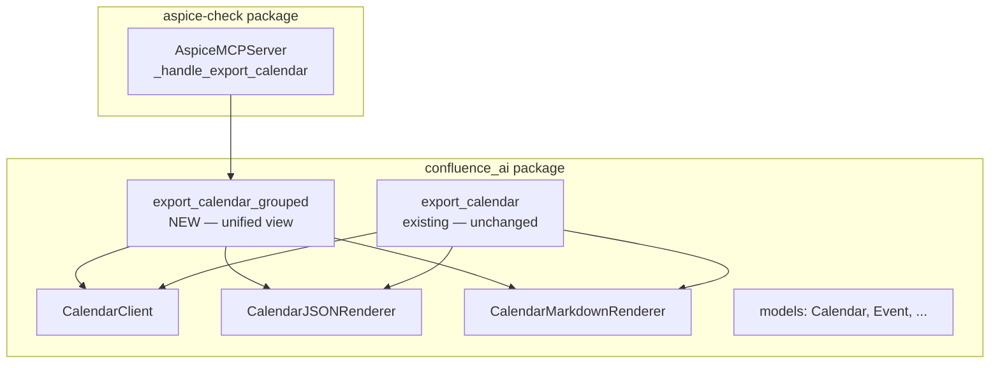
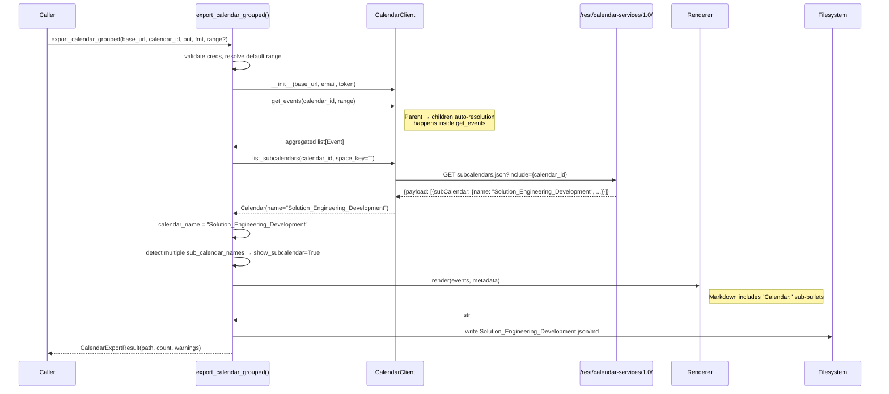
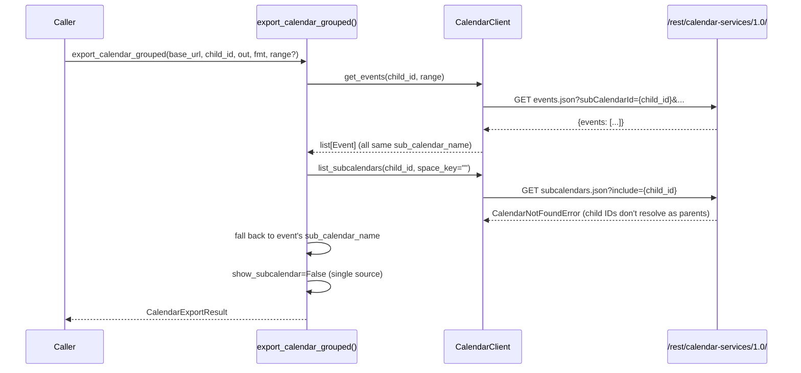

# Design Document

## Overview

This feature adds a new `export_calendar_grouped()` API function that produces a unified calendar view when exporting a parent calendar. Instead of the current behavior where the calendar name falls back to the raw GUID when events come from multiple subcalendars, the grouped export resolves the parent calendar's descriptive name and uses it as the unified title in both JSON and Markdown outputs.

The existing `export_calendar()` function remains unchanged. The MCP `export_calendar` tool switches to using the grouped export internally, so it automatically produces unified output when given a parent calendar ID.

### Goals

1. Add `export_calendar_grouped()` that resolves the parent calendar name and produces unified output.
2. Keep `export_calendar()` unchanged for backward compatibility.
3. Update the MCP `export_calendar` tool to use the grouped export.
4. Add a sub-calendar provenance sub-bullet in Markdown output for grouped exports.

### Non-Goals

- Changing the `list_calendars` MCP tool behavior.
- Modifying the `CalendarClient.get_events()` method.
- Changing the renderer classes themselves (the grouping logic lives in the orchestration layer).
- Adding new MCP tool parameters.

## Architecture

### High-level fit



### Module layout (changes only)

```
confluence-ai/src/confluence_ai/
├── calendar_export.py        # EXTEND — add export_calendar_grouped()
├── calendar_renderer.py      # EXTEND — add sub_calendar_name sub-bullet in Markdown
└── __init__.py               # EXTEND — export export_calendar_grouped

aspice-check/src/aspice_check/
└── mcp_server.py             # MODIFY — _handle_export_calendar uses export_calendar_grouped
```

### Rationale for key decisions

| Decision | Rationale |
|---|---|
| **New function instead of modifying `export_calendar()`** | The user explicitly requested keeping the current API functionality. A new function avoids breaking existing consumers while providing the grouped behavior. |
| **Parent name resolution via `list_subcalendars`** | The `get_events` parent→children auto-resolution already calls `list_subcalendars` internally but doesn't expose the parent name to the caller. The grouped export makes a separate `list_subcalendars` call to get the parent name. This is one extra HTTP call but keeps the `get_events` API clean. |
| **MCP tool uses grouped export by default** | The MCP tool is the primary consumer for AI assistants. Unified output is more useful for AI consumption — a single coherent document rather than a GUID-named file. |
| **Sub-calendar provenance in Markdown** | Adding a `- Calendar: {name}` sub-bullet preserves the information about which subcalendar an event came from, without breaking the unified structure. In JSON, the existing `sub_calendar_id`/`sub_calendar_name` fields already serve this purpose. |

## Components and Interfaces

### `export_calendar_grouped()` — New orchestration function

```python
# confluence_ai/calendar_export.py

def export_calendar_grouped(
    *,
    base_url: str,
    calendar_id: str,
    output_dir: str,
    email: str,
    api_token: str,
    output_format: str = "json",
    date_range: DateRange | None = None,
) -> CalendarExportResult:
    """Export a calendar with unified subcalendar grouping.

    When given a parent calendar ID, resolves the parent's descriptive
    name and uses it as the calendar_name in the output. All events from
    child subcalendars are merged into a single output file.

    When given a child subcalendar ID, behaves identically to
    export_calendar() (single subcalendar export).

    Steps:
    1. Validate credentials (raise AuthenticationError on empty email/token).
    2. Resolve default date range if None: now-30d → now+90d (UTC).
    3. Construct CalendarClient.
    4. Fetch events via CalendarClient.get_events(calendar_id, range).
       The client handles parent → children auto-resolution transparently.
    5. Resolve calendar_name:
       a. Try list_subcalendars(calendar_id, space_key="") to get parent name.
       b. If that succeeds and returns a Calendar with a name, use it.
       c. If it fails (CalendarNotFoundError for child IDs), use the
          first event's sub_calendar_name, then fall back to calendar_id.
    6. Pick renderer based on output_format.
    7. Render, sanitize filename, write to disk.
    8. Return CalendarExportResult.
    """
```

### Parent name resolution strategy

The key difference from `export_calendar()` is step 5. The grouped function attempts to resolve the parent calendar name proactively:

```python
def _resolve_calendar_name(
    client: CalendarClient,
    calendar_id: str,
    events: list[Event],
) -> str:
    """Resolve the calendar name for grouped export.

    Attempts to get the parent calendar's descriptive name via
    list_subcalendars. If that fails (because calendar_id is a child),
    falls back to event-based name resolution.

    Args:
        client: The CalendarClient instance.
        calendar_id: The calendar ID being exported.
        events: The fetched events list.

    Returns:
        The resolved calendar name string.
    """
    # Try to resolve as parent calendar
    try:
        parent_cal = client.list_subcalendars(calendar_id, space_key="")
        if parent_cal.name:
            return parent_cal.name
    except (CalendarNotFoundError, CalendarAPIError):
        pass

    # Fall back to event-based resolution
    if events:
        unique_names = {e.sub_calendar_name for e in events if e.sub_calendar_name}
        if len(unique_names) == 1:
            return unique_names.pop()

    return calendar_id
```

### Markdown renderer enhancement

The `CalendarMarkdownRenderer` is extended to optionally include a sub-calendar provenance sub-bullet when events come from multiple subcalendars:

```python
# calendar_renderer.py — modification to CalendarMarkdownRenderer

class CalendarMarkdownRenderer:
    def __init__(self, show_subcalendar: bool = False) -> None:
        """Initialize the Markdown renderer.

        Args:
            show_subcalendar: If True, include a "Calendar:" sub-bullet
                on each event showing the sub_calendar_name. Used by
                the grouped export when events come from multiple
                subcalendars.
        """
        self._show_subcalendar = show_subcalendar

    def render(self, events: list[Event], metadata: CalendarMetadata) -> str:
        # ... existing logic unchanged ...
        # After rendering event line and before location/organizer/description:
        # if self._show_subcalendar and event.sub_calendar_name:
        #     lines.append(f"  - Calendar: {event.sub_calendar_name}")
```

The `CalendarJSONRenderer` requires no changes — it already includes `sub_calendar_id` and `sub_calendar_name` on each event.

### MCP server change

```python
# mcp_server.py — _handle_export_calendar modification

def _handle_export_calendar(self, params: dict) -> dict:
    """Handle export_calendar tool call — uses grouped export."""
    from confluence_ai import export_calendar_grouped
    from confluence_ai.models import DateRange

    date_range = None
    if params.get("start_date") and params.get("end_date"):
        date_range = DateRange(
            start=datetime.fromisoformat(params["start_date"]),
            end=datetime.fromisoformat(params["end_date"]),
        )

    result = export_calendar_grouped(
        base_url=params["base_url"],
        calendar_id=params["calendar_id"],
        output_dir=params["output_dir"],
        output_format=params.get("output_format", "json"),
        date_range=date_range,
        email=params.get("email") or os.environ.get("CONFLUENCE_EMAIL", ""),
        api_token=params.get("api_token") or os.environ.get("CONFLUENCE_API_TOKEN", ""),
    )
    return {
        "output_path": result.output_path,
        "event_count": result.event_count,
        "warnings": result.warnings,
    }
```

### Public API addition (`confluence_ai/__init__.py`)

```python
# New export
from confluence_ai.calendar_export import export_calendar_grouped
```

Added to `__all__`.

## Data Models

No new data models are needed. The existing `CalendarExportResult`, `CalendarMetadata`, `Event`, and `DateRange` models are sufficient. The grouped export produces the same output types — the difference is in how `calendar_name` is resolved and whether the Markdown renderer shows subcalendar provenance.

## Flow Diagrams

### Sequence — `export_calendar_grouped()` with parent calendar



### Sequence — `export_calendar_grouped()` with child subcalendar ID



## Correctness Properties

### Property 1: Grouped export resolves parent calendar name for unified output

*For any* parent calendar ID P that resolves via `list_subcalendars` to a `Calendar` with a non-empty `name` field N, calling `export_calendar_grouped(calendar_id=P, ...)` produces a `CalendarExportResult` whose output file contains `calendar_name` equal to N (in JSON metadata or Markdown front-matter), and the output filename stem equals `_sanitize_calendar_name(N)`.

**Validates: Requirements 1.1, 1.2, 4.1**

### Property 2: Grouped export events are sorted chronologically by start time

*For any* list of events E from multiple subcalendars (in any input order) produced by `get_events`, the JSON output of `export_calendar_grouped` contains an `events` array where for all consecutive pairs `events[i]` and `events[i+1]`, `events[i].start <= events[i+1].start` (compared as ISO 8601 timestamps).

**Validates: Requirements 2.2**

### Property 3: Markdown subcalendar provenance sub-bullet appears when events come from multiple subcalendars

*For any* list of events E where `len({e.sub_calendar_name for e in E if e.sub_calendar_name}) > 1`, the Markdown output of `CalendarMarkdownRenderer(show_subcalendar=True).render(E, M)` contains, for every event `e` with a non-empty `sub_calendar_name`, the substring `Calendar: {e.sub_calendar_name}` in the rendered output.

**Validates: Requirements 3.3**

### Property 4: Grouped export result invariants match export_calendar invariants

*For any* valid credentials and any generated list of events E that the mocked `CalendarClient.get_events` returns, calling `export_calendar_grouped(...)` produces a `CalendarExportResult` r such that (a) `os.path.exists(r.output_path) is True`, (b) `r.event_count == len(E)`, (c) `r.warnings` is a `list`, and (d) the file at `r.output_path` is non-empty and parseable under the selected format.

**Validates: Requirements 5.3, 5.6**

---

The remaining acceptance criteria (1.3, 1.4, 2.1, 2.3, 2.4, 3.1, 3.2, 3.4, 4.2, 4.3, 5.1, 5.2, 5.4, 5.5, 6.1–6.4) are classified as EXAMPLE, SMOKE, or EDGE_CASE and are covered by unit/integration tests.

## Error Handling

No new exception classes are needed. The grouped export reuses the existing exception hierarchy:

| Scenario | Exception |
|---|---|
| Empty email/api_token | `AuthenticationError` |
| Parent name resolution fails | Caught internally; falls back gracefully (no exception to caller) |
| `get_events` fails (401/403/404/500) | Propagates existing `AuthenticationError`, `CalendarNotFoundError`, `CalendarAPIError` |
| Invalid output_format | `ValueError` |
| Server unreachable | `ConfluenceConnectionError` |

The `_resolve_calendar_name` helper catches `CalendarNotFoundError` and `CalendarAPIError` internally and falls back to event-based name resolution — it never propagates these to the caller.

## Testing Strategy

### New test files

```
confluence-ai/tests/
├── unit/
│   └── test_calendar_export_grouped.py    # Unit tests for export_calendar_grouped
├── property/
│   ├── test_prop13_grouped_name_resolution.py   # Property 1
│   ├── test_prop14_grouped_event_ordering.py    # Property 2
│   ├── test_prop15_subcalendar_provenance.py    # Property 3
│   └── test_prop16_grouped_result_invariants.py # Property 4
└── integration/
    └── test_calendar_mcp_tools.py         # Update existing — verify MCP uses grouped export
```

### Unit test coverage

- `test_calendar_export_grouped.py`:
  - Test parent ID → resolves name via `list_subcalendars` (mock returns Calendar with name)
  - Test child ID → `list_subcalendars` raises `CalendarNotFoundError` → falls back to event name
  - Test fallback chain: no events → uses calendar_id
  - Test `show_subcalendar=True` when events have multiple `sub_calendar_name` values
  - Test `show_subcalendar=False` when events have single `sub_calendar_name`
  - Test existing `export_calendar()` is unchanged (non-regression)
  - Test MCP handler calls `export_calendar_grouped` (not `export_calendar`)

### Mocking strategy

Same as existing tests:
- `CalendarClient.get_events` mocked to return predefined event lists
- `CalendarClient.list_subcalendars` mocked to return a `Calendar` with a known name (for parent IDs) or raise `CalendarNotFoundError` (for child IDs)
- No live Confluence calls

