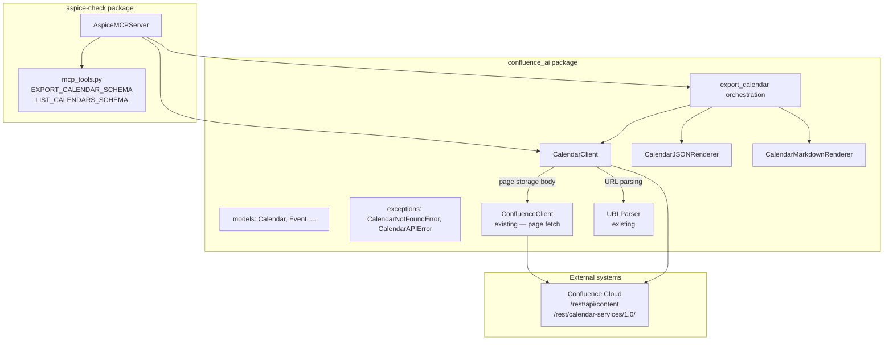
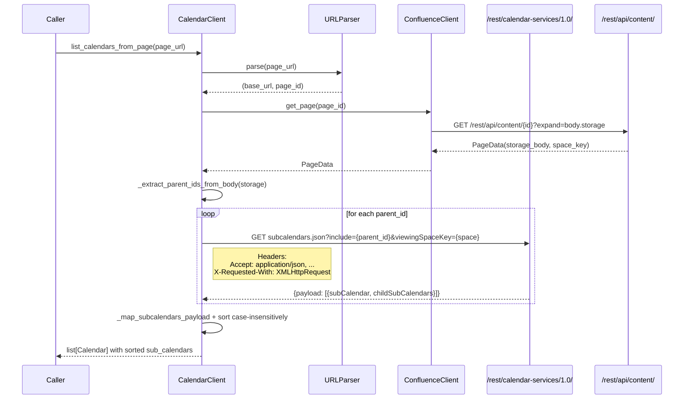
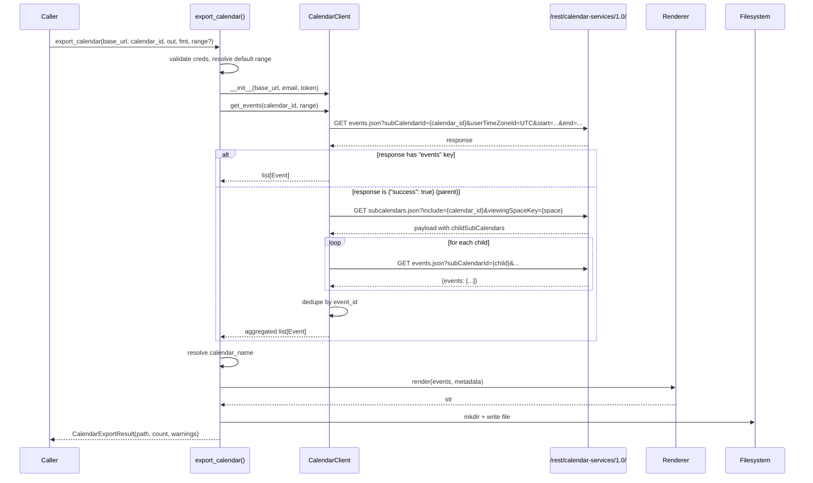
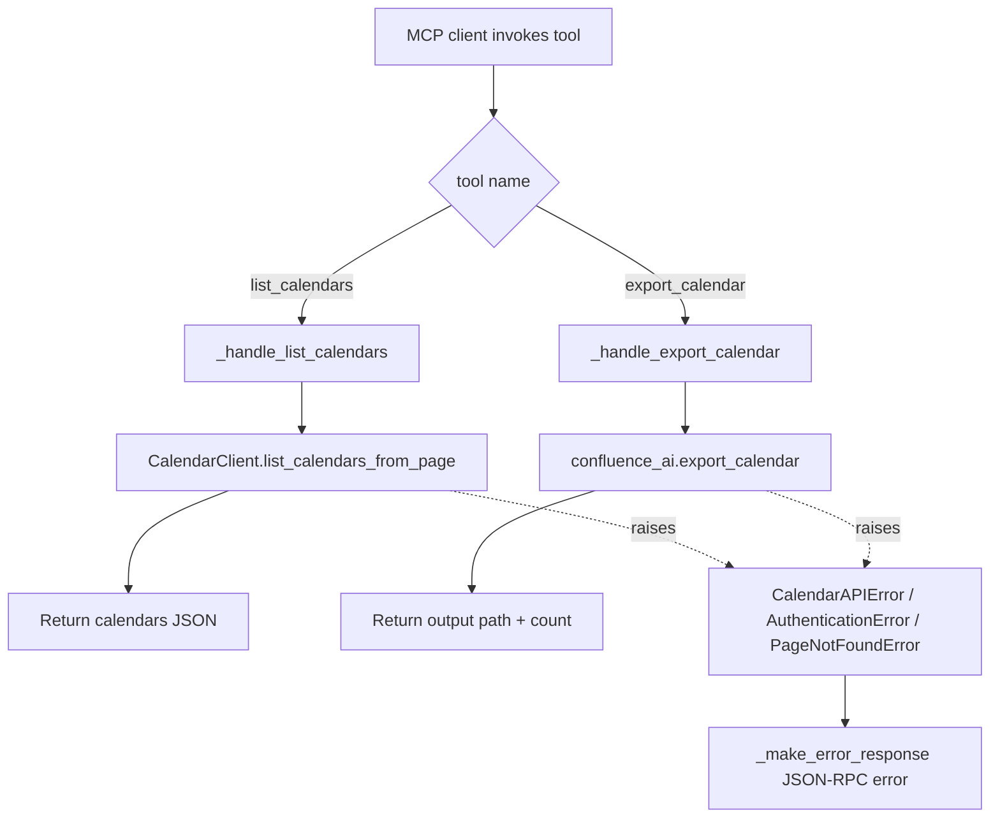

# Design Document

## Overview

This feature extends the `confluence-ai` library with **Confluence Team Calendar** export capability. It adds:

- A REST client (`CalendarClient`) that talks to the unofficial Team Calendars plugin endpoints under `/rest/calendar-services/1.0/` using the existing `atlassian-python-api` authenticated session.
- A **page-driven discovery** protocol that replaces the broken space-key endpoint — calendar IDs are read from `<ac:structured-macro ac:name="calendar">` elements in a Confluence page's storage format body, then resolved via the `subcalendars.json` endpoint.
- Data models for calendars, sub-calendars, events, and date ranges.
- An orchestration module (`CalendarExporter`) that wires discovery → retrieval → rendering → file output, with **parent → children auto-resolution** so callers can pass either a parent or a leaf sub-calendar ID.
- Two renderers: **JSON** (primary machine-readable format) and **Markdown** (secondary human-readable format). *No iCal.*
- A public convenience function `export_calendar()` exposed from `confluence_ai.__init__`.
- Two tools added to the **existing** `AspiceMCPServer` (`aspice-check/src/aspice_check/mcp_server.py`): `export_calendar` and `list_calendars`. Their JSON Schemas live alongside `EXPORT_PAGE_SCHEMA` in `aspice-check/src/aspice_check/mcp_tools.py`.

Matching the existing confluence-ai approach, **no CLI command is added**. Calendar export is only exposed through the library API and the MCP server, following the same pattern as the existing page export surface.

The feature follows the established patterns already used by the page-export pipeline: `@dataclass` models, structured exception hierarchy, src layout, and pytest + hypothesis for testing.

### Goals

1. Discover calendars from a **Confluence page URL** (reading calendar macros embedded in the page) and resolve parent → child sub-calendars.
2. Retrieve events within a caller-specified date range, with sensible defaults (30 days past → 90 days future).
3. Auto-resolve parent calendar IDs to child sub-calendars when callers pass a parent ID to `get_events` / `export_calendar`.
4. Expand recurring events into individual event instances inside the window (plugin-provided).
5. Produce JSON and Markdown outputs that round-trip faithfully (JSON) and are chronologically readable (Markdown).
6. Expose the capability through two surfaces — library API and MCP — without regressing the existing page-export surfaces. (No CLI, matching the existing confluence-ai approach for page export.)

### Non-Goals

- iCal / ICS output (explicitly rejected).
- Writing, updating, or deleting events.
- Sync/subscription semantics (one-shot export only).
- Server-side recurrence expansion (the plugin does this).
- Rich reminder/attendee graph traversal (we expose the raw fields; we do not chase attendee account IDs through the user API — that can be layered later).

## Architecture

### High-level fit



### Module layout (additions only)

```
confluence-ai/src/confluence_ai/
├── calendar_client.py        # NEW — REST calls to /rest/calendar-services/1.0/
├── calendar_export.py        # NEW — export_calendar() orchestration
├── calendar_renderer.py      # NEW — CalendarJSONRenderer + CalendarMarkdownRenderer
├── models.py                 # EXTEND — add calendar models at the bottom
├── exceptions.py             # EXTEND — add CalendarNotFoundError, CalendarAPIError
└── __init__.py               # EXTEND — export public API

aspice-check/src/aspice_check/
├── mcp_tools.py              # EXTEND — EXPORT_CALENDAR_SCHEMA, LIST_CALENDARS_SCHEMA
└── mcp_server.py             # EXTEND — register list_calendars, export_calendar handlers
```

### Rationale for key decisions

| Decision | Rationale |
|---|---|
| **Page-driven discovery instead of `?spaceKey=` listing** | The documented `/rest/calendar-services/1.0/calendar?spaceKey={key}` endpoint **returns HTTP 500 on Atlassian Cloud** (validated empirically on `here-technologies.atlassian.net`). The working alternative — observed from the UI's network traffic — is to read calendar macro IDs from a page's storage body and resolve each via `subcalendars.json?include={id}`. This mirrors how the Team Calendars page macro itself renders. |
| **Mandatory `X-Requested-With: XMLHttpRequest` header** | The Team Calendars plugin silently returns `{"success": true}` with **no `events` key** when requests do not include `X-Requested-With: XMLHttpRequest`, even for correctly authenticated Basic-Auth requests. This is not documented; it was discovered by comparing UI traffic with server responses. Every calendar REST call must include this header (and the matching `Accept: application/json, text/javascript, */*; q=0.01`) or results will silently drop. |
| **Parent → children auto-resolution in `get_events`** | Parent calendars (the IDs found in page macros) do not hold events themselves. A `get_events(parent_id)` call returns `{"success": true}` with no `events` key. Rather than forcing callers to know the distinction, the client detects this response and transparently resolves to child sub-calendars via `subcalendars.json`, fetches events from each, and dedupes by `event_id`. This keeps the public API simple: callers pass whatever ID they have. |
| Separate `calendar_client.py` instead of extending `ConfluenceClient` | The Team Calendars plugin is a distinct, unofficial REST API with its own error shapes, response structures, headers, and query parameters. Mixing it into `ConfluenceClient` would bloat that class and blur its role as the "page + attachments" API. The new client **reuses** the authenticated `requests.Session` from an existing `ConfluenceClient` (via composition) so we don't re-implement auth, and also borrows `ConfluenceClient.get_page` for the page-body fetch in discovery. |
| Separate calendar renderers instead of reusing `OutputRenderer` | The existing `OutputRenderer` protocol is tailored to `ContentNode` IR + `PageMetadata`. Calendars have a different IR (events) and different metadata. Forcing them into the same protocol would require either making `OutputRenderer` generic or producing synthetic `ContentNode` trees — both worse than two small dedicated renderers. Renderers still share the same naming convention (`render()` method returning `str`). |
| No CLI command added | The existing `confluence-ai` package does not expose a CLI for page export (the only exposed surface is the library API + MCP server). Matching that path keeps the package consistent and avoids introducing a new dependency surface. |
| Default range 30 days past → 90 days future | Matches the requirements; also avoids unbounded queries that would be slow and return huge payloads. |
| Recurrence expansion done server-side by Confluence | The Team Calendars plugin's `events.json` endpoint returns expanded occurrences when `start` and `end` are provided. We do **not** reimplement RRULE expansion. |

## Components and Interfaces

### `CalendarClient`

Responsibility: translate calendar-level operations into HTTP calls against `/rest/calendar-services/1.0/` and map responses / errors to models / exceptions. Uses the existing `ConfluenceClient.get_page` for the page-body fetch step of discovery.

```python
# confluence_ai/calendar_client.py

class CalendarClient:
    # Required headers for every Team Calendars REST request.
    _CALENDAR_HEADERS: ClassVar[dict[str, str]] = {
        "Accept": "application/json, text/javascript, */*; q=0.01",
        "X-Requested-With": "XMLHttpRequest",
    }

    def __init__(self, base_url: str, email: str, api_token: str) -> None:
        """Authenticate by constructing an internal ConfluenceClient and
        reusing its authenticated requests.Session for calendar calls.
        Raises ConfluenceConnectionError on unreachable host.
        """

    def list_calendars_from_page(self, page_url: str) -> list[Calendar]:
        """Discover calendars referenced by a Confluence page.

        Protocol:
          1. URLParser.parse(page_url) -> (base_url, page_id)
          2. confluence_client.get_page(page_id) -> PageData (storage body, space_key)
          3. _extract_parent_ids_from_body(storage) -> list[str]
          4. For each parent ID: list_subcalendars(parent_id, space_key)
          5. Merge into Calendar objects, sort both levels case-insensitively.

        Raises:
          PageNotFoundError on 404 for the page fetch.
          AuthenticationError on 401.
          CalendarAPIError on subcalendars.json failures.
          ConfluenceConnectionError on unreachable host.
        Returns empty list if the page contains no calendar macros.
        """

    def list_subcalendars(
        self,
        parent_id: str,
        space_key: str,
    ) -> Calendar:
        """GET /rest/calendar-services/1.0/calendar/subcalendars.json
           ?include={parent_id}
           &calendarContext=spaceCalendars
           &viewingSpaceKey={space_key}

        Returns a Calendar populated from the `payload[0].subCalendar`
        entry with `sub_calendars` filled from `childSubCalendars`.
        Used both by list_calendars_from_page and by get_events when it
        detects a parent-calendar response.
        Raises CalendarAPIError / CalendarNotFoundError as appropriate.
        """

    def get_events(
        self,
        calendar_id: str,
        date_range: DateRange,
    ) -> list[Event]:
        """GET /rest/calendar-services/1.0/calendar/events.json
           ?subCalendarId={calendar_id}
           &userTimeZoneId=UTC
           &start={iso8601}&end={iso8601}
           &_={epoch_millis}

        Parent → children auto-resolution:
          If response is {"success": true} and no "events" key (or an
          empty events list while the calendar is known to be a parent),
          call list_subcalendars(calendar_id, space_key) to discover
          children, recursively call get_events on each child, and return
          the aggregated list deduped by event_id.
          (space_key is inferred from the parent subcalendars.json
           response's `subCalendar.spaceKey` field.)

        Raises CalendarNotFoundError on 404, AuthenticationError on 401,
        CalendarAPIError on other non-2xx responses.
        """
```

Internal helpers:

- `_extract_parent_ids_from_body(storage_body: str) -> list[str]` — regex-extracts the `id` parameter from every `<ac:structured-macro ac:name="calendar">` element, splits comma-separated IDs, deduplicates while preserving order.
- `_map_subcalendars_payload(payload: list[dict]) -> list[Calendar]` — maps the `{payload: [{subCalendar, childSubCalendars: [{subCalendar: ...}]}]}` response shape to a list of `Calendar` objects with populated `sub_calendars`.
- `_map_event(raw: dict) -> Event` — maps one plugin event response to `Event`, parsing ISO 8601 timestamps into `datetime` with timezone.
- `_handle_http_error(exc, *, calendar_id=None, endpoint=None)` — translates non-2xx responses to the right custom exception; mirrors `ConfluenceClient._handle_http_error`.
- `_is_parent_response(data: dict) -> bool` — returns True iff `data.get("success") is True` and `"events" not in data`.
- `_sort_calendars_case_insensitive(cals: list[Calendar]) -> list[Calendar]` — sorts calendars (and their `sub_calendars`) by `name.casefold()`.

### Orchestration: `export_calendar()`

```python
# confluence_ai/calendar_export.py

def export_calendar(
    *,
    base_url: str,
    calendar_id: str,
    output_dir: str,
    email: str,
    api_token: str,
    output_format: str = "json",
    date_range: DateRange | None = None,
) -> CalendarExportResult:
    """Discover the calendar name, fetch events, render, and write file.

    Steps:
    1. Validate credentials (raise AuthenticationError on empty email/token).
    2. Resolve default date range if None: now-30d → now+90d (UTC).
    3. Construct CalendarClient.
    4. Fetch events via CalendarClient.get_events(calendar_id, range).
       The client handles parent → children auto-resolution transparently.
    5. Resolve calendar_name via resolve_calendar_name() (see below).
    6. Pick renderer based on output_format.
    7. Render, sanitize filename, write to disk.
    8. Return CalendarExportResult.
    """
```

**Calendar name resolution.** The events endpoint does not return the owning calendar's name with every request. The orchestrator resolves the name with this precedence:

1. If the caller-supplied `calendar_id` is a known parent — detected by calling `list_subcalendars(calendar_id, space_key)` *when* the initial events request signalled a parent — use the returned parent `subCalendar.name`.
2. Otherwise, use the first event's `sub_calendar_name` field if present.
3. Fall back to `calendar_id` itself.

(The orchestrator does not need a `page_url` parameter — the caller already has the `calendar_id` from `list_calendars_from_page` and passes it here.)

### Renderers

Both renderers live in `calendar_renderer.py` and expose a plain `render()` method; they are **not** registered in the page `OutputRenderer` registry.

```python
# confluence_ai/calendar_renderer.py

class CalendarJSONRenderer:
    def render(
        self, events: list[Event], metadata: CalendarMetadata
    ) -> str:
        """Emit indent=2 JSON:

        {
          "metadata": { calendar_id, calendar_name, export_timestamp,
                        exporter_version, date_range: {start, end},
                        event_count },
          "events": [ { event_id, summary, start, end, all_day,
                        description, location, organizer,
                        sub_calendar_id, sub_calendar_name }, ... ]
        }
        """

class CalendarMarkdownRenderer:
    def render(
        self, events: list[Event], metadata: CalendarMetadata
    ) -> str:
        """Emit YAML front-matter + events grouped by calendar date,
        chronologically sorted."""
```

Markdown output shape (illustrative):

```markdown
---
calendar_id: "abc-123"
calendar_name: "Team Leave"
export_timestamp: "2025-01-15T10:00:00+00:00"
exporter_version: "0.3.0"
date_range:
  start: "2024-12-16"
  end: "2025-04-15"
event_count: 7
---

# Team Leave

## 2025-01-02

- **Alice out**  —  All day
  - Organizer: alice@acme.com

## 2025-01-05

- **Sprint planning**  —  09:00 – 10:30 UTC
  - Location: Room 3 / Zoom
  - Description: Agenda link in wiki.
```

### MCP server additions

Two tools are added to the **existing** `AspiceMCPServer._tool_handlers` dict and `ALL_TOOL_SCHEMAS`:

**`list_calendars`** — inputs: `base_url`, `page_url`, optional `email`/`api_token`. Returns `{ "calendars": [ ... ] }` — the full sorted parent→children tree as produced by `list_calendars_from_page`.

**`export_calendar`** — inputs: `base_url`, `calendar_id`, `output_dir`, optional `output_format` (default `"json"`), optional `start_date`, `end_date`, `email`, `api_token`. Returns `{ "output_path", "event_count", "warnings" }`. Parent → children auto-resolution happens inside the library so the tool surface is unchanged.

Both handlers call the library-level functions and translate exceptions to JSON-RPC error payloads using the existing `_make_error_response` helper.

## Data Models

All new dataclasses live at the bottom of `confluence_ai/models.py` under a new section header.

```python
# confluence_ai/models.py  (new section)

@dataclass
class DateRange:
    """Inclusive start, exclusive end — matches most calendar APIs."""
    start: datetime.datetime
    end: datetime.datetime


@dataclass
class SubCalendar:
    """A child calendar nested under a parent Team Calendar."""
    calendar_id: str
    name: str
    type: str           # e.g., "custom", "leaves", "travel", "rota"
    color: str = ""
    description: str = ""
    parent_id: str = ""  # the `parentId` field from subcalendars.json


@dataclass
class Calendar:
    """A Confluence Team Calendar (parent).

    Populated from subcalendars.json — NOT from the broken
    ?spaceKey= listing endpoint.
    """
    calendar_id: str
    name: str
    type: str
    space_key: str = ""
    description: str = ""
    sub_calendars: list[SubCalendar] = field(default_factory=list)


@dataclass
class Event:
    """A single calendar occurrence.

    Recurring events are pre-expanded by Confluence into one Event per
    occurrence, so consumers do not need to handle RRULE.
    """
    event_id: str
    summary: str
    start: datetime.datetime        # tz-aware
    end:   datetime.datetime        # tz-aware
    all_day: bool = False
    description: str = ""
    location: str = ""
    organizer: str = ""
    sub_calendar_id: str = ""       # parent/sub cal that owns this event
    sub_calendar_name: str = ""


@dataclass
class CalendarMetadata:
    """Metadata block for the export output (JSON top-level + MD front-matter)."""
    calendar_id: str
    calendar_name: str
    export_timestamp: str           # ISO 8601 UTC
    exporter_version: str
    date_range: DateRange
    event_count: int = 0


@dataclass
class CalendarExportResult:
    """Returned by export_calendar()."""
    output_path: str
    event_count: int
    warnings: list[str] = field(default_factory=list)
```

### Invariants on the model

1. `Event.end >= Event.start`.
2. `DateRange.end > DateRange.start`.
3. `Event.all_day == True` implies `start` is at 00:00 and `end` is at 00:00 the next day in the event's originating timezone (Confluence plugin convention).
4. `CalendarMetadata.event_count == len(events)` in the rendered output.
5. For every `SubCalendar` sc belonging to a `Calendar` c, `sc.parent_id == c.calendar_id` when populated from the plugin response.

## REST API details — Confluence Team Calendars plugin

The Team Calendars plugin is an Atlassian-supplied marketplace app and its REST surface is **unofficial** and only partly documented. All endpoints are relative to `{base_url}/rest/calendar-services/1.0/` and authenticate with the same Basic Auth (email + API token) used by the page API.

### Required headers (mandatory on every call)

```
Accept:           application/json, text/javascript, */*; q=0.01
X-Requested-With: XMLHttpRequest
```

Without `X-Requested-With`, the `events.json` endpoint silently returns `{"success": true}` with no `events` key — even for Basic-Auth requests. This was validated empirically against `here-technologies.atlassian.net`. These headers must be sent on **every** call (`subcalendars.json` and `events.json`).

### Endpoints used

| Purpose | Method | Path | Key query params |
|---|---|---|---|
| Resolve one or more parent calendars to their full metadata (including children) | GET | `/calendar/subcalendars.json` | `include={parentId}`, `calendarContext=spaceCalendars`, `viewingSpaceKey={spaceKey}` |
| List events in a (sub-)calendar | GET | `/calendar/events.json` | `subCalendarId={id}`, `userTimeZoneId=UTC`, `start`, `end`, optional cache-buster `_={epoch_millis}` |

`start`/`end` must be full ISO 8601 timestamps in the form `YYYY-MM-DDTHH:MM:SSZ`. Date-only strings (`YYYY-MM-DD`) cause the server to reply **HTTP 500 with `BAD_START_DATETIME`**. The `_={epoch_millis}` parameter is the cache-buster the UI uses; it is optional but documented for parity.

The ~~`GET /calendar?spaceKey={key}`~~ endpoint is **not** used — it returns HTTP 500 on Atlassian Cloud.

### Response shapes (abridged)

`GET /calendar/subcalendars.json?include={parentId}&calendarContext=spaceCalendars&viewingSpaceKey={space}` returns:

```json
{
  "success": true,
  "payload": [
    {
      "subCalendar": {
        "id": "abc-123",
        "name": "Team Leave",
        "type": "custom",
        "spaceKey": "ENG",
        "description": "Team out-of-office"
      },
      "childSubCalendars": [
        {
          "subCalendar": {
            "id": "abc-123-leaves",
            "name": "Leaves",
            "type": "leaves",
            "parentId": "abc-123"
          }
        },
        {
          "subCalendar": {
            "id": "abc-123-travel",
            "name": "Travel",
            "type": "travel",
            "parentId": "abc-123"
          }
        }
      ]
    }
  ]
}
```

`GET /calendar/events.json?subCalendarId=abc-123-leaves&userTimeZoneId=UTC&start=2024-12-16T00:00:00Z&end=2025-04-15T00:00:00Z` (child calendar) returns:

```json
{
  "events": [
    {
      "id": "evt-9f8e",
      "subCalendarId": "abc-123-leaves",
      "subCalendarName": "Leaves",
      "title": "Alice out",
      "start": "2025-01-02T00:00:00.000Z",
      "end":   "2025-01-03T00:00:00.000Z",
      "allDay": true,
      "description": "",
      "location": "",
      "organizer": { "displayName": "Alice", "email": "alice@acme.com" }
    }
  ]
}
```

The same request against a **parent** calendar ID (with everything else identical) returns:

```json
{ "success": true }
```

This is the trigger for the parent → children auto-resolution branch in `get_events`.

Field naming differences (plugin ↔ our `Event` model) are normalised in `_map_event`:

| Plugin field | `Event` field |
|---|---|
| `id` | `event_id` |
| `title` | `summary` |
| `allDay` | `all_day` |
| `organizer.email` or `.displayName` | `organizer` |
| `subCalendarId` / `subCalendarName` | `sub_calendar_id` / `sub_calendar_name` |

Unknown/absent fields default to empty strings or `False` for booleans so the model shape stays stable.

### Error mapping

| HTTP | Exception |
|---|---|
| 401 | `AuthenticationError` |
| 403 on calendar | `CalendarNotFoundError` (access-denied maps to same class, per existing `PageNotFoundError` pattern) |
| 404 on calendar | `CalendarNotFoundError` |
| 500 on events.json with `BAD_START_DATETIME` | `CalendarAPIError` with a hint about date format |
| 5xx / other non-2xx | `CalendarAPIError(endpoint=..., status_code=...)` |
| Connection error | `ConfluenceConnectionError` |

## Rendering strategy

### JSON rendering

- Top-level object: `{ "metadata": {...}, "events": [...] }`.
- `datetime` serialised as ISO 8601 with explicit timezone offset (via `datetime.isoformat()`; we ensure `tzinfo` is always set — events without a timezone from the API are normalised to UTC at parse time).
- `DateRange` serialised as `{ "start": ISO8601, "end": ISO8601 }`.
- Uses `indent=2`, `ensure_ascii=False` — same conventions as the existing `JSONRenderer`.

### Markdown rendering

1. **Front-matter**: YAML block with `calendar_id`, `calendar_name`, `export_timestamp`, `exporter_version`, `date_range.start/end` (as `YYYY-MM-DD`), `event_count`.
2. **Heading**: `# {calendar_name}`.
3. **Grouping**: events grouped by `local_date(event.start)` (the date in the event's own timezone).
4. **Ordering**: groups sorted ascending by date; within a group events sorted ascending by `start` then `summary`.
5. **Event line**:
   - All-day: `- **{summary}**  —  All day`
   - Timed: `- **{summary}**  —  {HH:MM} – {HH:MM} {TZNAME}`
   - Optional sub-bullets (only if non-empty): `Location:`, `Organizer:`, `Description:` (first line only; multi-line descriptions are wrapped in a blockquote).

### Filename sanitization

Reuses the existing `_sanitize_calendar_name` helper:

```python
def _sanitize_calendar_name(name: str) -> str:
    sanitized = name.replace(" ", "_")
    sanitized = re.sub(r"[^a-zA-Z0-9_\-]", "", sanitized)
    return sanitized or "calendar"
```

Final filename: `{sanitized}.json` or `{sanitized}.md`.

## Integration points

### Public API (`confluence_ai/__init__.py`)

Adds to the existing exports:

```python
# New convenience function
from confluence_ai.calendar_export import export_calendar

# New models
from confluence_ai.models import (
    Calendar,
    SubCalendar,
    Event,
    DateRange,
    CalendarMetadata,
    CalendarExportResult,
)

# New exceptions
from confluence_ai.exceptions import (
    CalendarNotFoundError,
    CalendarAPIError,
)
```

All new names added to `__all__`. No existing names change.

### MCP server

Two new entries in `_tool_handlers` and two new schemas appended to `ALL_TOOL_SCHEMAS`:

```python
# mcp_server.py additions
self._tool_handlers.update({
    "list_calendars":  self._handle_list_calendars,
    "export_calendar": self._handle_export_calendar,
})

def _handle_list_calendars(self, params: dict) -> dict:
    from confluence_ai.calendar_client import CalendarClient
    client = CalendarClient(
        base_url=params["base_url"],
        email=params.get("email") or os.environ["CONFLUENCE_EMAIL"],
        api_token=params.get("api_token") or os.environ["CONFLUENCE_API_TOKEN"],
    )
    calendars = client.list_calendars_from_page(params["page_url"])
    return {"calendars": [asdict(c) for c in calendars]}

def _handle_export_calendar(self, params: dict) -> dict:
    from confluence_ai import export_calendar, DateRange
    date_range = None
    if params.get("start_date") and params.get("end_date"):
        date_range = DateRange(
            start=datetime.fromisoformat(params["start_date"]),
            end=datetime.fromisoformat(params["end_date"]),
        )
    result = export_calendar(
        base_url=params["base_url"],
        calendar_id=params["calendar_id"],
        output_dir=params["output_dir"],
        output_format=params.get("output_format", "json"),
        date_range=date_range,
        email=params.get("email") or os.environ.get("CONFLUENCE_EMAIL", ""),
        api_token=params.get("api_token") or os.environ.get("CONFLUENCE_API_TOKEN", ""),
    )
    return {
        "output_path": result.output_path,
        "event_count": result.event_count,
        "warnings": result.warnings,
    }
```

**`LIST_CALENDARS_SCHEMA`** updated parameters:

| Param | Type | Required | Notes |
|---|---|---|---|
| `base_url` | string | yes | Confluence Cloud base URL |
| `page_url` | string | yes | Full page URL containing calendar macros |
| `email` | string | no | Falls back to `CONFLUENCE_EMAIL` env var |
| `api_token` | string | no | Falls back to `CONFLUENCE_API_TOKEN` env var |

(The previous `space_key` parameter is removed — discovery is now page-driven.)

`EXPORT_CALENDAR_SCHEMA` is unchanged from Requirement 6.1 (`calendar_id`, `base_url`, `output_dir`, `output_format`, `start_date`, `end_date`, `email`, `api_token`).

## Flow diagrams

### Sequence — `list_calendars_from_page()`



### Sequence — `export_calendar()` with parent → children fallback



### Flow — MCP tool dispatch



## Correctness Properties

*A property is a characteristic or behavior that should hold true across all valid executions of a system — essentially, a formal statement about what the system should do. Properties serve as the bridge between human-readable specifications and machine-verifiable correctness guarantees.*

The prework analysis identified twelve consolidated properties. Each maps to one or more acceptance criteria.

### Property 1: `_map_subcalendars_payload` preserves fields and sorts both levels case-insensitively

*For any* plugin `subcalendars.json` response payload containing N parent entries, each with M_i children, `CalendarClient._map_subcalendars_payload(payload)` returns a list of N `Calendar` instances such that (a) every `calendar_id`, `name`, `type`, `space_key`, and `description` equals the corresponding `subCalendar.*` input field; (b) each `sub_calendars` list contains exactly M_i `SubCalendar` instances with `calendar_id`, `name`, `type`, and `parent_id` matching the corresponding `childSubCalendars[].subCalendar.*` inputs; (c) the top-level list is sorted ascending by `name.casefold()`; and (d) each `sub_calendars` list is sorted ascending by `name.casefold()`.

**Validates: Requirements 1.3, 1.9, 1.10**

### Property 2: Macro extraction returns all comma-separated IDs from every calendar macro

*For any* synthetic XHTML storage-format string containing zero or more `<ac:structured-macro ac:name="calendar">...<ac:parameter ac:name="id">{csv}</ac:parameter>...</ac:structured-macro>` blocks (with surrounding arbitrary markup that does not contain the literal `ac:name="calendar"`), `CalendarClient._extract_parent_ids_from_body(body)` returns a list equal to the in-order, deduplicated concatenation of the stripped, comma-separated IDs from each macro, skipping empty segments.

**Validates: Requirements 1.1, 1.4**

### Property 3: Event response mapping is field-complete and timezone-aware

*For any* plugin event JSON dict, `CalendarClient._map_event(raw)` returns an `Event` instance where (a) `event_id`, `summary`, `description`, `location`, `organizer`, `sub_calendar_id`, and `sub_calendar_name` are `str` (possibly empty) and never `None`; (b) `start` and `end` are `datetime` instances with `tzinfo is not None`; (c) `end >= start`; (d) `all_day` is a `bool` reflecting the `allDay` input flag.

**Validates: Requirements 2.4**

### Property 4: `get_events` passes through the plugin's event list for a child calendar

*For any* list of plugin event dicts D injected as the mocked `events.json` response body `{"events": D}`, `CalendarClient.get_events(child_id, date_range)` returns a list of exactly `len(D)` `Event` instances whose fields are the `_map_event` image of `D` element-wise and in the same order (no filtering, deduping, or reordering by the client).

**Validates: Requirements 2.1**

### Property 5: JSON render + parse round-trips events and metadata

*For any* `CalendarMetadata` M and any list of `Event` instances E, parsing the output of `CalendarJSONRenderer().render(E, M)` with `json.loads` produces a dict D such that (a) `D["metadata"]` contains every field of M with values equal to M's (dates serialised as ISO 8601, compared by instant); (b) `D["events"]` is a list of length `len(E)`; (c) for each `i`, `D["events"][i]` contains `event_id`, `summary`, `start`, `end`, `all_day`, `description`, `location`, `organizer` matching `E[i]` (datetime fields parsed via `datetime.fromisoformat` and compared by UTC instant).

**Validates: Requirements 3.1, 3.2, 3.3, 3.4**

### Property 6: Markdown front-matter parses to the original metadata

*For any* `CalendarMetadata` M and any list of `Event` instances E, the output of `CalendarMarkdownRenderer().render(E, M)` begins with a `---\n...\n---\n` YAML front-matter block whose `yaml.safe_load` result is a dict containing `calendar_id`, `calendar_name`, `export_timestamp`, `exporter_version`, `date_range.start`, `date_range.end`, and `event_count`, with values equal to M's (dates compared as `YYYY-MM-DD` strings, event_count compared as int).

**Validates: Requirements 4.1**

### Property 7: Markdown events render grouped and chronologically ordered

*For any* list of `Event` instances E (in any input order) and any metadata M, the markdown output of `CalendarMarkdownRenderer().render(E, M)` contains, in reading order, one `## YYYY-MM-DD` date header per distinct local date of `E[*].start`, these headers appear in strictly ascending date order, and within each date group the event bullets are emitted in ascending `start` order. Additionally, for every `e ∈ E`, the string `e.summary` appears at least once in the rendered output.

**Validates: Requirements 4.2, 4.3**

### Property 8: All-day vs timed event rendering dichotomy

*For any* `Event` e rendered in markdown: if `e.all_day is True`, the event's bullet line contains the literal substring `"All day"` and does **not** contain an `HH:MM` time pattern; if `e.all_day is False`, the event's bullet line contains two `HH:MM` substrings (start and end) separated by an en-dash and does **not** contain `"All day"`.

**Validates: Requirements 4.4**

### Property 9: Calendar filename sanitization produces filesystem-safe names

*For any* input string s, `_sanitize_calendar_name(s)` returns a result r such that (a) `re.fullmatch(r"[A-Za-z0-9_\-]+", r)` matches (or r equals the fallback `"calendar"` when the sanitised string would be empty), (b) `r` contains no whitespace characters, and (c) every character in s that is `[A-Za-z0-9_\-]` is preserved and every space character in s becomes `_` at the same relative position.

**Validates: Requirements 5.5**

### Property 10: `export_calendar` result invariants

*For any* valid credentials and any generated list of events E that the mocked `CalendarClient.get_events` returns, calling `export_calendar(...)` produces a `CalendarExportResult` r such that (a) `os.path.exists(r.output_path) is True`, (b) `r.event_count == len(E)`, (c) `r.warnings` is a `list`, and (d) the file at `r.output_path` is non-empty and parseable under the selected format (valid JSON for `output_format="json"`, contains a YAML front-matter block for `output_format="markdown"`).

**Validates: Requirements 5.3**

### Property 11: Parent → children fallback triggers on the no-events response and aggregates deduped child events

*For any* parent calendar ID P with K child sub-calendars C_1..C_K each holding event lists E_1..E_K (possibly overlapping by `event_id`), when `CalendarClient.get_events(P, range)` receives the response `{"success": true}` (no `events` key) for P, it subsequently issues `list_subcalendars(P, space_key)` followed by one `get_events(C_i, range)` per child, and returns a list equal to the union of E_1..E_K deduplicated by `event_id` (first occurrence wins). Conversely, when the initial response contains an `events` key (even with an empty list), no fallback requests are issued.

**Validates: Requirements 2.2, 2.3, 5.6**

### Property 12: Every calendar REST request carries the required headers and parameters

*For any* invocation of `CalendarClient.list_calendars_from_page`, `CalendarClient.list_subcalendars`, or `CalendarClient.get_events` that triggers HTTP GET calls to paths under `/rest/calendar-services/1.0/`, every such request carries (a) the header `X-Requested-With: XMLHttpRequest`, (b) the header `Accept: application/json, text/javascript, */*; q=0.01`, and (c) for any `events.json` URL specifically, the query parameter `userTimeZoneId=UTC`.

**Validates: Requirements 1.8, 2.8, 2.9**

---

The remaining acceptance criteria (1.2 implementation-level, 1.5, 1.6, 1.7, 2.5, 2.6, 2.7, 5.1, 5.2, 5.4, 6.1–6.8, 7.1–7.4, 8.1–8.3) are classified as EXAMPLE, SMOKE, INTEGRATION, or EDGE_CASE and are covered by unit/integration tests — see the Testing Strategy section.

## Error Handling

### New exception classes (added to `confluence_ai/exceptions.py`)

```python
class CalendarNotFoundError(ExporterError):
    """Raised when a calendar ID is not found or the user lacks access."""

    def __init__(
        self,
        calendar_id: str,
        status_code: int | None = None,
        message: str | None = None,
    ) -> None:
        self.calendar_id = calendar_id
        self.status_code = status_code
        if message:
            msg = message
        elif status_code == 403:
            msg = (
                f"Access denied for calendar {calendar_id!r} (HTTP 403). "
                "The authenticated user may lack read permission."
            )
        else:
            msg = (
                f"Calendar {calendar_id!r} not found"
                f"{f' (HTTP {status_code})' if status_code else ''}."
            )
        super().__init__(msg)


class CalendarAPIError(ExporterError):
    """Raised when the Team Calendars REST API returns an unexpected error."""

    def __init__(
        self,
        endpoint: str,
        status_code: int | None = None,
        message: str | None = None,
    ) -> None:
        self.endpoint = endpoint
        self.status_code = status_code
        msg = message or (
            f"Calendar API error at {endpoint!r}"
            f"{f' (HTTP {status_code})' if status_code else ''}."
        )
        super().__init__(msg)
```

Both subclass `ExporterError`, so existing `except ExporterError:` blocks continue to cover them.

### Error handling policy by surface

| Surface | Strategy |
|---|---|
| Library (`export_calendar`, `list_calendars_from_page`) | Raise typed exceptions. Callers catch what they need. |
| MCP | Catch broad `Exception` inside the tool handler; the existing dispatcher converts to JSON-RPC error code `-32603` with `exc` message. Credential / parameter errors surface as `-32602`. |

### Credential validation order

1. If `email` is empty → raise `AuthenticationError(base_url, message="email required")`.
2. If `api_token` is empty → raise `AuthenticationError(base_url, message="api_token required")`.
3. Connect. If connect fails → `ConfluenceConnectionError`.
4. Any subsequent 401 from the plugin API → `AuthenticationError(status_code=401)`.

### BAD_START_DATETIME hint

If `events.json` returns HTTP 500 and the body contains `BAD_START_DATETIME`, `CalendarAPIError` is raised with the message hint: *"date range must use full ISO 8601 timestamps (YYYY-MM-DDTHH:MM:SSZ), not date-only"*.

## Testing Strategy

### Dual testing approach

- **Unit tests** cover specific examples, edge cases, and error paths for each module.
- **Property-based tests** cover the universal properties above using `hypothesis`.

Both are necessary: the examples anchor expected concrete behaviour (e.g., "HTTP 404 → `CalendarNotFoundError`"); the properties exercise the input space to catch unexpected edge cases (timezone handling, Unicode in names, recurrence counts, macro parsing, header invariants).

### Test layout (new files)

```
confluence-ai/tests/
├── unit/
│   ├── test_calendar_client_discovery.py      # 1.5, 1.6, 1.7 (error paths for list_calendars_from_page)
│   ├── test_calendar_client_errors.py         # 2.6, 7.1–7.4
│   ├── test_calendar_client_passthrough.py    # URL construction for events.json
│   ├── test_calendar_export_defaults.py       # 2.5, 5.1, 5.2, 5.4
│   ├── test_calendar_exceptions.py            # 7.3, 7.4 (attribute tests)
│   ├── test_calendar_mcp_handlers.py          # 6.1, 6.2, 6.3, 6.4, 6.5, 6.6
│   └── test_public_api.py                     # 8.1, 8.2, 8.3
├── property/
│   ├── test_prop01_subcalendars_mapping.py     # Property 1
│   ├── test_prop02_macro_extraction.py         # Property 2
│   ├── test_prop03_event_mapping.py            # Property 3
│   ├── test_prop04_get_events_passthrough.py   # Property 4
│   ├── test_prop05_json_roundtrip.py           # Property 5
│   ├── test_prop06_markdown_frontmatter.py     # Property 6
│   ├── test_prop07_markdown_ordering.py        # Property 7
│   ├── test_prop08_allday_dichotomy.py         # Property 8
│   ├── test_prop09_filename_sanitization.py    # Property 9
│   ├── test_prop10_export_result.py            # Property 10
│   ├── test_prop11_parent_fallback.py          # Property 11
│   └── test_prop12_request_invariants.py       # Property 12
└── integration/
    └── test_calendar_mcp_tools.py              # end-to-end via AspiceMCPServer in-proc
```

### Property-based testing configuration

- Library: **hypothesis** (already in `[project.optional-dependencies] dev`).
- Each property test uses `@given` with custom strategies defined at the top of the file.
- Tests inherit the repository's existing `ci` profile (100 examples) and `dev` profile (50 examples) from `tests/conftest.py`.
- Each property test is tagged with a module-level docstring of the form:

  ```python
  """Feature: confluence-calendar-export, Property 11: Parent → children fallback triggers on the no-events response and aggregates deduped child events."""
  ```

- Each property is implemented by a **single** `@given`-decorated test function (may have helper strategies).

### Key strategies

- `st_datetime_tz()` — generates timezone-aware `datetime` instances using `hypothesis.strategies.datetimes` + a small set of `zoneinfo.ZoneInfo` timezones (UTC, a couple of positive/negative offsets, DST-affected zones).
- `st_event()` — composes an `Event` with a random tz-aware `start`, a random non-negative `timedelta` for duration, and random summary/description/location strings (including Unicode).
- `st_plugin_event_dict()` — generates the raw plugin JSON dict shape used by mapping tests.
- `st_subcalendars_payload()` — generates the `{payload: [{subCalendar, childSubCalendars: [{subCalendar}]}]}` shape with N parents × M_i children of random names.
- `st_calendar_macro_body()` — generates synthetic XHTML bodies containing N `<ac:structured-macro ac:name="calendar">` elements with random IDs, optional comma-joined, wrapped in arbitrary safe filler markup.
- `st_calendar_metadata()` — composes a `CalendarMetadata` with a random `DateRange` where `end > start`.
- `st_daterange()` — generates a random `DateRange` around a fixed epoch.
- `st_parent_with_children()` — produces a parent ID plus K child IDs and event lists (possibly overlapping by `event_id`) for the parent-fallback property.

### Mocking strategy

- All `requests.Session.get` calls are mocked with `pytest-mock` or a fixture that returns predefined `Response` objects. Fixtures include:
  - `FakeResponse(status_code=200, json={"events": [...]})` — normal child-calendar event response.
  - `FakeResponse(status_code=200, json={"success": True})` — parent-calendar trigger response for fallback tests.
  - `FakeResponse(status_code=200, json={"payload": [{"subCalendar": {...}, "childSubCalendars": [...]}]})` — subcalendars.json response.
  - `FakeResponse(status_code=401/403/404/500, ...)` — error paths.
- For Property 12, fixtures record the `headers` dict and full URL of every mocked request so the test can assert on each.
- For macro-extraction tests (Property 2), no HTTP mock is needed — `_extract_parent_ids_from_body` takes a raw string.
- For page-fetch tests, `ConfluenceClient.get_page` is mocked with a `PageData` fixture containing a synthetic storage body.
- MCP handler tests instantiate `AspiceMCPServer()` and call its `_handle_request` directly with crafted JSON-RPC dicts (no stdio round-trip).
- No live Confluence calls — every test runs offline.

### Review checklist before implementation

- [ ] Every property-based test runs ≥100 iterations under the `ci` profile.
- [ ] All new exception classes export from `confluence_ai.__init__` and appear in `__all__`.
- [ ] `EXPORT_CALENDAR_SCHEMA` and `LIST_CALENDARS_SCHEMA` (with the new `page_url` param) appear in `ALL_TOOL_SCHEMAS` so `tools/list` advertises them.
- [ ] `list_calendars_from_page` and `list_subcalendars` are public on `CalendarClient`; the old `list_calendars(space_key)` is removed.
- [ ] The mandatory headers dict `{"Accept": ..., "X-Requested-With": ...}` is attached to every GET in the client (Property 12).
- [ ] Parent → children fallback in `get_events` is exercised by Property 11 with both trigger (`{"success": true}`) and non-trigger (`{"events": []}`) cases.
- [ ] No regression in existing page-export tests when new code is imported (side-effect imports kept minimal).
