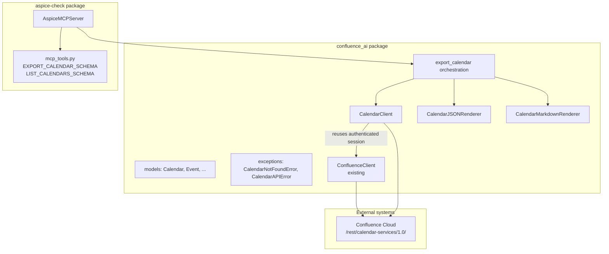
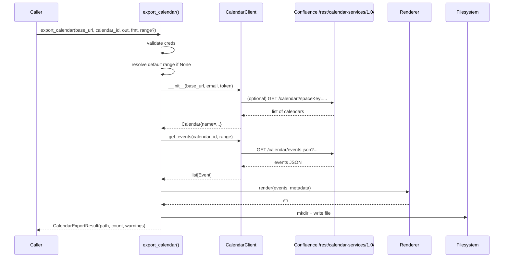
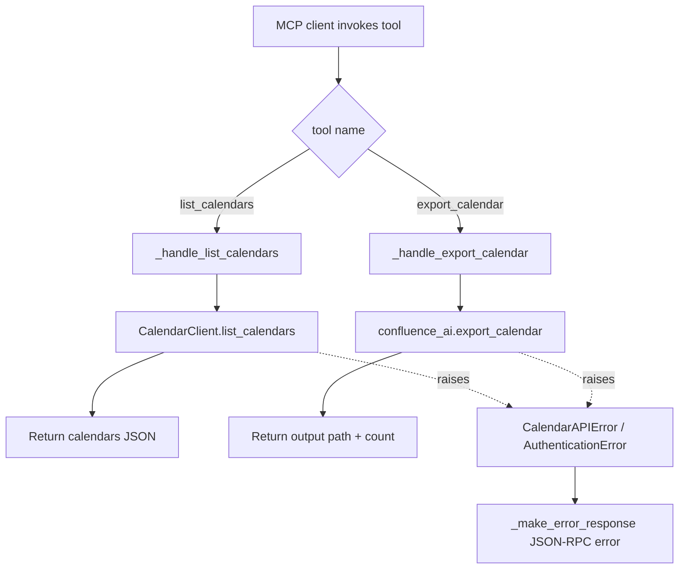

# Design Document

## Overview

This feature extends the `confluence-ai` library with **Confluence Team Calendar** export capability. It adds:

- A REST client (`CalendarClient`) that talks to the unofficial Team Calendars plugin endpoints under `/rest/calendar-services/1.0/` using the existing `atlassian-python-api` authenticated session.
- Data models for calendars, sub-calendars, events, and date ranges.
- An orchestration module (`CalendarExporter`) that wires discovery → retrieval → rendering → file output.
- Two renderers: **JSON** (primary machine-readable format) and **Markdown** (secondary human-readable format). *No iCal.*
- A public convenience function `export_calendar()` exposed from `confluence_ai.__init__`.
- Two tools added to the **existing** `AspiceMCPServer` (`aspice-check/src/aspice_check/mcp_server.py`): `export_calendar` and `list_calendars`. Their JSON Schemas live alongside `EXPORT_PAGE_SCHEMA` in `aspice-check/src/aspice_check/mcp_tools.py`.

Matching the existing confluence-ai approach, **no CLI command is added**. Calendar export is only exposed through the library API and the MCP server, following the same pattern as the existing page export surface.

The feature follows the established patterns already used by the page-export pipeline: `@dataclass` models, structured exception hierarchy, src layout, and pytest + hypothesis for testing.

### Goals

1. Discover calendars in a space (parents and sub-calendars).
2. Retrieve events within a caller-specified date range, with sensible defaults (30 days past → 90 days future).
3. Expand recurring events into individual event instances inside the window.
4. Produce JSON and Markdown outputs that round-trip faithfully (JSON) and are chronologically readable (Markdown).
5. Expose the capability through two surfaces — library API and MCP — without regressing the existing page-export surfaces. (No CLI, matching the existing confluence-ai approach for page export.)

### Non-Goals

- iCal / ICS output (explicitly rejected).
- Writing, updating, or deleting events.
- Sync/subscription semantics (one-shot export only).
- Rich reminder/attendee graph traversal (we expose the raw fields; we do not chase attendee account IDs through the user API — that can be layered later).

## Architecture

### High-level fit



### Module layout (additions only)

```
confluence-ai/src/confluence_ai/
├── calendar_client.py        # NEW — REST calls to /rest/calendar-services/1.0/
├── calendar_export.py        # NEW — export_calendar() orchestration
├── calendar_renderer.py      # NEW — CalendarJSONRenderer + CalendarMarkdownRenderer
├── models.py                 # EXTEND — add calendar models at the bottom
├── exceptions.py             # EXTEND — add CalendarNotFoundError, CalendarAPIError
└── __init__.py               # EXTEND — export public API

aspice-check/src/aspice_check/
├── mcp_tools.py              # EXTEND — EXPORT_CALENDAR_SCHEMA, LIST_CALENDARS_SCHEMA
└── mcp_server.py             # EXTEND — register list_calendars, export_calendar handlers
```

### Rationale for key decisions

| Decision | Rationale |
|---|---|
| Separate `calendar_client.py` instead of extending `ConfluenceClient` | The Team Calendars plugin is a distinct, unofficial REST API with its own error shapes, response structures, and query parameters. Mixing it into `ConfluenceClient` would bloat that class and blur its role as the "page + attachments" API. The new client **reuses** the authenticated `requests.Session` from an existing `ConfluenceClient` (via composition) so we don't re-implement auth. |
| Separate calendar renderers instead of reusing `OutputRenderer` | The existing `OutputRenderer` protocol is tailored to `ContentNode` IR + `PageMetadata`. Calendars have a different IR (events) and different metadata. Forcing them into the same protocol would require either making `OutputRenderer` generic or producing synthetic `ContentNode` trees — both worse than two small dedicated renderers. Renderers still share the same naming convention (`render()` method returning `str`). |
| No CLI command added | The existing `confluence-ai` package does not expose a CLI for page export (the only exposed surface is the library API + MCP server). Matching that path keeps the package consistent and avoids introducing a new dependency surface. If CLI demand emerges later, a dedicated entry point can be added without touching the library API. |
| Default range 30 days past → 90 days future | Matches the requirements; also avoids unbounded queries that would be slow and return huge payloads. |
| Recurrence expansion done server-side by Confluence | The Team Calendars plugin's `events` endpoint already returns expanded occurrences when `start` and `end` are provided. We do **not** reimplement RRULE expansion. |

## Components and Interfaces

### `CalendarClient`

Responsibility: translate calendar-level operations into HTTP calls against `/rest/calendar-services/1.0/` and map responses / errors to models / exceptions.

```python
# confluence_ai/calendar_client.py

class CalendarClient:
    def __init__(self, base_url: str, email: str, api_token: str) -> None:
        """Authenticate by constructing an internal atlassian-python-api
        Confluence object and reusing its requests.Session for calendar
        calls. Raises ConfluenceConnectionError on unreachable host.
        """

    def list_calendars(self, space_key: str) -> list[Calendar]:
        """GET /rest/calendar-services/1.0/calendar?spaceKey={space_key}

        Returns parent calendars with their nested sub-calendars.
        Raises CalendarAPIError on non-2xx responses, AuthenticationError
        on 401, CalendarNotFoundError on 404.
        """

    def get_events(
        self,
        calendar_id: str,
        date_range: DateRange,
    ) -> list[Event]:
        """GET /rest/calendar-services/1.0/calendar/events.json
          ?subCalendarId={calendar_id}&start={iso}&end={iso}

        Accepts either a parent calendar ID or a sub-calendar ID — the
        plugin uses the same parameter name for both. Returns a flat list
        of Event instances with recurring events already expanded to
        occurrences. Raises CalendarNotFoundError on 404,
        CalendarAPIError on other non-2xx responses.
        """
```

Internal helpers:

- `_map_calendar(raw: dict) -> Calendar` — maps one plugin calendar response to the `Calendar` dataclass.
- `_map_event(raw: dict) -> Event` — maps one plugin event response to `Event`, parsing ISO 8601 timestamps into `datetime` with timezone.
- `_handle_http_error(exc, *, calendar_id=None)` — translates `HTTPError` to the right custom exception; mirrors `ConfluenceClient._handle_http_error`.

### Orchestration: `export_calendar()`

```python
# confluence_ai/calendar_export.py

def export_calendar(
    *,
    base_url: str,
    calendar_id: str,
    output_dir: str,
    email: str,
    api_token: str,
    output_format: str = "json",
    date_range: DateRange | None = None,
) -> CalendarExportResult:
    """Discover the calendar name, fetch events, render, and write file.

    Steps:
    1. Validate credentials (raise AuthenticationError on empty email/token).
    2. Resolve default date range if None: now-30d → now+90d (UTC).
    3. Construct CalendarClient.
    4. Fetch calendar metadata (via list_calendars on the calendar's space
       if known; otherwise we keep the calendar_id as name fallback).
       See "Calendar name resolution" below.
    5. Fetch events in the window.
    6. Pick renderer based on output_format.
    7. Render, sanitize filename, write to disk.
    8. Return CalendarExportResult.
    """
```

**Calendar name resolution.** The plugin's events endpoint does not return the owning calendar's name with every request. To fill metadata (`calendar_name`) we resolve it once at the start:

- If the caller passes a `space_key` (optional future param, not in v1 requirements), we call `list_calendars(space_key)` and pick the matching `calendar_id`.
- Otherwise we fall back to the value returned on the first event's `subCalendarName` field if present, else `calendar_id` itself.

### Renderers

Both renderers live in `calendar_renderer.py` and expose a plain `render()` method; they are **not** registered in the page `OutputRenderer` registry.

```python
# confluence_ai/calendar_renderer.py

class CalendarJSONRenderer:
    def render(
        self, events: list[Event], metadata: CalendarMetadata
    ) -> str:
        """Emit indent=2 JSON:

        {
          "metadata": { calendar_id, calendar_name, export_timestamp,
                        exporter_version, date_range: {start, end} },
          "events": [ { event_id, summary, start, end, all_day,
                        description, location, organizer }, ... ]
        }
        """

class CalendarMarkdownRenderer:
    def render(
        self, events: list[Event], metadata: CalendarMetadata
    ) -> str:
        """Emit YAML front-matter + events grouped by calendar date,
        chronologically sorted."""
```

Markdown output shape (illustrative):

```markdown
---
calendar_id: "abc-123"
calendar_name: "Team Leave"
export_timestamp: "2025-01-15T10:00:00+00:00"
exporter_version: "0.3.0"
date_range:
  start: "2024-12-16"
  end: "2025-04-15"
event_count: 7
---

# Team Leave

## 2025-01-02

- **Alice out**  —  All day
  - Organizer: alice@acme.com

## 2025-01-05

- **Sprint planning**  —  09:00 – 10:30 UTC
  - Location: Room 3 / Zoom
  - Description: Agenda link in wiki.
```

### MCP server additions

Two tools are added to the **existing** `AspiceMCPServer._tool_handlers` dict and `ALL_TOOL_SCHEMAS`:

**`list_calendars`** — inputs: `base_url`, `space_key`, optional `email`/`api_token`. Returns `{ "calendars": [ ... ] }`.

**`export_calendar`** — inputs: `base_url`, `calendar_id`, `output_dir`, optional `output_format` (default `"json"`), optional `start_date`, `end_date`, `email`, `api_token`. Returns `{ "output_path", "event_count", "warnings" }`.

Both handlers call the library-level functions and translate exceptions to JSON-RPC error payloads using the existing `_make_error_response` helper.

## Data Models

All new dataclasses live at the bottom of `confluence_ai/models.py` under a new section header.

```python
# confluence_ai/models.py  (new section)

@dataclass
class DateRange:
    """Inclusive start, exclusive end — matches most calendar APIs."""
    start: datetime.datetime
    end: datetime.datetime


@dataclass
class SubCalendar:
    """A child calendar nested under a parent Team Calendar."""
    calendar_id: str
    name: str
    type: str           # e.g., "custom", "leaves", "travel", "rota"
    color: str = ""
    description: str = ""


@dataclass
class Calendar:
    """A Confluence Team Calendar (parent)."""
    calendar_id: str
    name: str
    type: str
    space_key: str = ""
    description: str = ""
    sub_calendars: list[SubCalendar] = field(default_factory=list)


@dataclass
class Event:
    """A single calendar occurrence.

    Recurring events are pre-expanded by Confluence into one Event per
    occurrence, so consumers do not need to handle RRULE.
    """
    event_id: str
    summary: str
    start: datetime.datetime        # tz-aware
    end:   datetime.datetime        # tz-aware
    all_day: bool = False
    description: str = ""
    location: str = ""
    organizer: str = ""
    sub_calendar_id: str = ""       # parent/sub cal that owns this event
    sub_calendar_name: str = ""


@dataclass
class CalendarMetadata:
    """Metadata block for the export output (JSON top-level + MD front-matter)."""
    calendar_id: str
    calendar_name: str
    export_timestamp: str           # ISO 8601 UTC
    exporter_version: str
    date_range: DateRange
    event_count: int = 0


@dataclass
class CalendarExportResult:
    """Returned by export_calendar()."""
    output_path: str
    event_count: int
    warnings: list[str] = field(default_factory=list)
```

### Invariants on the model

1. `Event.end >= Event.start`.
2. `DateRange.end > DateRange.start`.
3. `Event.all_day == True` implies `start` is at 00:00 and `end` is at 00:00 the next day in the event's originating timezone (Confluence plugin convention).
4. `CalendarMetadata.event_count == len(events)` in the rendered output.

## REST API details — Confluence Team Calendars plugin

The Team Calendars plugin is an Atlassian-supplied marketplace app and its REST surface is **unofficial** but stable. All endpoints are relative to `{base_url}/rest/calendar-services/1.0/` and authenticate with the same Basic Auth (email + API token) used by the page API.

### Endpoints used

| Purpose | Method | Path | Key query params |
|---|---|---|---|
| List calendars in a space | GET | `/calendar?spaceKey={SPACE}` | `spaceKey` |
| List events in a calendar | GET | `/calendar/events.json` | `subCalendarId`, `start` (ISO 8601), `end` (ISO 8601), `timezoneId` (optional) |

### Response shapes (abridged)

`GET /calendar?spaceKey=ENG` returns an array of calendar objects:

```json
[
  {
    "subCalendarId": "abc-123",
    "name": "Team Leave",
    "type": "custom",
    "spaceKey": "ENG",
    "description": "Team out-of-office",
    "subCalendars": [
      { "subCalendarId": "abc-123-leaves", "name": "Leaves", "type": "leaves" },
      { "subCalendarId": "abc-123-travel", "name": "Travel", "type": "travel" }
    ]
  },
  ...
]
```

`GET /calendar/events.json?subCalendarId=abc-123&start=2024-12-16T00:00:00Z&end=2025-04-15T00:00:00Z` returns:

```json
{
  "events": [
    {
      "id": "evt-9f8e",
      "subCalendarId": "abc-123-leaves",
      "subCalendarName": "Leaves",
      "title": "Alice out",
      "start": "2025-01-02T00:00:00.000Z",
      "end": "2025-01-03T00:00:00.000Z",
      "allDay": true,
      "description": "",
      "location": "",
      "organizer": { "displayName": "Alice", "email": "alice@acme.com" }
    }
  ]
}
```

Field naming differences (plugin ↔ our `Event` model) are normalised in `_map_event`:

| Plugin field | `Event` field |
|---|---|
| `id` | `event_id` |
| `title` | `summary` |
| `allDay` | `all_day` |
| `organizer.email` or `.displayName` | `organizer` |
| `subCalendarId` / `subCalendarName` | `sub_calendar_id` / `sub_calendar_name` |

Unknown/absent fields default to empty strings or `False` for booleans so the model shape stays stable.

### Error mapping

| HTTP | Exception |
|---|---|
| 401 | `AuthenticationError` |
| 403 on calendar | `CalendarNotFoundError` (access-denied maps to same class, per existing `PageNotFoundError` pattern) |
| 404 on calendar | `CalendarNotFoundError` |
| 5xx / other non-2xx | `CalendarAPIError(endpoint=..., status_code=...)` |
| Connection error | `ConfluenceConnectionError` |

## Rendering strategy

### JSON rendering

- Top-level object: `{ "metadata": {...}, "events": [...] }`.
- `datetime` serialised as ISO 8601 with explicit timezone offset (via `datetime.isoformat()`; we ensure `tzinfo` is always set — events without a timezone from the API are normalised to UTC at parse time).
- `DateRange` serialised as `{ "start": ISO8601, "end": ISO8601 }`.
- Uses `indent=2`, `ensure_ascii=False` — same conventions as the existing `JSONRenderer`.

### Markdown rendering

1. **Front-matter**: YAML block with `calendar_id`, `calendar_name`, `export_timestamp`, `exporter_version`, `date_range.start/end` (as `YYYY-MM-DD`), `event_count`.
2. **Heading**: `# {calendar_name}`.
3. **Grouping**: events grouped by `local_date(event.start)` (the date in the event's own timezone).
4. **Ordering**: groups sorted ascending by date; within a group events sorted ascending by `start` then `summary`.
5. **Event line**:
   - All-day: `- **{summary}**  —  All day`
   - Timed: `- **{summary}**  —  {HH:MM} – {HH:MM} {TZNAME}`
   - Optional sub-bullets (only if non-empty): `Location:`, `Organizer:`, `Description:` (first line only; multi-line descriptions are wrapped in a blockquote).

### Filename sanitization

Reuses the pattern from `confluence_ai.export._sanitize_title`:

```python
def _sanitize_calendar_name(name: str) -> str:
    sanitized = name.replace(" ", "_")
    sanitized = re.sub(r"[^a-zA-Z0-9_\-]", "", sanitized)
    return sanitized or "calendar"
```

Final filename: `{sanitized}.json` or `{sanitized}.md`.

## Integration points

### Public API (`confluence_ai/__init__.py`)

Adds to the existing exports:

```python
# New convenience function
from confluence_ai.calendar_export import export_calendar

# New models
from confluence_ai.models import (
    Calendar,
    SubCalendar,
    Event,
    DateRange,
    CalendarMetadata,
    CalendarExportResult,
)

# New exceptions
from confluence_ai.exceptions import (
    CalendarNotFoundError,
    CalendarAPIError,
)
```

All new names added to `__all__`. No existing names change.

### MCP server

Two new entries in `_tool_handlers` and two new schemas appended to `ALL_TOOL_SCHEMAS`:

```python
# mcp_server.py additions
self._tool_handlers.update({
    "list_calendars":  self._handle_list_calendars,
    "export_calendar": self._handle_export_calendar,
})

def _handle_list_calendars(self, params: dict) -> dict:
    from confluence_ai.calendar_client import CalendarClient
    client = CalendarClient(
        base_url=params["base_url"],
        email=params.get("email") or os.environ["CONFLUENCE_EMAIL"],
        api_token=params.get("api_token") or os.environ["CONFLUENCE_API_TOKEN"],
    )
    calendars = client.list_calendars(params["space_key"])
    return {"calendars": [asdict(c) for c in calendars]}

def _handle_export_calendar(self, params: dict) -> dict:
    from confluence_ai import export_calendar, DateRange
    date_range = None
    if params.get("start_date") and params.get("end_date"):
        date_range = DateRange(
            start=datetime.fromisoformat(params["start_date"]),
            end=datetime.fromisoformat(params["end_date"]),
        )
    result = export_calendar(
        base_url=params["base_url"],
        calendar_id=params["calendar_id"],
        output_dir=params["output_dir"],
        output_format=params.get("output_format", "json"),
        date_range=date_range,
        email=params.get("email") or os.environ.get("CONFLUENCE_EMAIL", ""),
        api_token=params.get("api_token") or os.environ.get("CONFLUENCE_API_TOKEN", ""),
    )
    return {
        "output_path": result.output_path,
        "event_count": result.event_count,
        "warnings": result.warnings,
    }
```

Schema additions in `mcp_tools.py` follow the same shape as `EXPORT_PAGE_SCHEMA` (see Components and Interfaces § MCP server for the parameter list).

## Flow diagrams

### Sequence — `export_calendar()`



### Flow — MCP tool dispatch



## Correctness Properties

*A property is a characteristic or behavior that should hold true across all valid executions of a system — essentially, a formal statement about what the system should do. Properties serve as the bridge between human-readable specifications and machine-verifiable correctness guarantees.*

The prework analysis identified nine consolidated properties. Each maps to one or more acceptance criteria.

### Property 1: Calendar response mapping preserves IDs, names, and sub-calendar structure

*For any* plugin calendar JSON array with N parent calendars, each parent having M_i sub-calendars, `CalendarClient._map_calendar` applied to each element produces N `Calendar` instances where (a) every `calendar_id` equals the input `subCalendarId`, (b) every `name` equals the input `name`, (c) every `type` equals the input `type`, and (d) the resulting `sub_calendars` list has exactly M_i elements whose `calendar_id` fields are the input sub-calendar `subCalendarId` values in order.

**Validates: Requirements 1.1, 1.2**

### Property 2: Event response mapping is field-complete, timezone-aware, and one-per-occurrence

*For any* plugin events JSON containing K raw event entries (including duplicates representing recurrence occurrences), `CalendarClient.get_events` produces exactly K `Event` instances where every instance has (a) non-None `event_id`, `summary`, `start`, `end`, `description`, `location`, and `organizer` fields, (b) `start.tzinfo is not None` and `end.tzinfo is not None`, (c) `end >= start`, and (d) `all_day` is a `bool` reflecting the `allDay` input flag.

**Validates: Requirements 2.3, 2.6**

### Property 3: Date-range filtering returns only overlapping events

*For any* universe of events U and any `DateRange` R where `R.end > R.start`, the events returned by `CalendarClient.get_events(calendar_id, R)` (with U injected as the plugin response) are exactly those events `e ∈ U` satisfying `e.end > R.start AND e.start < R.end` (the standard interval-overlap predicate).

**Validates: Requirements 2.1**

### Property 4: JSON render + parse round-trips events and metadata

*For any* `CalendarMetadata` M and any list of `Event` instances E, parsing the output of `CalendarJSONRenderer().render(E, M)` with `json.loads` produces a dict D such that (a) `D["metadata"]` contains every field of M with values equal to M's (dates serialised as ISO 8601, compared by instant); (b) `D["events"]` is a list of length `len(E)`; (c) for each `i`, `D["events"][i]` contains `event_id`, `summary`, `start`, `end`, `all_day`, `description`, `location`, `organizer` matching `E[i]` (datetime fields parsed via `datetime.fromisoformat` and compared by UTC instant).

**Validates: Requirements 3.1, 3.2, 3.3, 3.4**

### Property 5: Markdown front-matter parses to the original metadata

*For any* `CalendarMetadata` M and any list of `Event` instances E, the output of `CalendarMarkdownRenderer().render(E, M)` begins with a `---\n...\n---\n` YAML front-matter block whose `yaml.safe_load` result is a dict containing `calendar_id`, `calendar_name`, `export_timestamp`, `exporter_version`, `date_range.start`, `date_range.end`, and `event_count`, with values equal to M's (dates compared as `YYYY-MM-DD` strings, event_count compared as int).

**Validates: Requirements 4.1**

### Property 6: Markdown events render grouped and chronologically ordered

*For any* list of `Event` instances E (in any input order), the markdown output of `CalendarMarkdownRenderer().render(E, M)` contains, in reading order, one `## YYYY-MM-DD` date header per distinct local date of `E[*].start`, these headers appear in strictly ascending date order, and within each date group the event bullets are emitted in ascending `start` order. Additionally, for every `e ∈ E`, the string `e.summary` appears at least once in the rendered output.

**Validates: Requirements 4.2, 4.3**

### Property 7: All-day vs timed event rendering dichotomy

*For any* `Event` e rendered in markdown: if `e.all_day is True`, the event's bullet line contains the literal substring `"All day"` and does **not** contain an `HH:MM` time pattern; if `e.all_day is False`, the event's bullet line contains two `HH:MM` substrings (start and end) separated by an en-dash and does **not** contain `"All day"`.

**Validates: Requirements 4.4**

### Property 8: Calendar filename sanitization produces filesystem-safe names

*For any* input string s, `_sanitize_calendar_name(s)` returns a result r such that (a) `re.fullmatch(r"[A-Za-z0-9_\-]+", r)` matches (or r equals the fallback `"calendar"` when the sanitised string would be empty), (b) `r` contains no whitespace characters, and (c) every character in s that is `[A-Za-z0-9_\-]` is preserved and every space character in s becomes `_` at the same relative position.

**Validates: Requirements 5.5**

### Property 9: `export_calendar` result invariants

*For any* valid credentials and any generated list of events E that the mocked `CalendarClient` returns, calling `export_calendar(...)` produces a `CalendarExportResult` r such that (a) `os.path.exists(r.output_path) is True`, (b) `r.event_count == len(E)`, (c) `r.warnings` is a `list`, and (d) the file at `r.output_path` is non-empty and parseable under the selected format (valid JSON for `output_format="json"`, contains a YAML front-matter block for `output_format="markdown"`).

**Validates: Requirements 5.3, 6.6**

---

The remaining acceptance criteria (1.3, 1.4, 2.2, 2.4, 2.5, 5.1, 5.2, 5.4, 6.1–6.5, 6.7, 6.8, 7.1–7.6, 8.1–8.4, 9.1–9.3) are classified as EXAMPLE or SMOKE and are covered by unit tests — see the Testing Strategy section.

## Error Handling

### New exception classes (added to `confluence_ai/exceptions.py`)

```python
class CalendarNotFoundError(ExporterError):
    """Raised when a calendar ID is not found or the user lacks access."""

    def __init__(
        self,
        calendar_id: str,
        status_code: int | None = None,
        message: str | None = None,
    ) -> None:
        self.calendar_id = calendar_id
        self.status_code = status_code
        if message:
            msg = message
        elif status_code == 403:
            msg = (
                f"Access denied for calendar {calendar_id!r} (HTTP 403). "
                "The authenticated user may lack read permission."
            )
        else:
            msg = (
                f"Calendar {calendar_id!r} not found"
                f"{f' (HTTP {status_code})' if status_code else ''}."
            )
        super().__init__(msg)


class CalendarAPIError(ExporterError):
    """Raised when the Team Calendars REST API returns an unexpected error."""

    def __init__(
        self,
        endpoint: str,
        status_code: int | None = None,
        message: str | None = None,
    ) -> None:
        self.endpoint = endpoint
        self.status_code = status_code
        msg = message or (
            f"Calendar API error at {endpoint!r}"
            f"{f' (HTTP {status_code})' if status_code else ''}."
        )
        super().__init__(msg)
```

Both subclass `ExporterError`, so existing `except ExporterError:` blocks in the CLI continue to cover them.

### Error handling policy by surface

| Surface | Strategy |
|---|---|
| Library (`export_calendar`) | Raise typed exceptions. Callers catch what they need. |
| CLI | Catch `InvalidURLError`, `AuthenticationError`, `ConfluenceConnectionError`, `CalendarNotFoundError`, `CalendarAPIError`, `ExporterError`, and `OSError`; print `Error: {exc}` to stderr; exit non-zero. Same pattern as `confluence_ai/cli.py`. |
| MCP | Catch broad `Exception` inside the tool handler; the existing dispatcher converts to JSON-RPC error code `-32603` with `exc` message. Credential / parameter errors surface as `-32602`. |

### Credential validation order

1. If `email` is empty → raise `AuthenticationError(base_url, message="email required")`.
2. If `api_token` is empty → raise `AuthenticationError(base_url, message="api_token required")`.
3. Connect. If connect fails → `ConfluenceConnectionError`.
4. Any subsequent 401 from the plugin API → `AuthenticationError(status_code=401)`.

## Testing Strategy

### Dual testing approach

- **Unit tests** cover specific examples, edge cases, and error paths for each module.
- **Property-based tests** cover the universal properties above using `hypothesis`.

Both are necessary: the examples anchor expected concrete behaviour (e.g., "HTTP 404 → `CalendarNotFoundError`"); the properties exercise the space of inputs to catch unexpected edge cases (timezone handling, Unicode in names, recurrence counts, etc.).

### Test layout (new files)

```
confluence-ai/tests/
├── unit/
│   ├── test_calendar_client_errors.py         # 1.3, 1.4, 2.5, 8.1–8.4
│   ├── test_calendar_client_passthrough.py    # 2.2 (query string)
│   ├── test_calendar_export_defaults.py       # 2.4 (date range), 5.2, 5.4
│   ├── test_calendar_exceptions.py            # 8.3, 8.4 (attribute tests)
│   ├── test_calendar_cli.py                   # 6.1–6.5, 6.7, 6.8
│   └── test_public_api.py                     # 9.1–9.3
├── property/
│   ├── test_prop01_calendar_mapping.py         # Property 1
│   ├── test_prop02_event_mapping.py            # Property 2
│   ├── test_prop03_daterange_overlap.py        # Property 3
│   ├── test_prop04_json_roundtrip.py           # Property 4
│   ├── test_prop05_markdown_frontmatter.py     # Property 5
│   ├── test_prop06_markdown_ordering.py        # Property 6
│   ├── test_prop07_allday_dichotomy.py         # Property 7
│   ├── test_prop08_filename_sanitization.py    # Property 8
│   └── test_prop09_export_result.py            # Property 9
└── integration/
    └── test_calendar_mcp_tools.py              # 7.1–7.6 (via AspiceMCPServer in-proc)
```

### Property-based testing configuration

- Library: **hypothesis** (already in `[project.optional-dependencies] dev`).
- Each property test uses `@given` with custom strategies defined at the top of the file.
- Tests inherit the repository's existing `ci` profile (100 examples) and `dev` profile (50 examples) from `tests/conftest.py`.
- Each property test is tagged with a module-level docstring of the form:

  ```python
  """Feature: confluence-calendar-export, Property 3: Date-range filtering returns only overlapping events."""
  ```

- Each property is implemented by a **single** `@given`-decorated test function (may have helper strategies).

### Key strategies

- `st_datetime_tz()` — generates timezone-aware `datetime` instances using `hypothesis.strategies.datetimes` + a small set of `zoneinfo.ZoneInfo` timezones (UTC, a couple of positive/negative offsets, DST-affected zones).
- `st_event()` — composes an `Event` with a random tz-aware `start`, a random non-negative `timedelta` for duration, and random summary/description/location strings (including Unicode).
- `st_plugin_event_dict()` — generates the raw plugin JSON dict shape used by mapping tests.
- `st_calendar_metadata()` — composes a `CalendarMetadata` with a random `DateRange` where `end > start`.
- `st_daterange()` — generates a random `DateRange` around a fixed epoch.

### Example-based / smoke tests

- CLI: exercised via `click.testing.CliRunner`; `export_calendar` is mocked with `pytest-mock`.
- MCP: tests instantiate `AspiceMCPServer()` and call its `_handle_request` directly with crafted JSON-RPC dicts (no stdio round-trip).
- HTTP: all `requests.Session.get` calls are mocked with `pytest-mock` or a fixture that returns predefined `Response` objects.
- No live Confluence calls — every test runs offline.

### Review checklist before implementation

- [ ] Every property-based test runs ≥100 iterations under the `ci` profile.
- [ ] All new exception classes export from `confluence_ai.__init__` and appear in `__all__`.
- [ ] The CLI entry point is added to `pyproject.toml` `[project.scripts]`.
- [ ] `EXPORT_CALENDAR_SCHEMA` and `LIST_CALENDARS_SCHEMA` appear in `ALL_TOOL_SCHEMAS` so `tools/list` advertises them.
- [ ] No regression in existing page-export tests when new code is imported (side-effect imports kept minimal).

