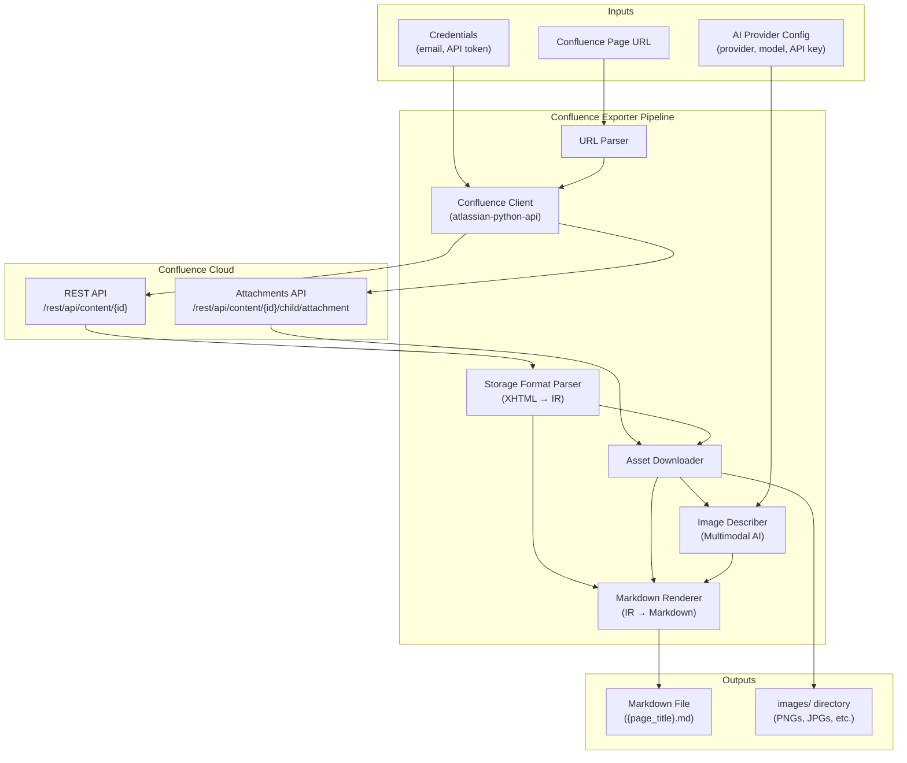
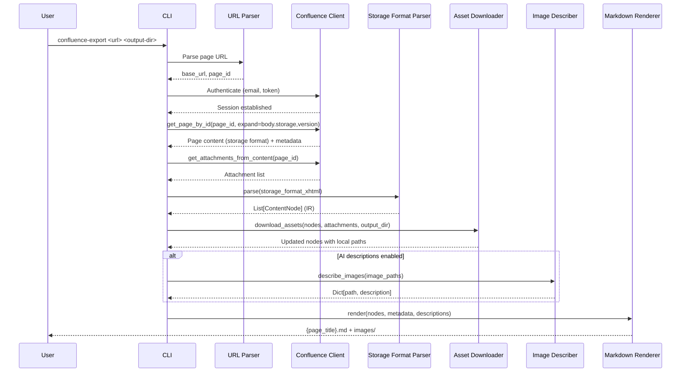

# Design Document — Confluence Page Exporter

## Overview

This design describes a Python CLI tool that exports Confluence Cloud pages to self-contained Markdown files with locally downloaded images and AI-generated image descriptions. The tool bridges the gap between Confluence-hosted SDP documentation and the `aspice-eval` tool's Markdown-based ingestion pipeline.

The exporter operates as a pipeline with five stages:

1. **Authenticate & Retrieve** — Connect to Confluence Cloud, extract the page ID from a URL, fetch the page in storage format, and retrieve the attachment list.
2. **Parse Storage Format** — Parse the Confluence XHTML-based storage format into a structured intermediate representation (IR) of content nodes.
3. **Download Assets** — Download inline images (attachments and external URLs) and Gliffy diagram PNG previews to a local `images/` directory.
4. **Generate Image Descriptions** — Send each downloaded image to a multimodal AI provider to produce a textual description of the visual content.
5. **Render Markdown** — Convert the IR to clean Markdown with relative image paths, embedded image descriptions, and YAML front-matter metadata.

### Design Decisions

| Decision | Rationale |
|---|---|
| **`atlassian-python-api`** for Confluence access | Mature, well-maintained library with direct support for page retrieval, attachment listing, and download. Avoids hand-rolling REST calls. |
| **Python `xml.etree.ElementTree`** for XHTML parsing | Standard library, no extra dependency. Confluence storage format is well-formed XML. Handles namespaced elements (`ac:`, `ri:`) natively. |
| **Intermediate Representation (IR)** between parse and render | Decouples parsing from rendering. Enables testing the parser and renderer independently. Makes it straightforward to add new output formats later. |
| **Provider-agnostic AI interface** | Mirrors the `aspice-eval` provider pattern. Supports Anthropic Claude and OpenAI GPT-4o via a common `ImageDescriber` base class. |
| **Click for CLI** | Consistent with `aspice-eval`. Provides argument parsing, help generation, and environment variable support out of the box. |
| **Blockquote format for image descriptions** | Visually distinct in Markdown. Doesn't interfere with heading structure that `SDPIngester` relies on for section extraction. |
| **YAML front-matter** | Standard metadata format for Markdown files. Parseable by downstream tools. Ignored by most Markdown renderers. |
| **Sanitized filenames** | Spaces → underscores, special characters removed. Prevents filesystem issues across platforms. Numeric suffix for collision resolution. |
| **Shared AI config with `aspice-eval`** | Both tools use the same AI providers (Anthropic, OpenAI). The `ImageDescriberConfig` uses the same environment variable names (`ANTHROPIC_API_KEY`, `OPENAI_API_KEY`) and config structure as `aspice-eval`'s `ModelConfig`. This avoids users configuring credentials twice. The AI call logic itself is NOT shared — image description (image-in, text-out) differs from gap analysis evaluation (text-in, structured-data-out). A shared provider library may be extracted later if a third tool is added. |

---

## Architecture

### System Architecture Diagram



### Data Flow



---

## Components and Interfaces

### 1. URL Parser

**Responsibility:** Extract the Confluence base URL and page ID from a Confluence Cloud page URL.

Confluence Cloud URLs follow these patterns:
- `https://{domain}.atlassian.net/wiki/spaces/{space}/pages/{page_id}/{title}`
- `https://{domain}.atlassian.net/wiki/spaces/{space}/pages/{page_id}`

```python
class URLParser:
    """Extracts base URL and page ID from Confluence Cloud page URLs."""

    # Matches Confluence Cloud URL patterns
    _CLOUD_URL_RE = re.compile(
        r"^(https://[^/]+\.atlassian\.net/wiki)/spaces/[^/]+/pages/(\d+)"
    )

    def parse(self, url: str) -> ParsedURL:
        """Parse a Confluence Cloud page URL.

        Args:
            url: Full Confluence Cloud page URL.

        Returns:
            ParsedURL with base_url and page_id.

        Raises:
            InvalidURLError: If the URL doesn't match expected Confluence Cloud patterns.
        """
```

### 2. Confluence Client

**Responsibility:** Authenticate with Confluence Cloud and retrieve page content and attachments.

Wraps `atlassian-python-api` to provide a focused interface for the exporter's needs.

```python
class ConfluenceClient:
    """Authenticated client for Confluence Cloud page and attachment retrieval."""

    def __init__(self, base_url: str, email: str, api_token: str):
        """Initialize and authenticate with Confluence Cloud.

        Args:
            base_url: Confluence Cloud base URL (e.g., https://acme.atlassian.net/wiki).
            email: User email for Basic Auth.
            api_token: Confluence Cloud API token.

        Raises:
            AuthenticationError: If credentials are invalid.
            ConnectionError: If the base URL is unreachable.
        """

    def get_page(self, page_id: str) -> PageData:
        """Retrieve page content in storage format with metadata.

        Args:
            page_id: Confluence page ID.

        Returns:
            PageData containing title, storage format body, version, and labels.

        Raises:
            PageNotFoundError: If the page doesn't exist or user lacks access.
        """

    def get_attachments(self, page_id: str) -> list[AttachmentData]:
        """Retrieve all attachments for a page.

        Args:
            page_id: Confluence page ID.

        Returns:
            List of AttachmentData with filename, media type, download URL, and size.
        """

    def download_attachment(self, download_url: str, dest_path: str) -> None:
        """Download an attachment to a local file path.

        Args:
            download_url: Relative or absolute URL for the attachment.
            dest_path: Local filesystem path to write the file.

        Raises:
            DownloadError: If the download fails.
        """
```

### 3. Storage Format Parser

**Responsibility:** Parse Confluence XHTML-based storage format into a list of `ContentNode` objects (the intermediate representation).

The parser handles the following Confluence storage format elements:

| Storage Format Element | IR Node Type |
|---|---|
| `<h1>` – `<h6>` | `HeadingNode(level, text)` |
| `<p>` | `ParagraphNode(children)` |
| `<strong>`, `<em>`, `<u>`, `<code>` | `TextNode(text, bold, italic, underline, code)` |
| `<ul>`, `<ol>`, `<li>` | `ListNode(ordered, items)` |
| `<table>`, `<tr>`, `<th>`, `<td>` | `TableNode(headers, rows)` |
| `<ac:image><ri:attachment>` | `ImageNode(source_type="attachment", filename)` |
| `<ac:image><ri:url>` | `ImageNode(source_type="external", url)` |
| `<ac:structured-macro ac:name="gliffy">` | `GliffyNode(name, diagram_id)` |
| `<ac:link>` | `LinkNode(href, text)` |
| `<pre>`, `<ac:structured-macro ac:name="code">` | `CodeBlockNode(language, content)` |
| `<hr />` | `HorizontalRuleNode()` |
| `<ac:structured-macro>` (other) | `MacroNode(name, params, body)` — rendered as plain text |

```python
class StorageFormatParser:
    """Parses Confluence XHTML storage format into an intermediate representation."""

    # Confluence XML namespaces
    _NAMESPACES = {
        "ac": "http://atlassian.com/content",
        "ri": "http://atlassian.com/resource/identifier",
    }

    def parse(self, xhtml: str) -> list[ContentNode]:
        """Parse Confluence storage format XHTML into content nodes.

        Args:
            xhtml: Raw XHTML string from Confluence storage format.

        Returns:
            Ordered list of ContentNode objects representing the page structure.

        Raises:
            ParseError: If the XHTML is malformed and cannot be parsed.
        """
```

### 4. Asset Downloader

**Responsibility:** Download images (attachments and external URLs) and Gliffy PNG previews to the local `images/` directory.

```python
class AssetDownloader:
    """Downloads images and Gliffy diagram PNGs to a local directory."""

    def __init__(self, client: ConfluenceClient, output_dir: str):
        """Initialize with a Confluence client and output directory.

        Args:
            client: Authenticated ConfluenceClient for downloading attachments.
            output_dir: Root output directory (images go to output_dir/images/).
        """

    def download_assets(
        self,
        nodes: list[ContentNode],
        attachments: list[AttachmentData],
    ) -> list[ContentNode]:
        """Download all referenced images and update nodes with local paths.

        For each ImageNode and GliffyNode in the node list:
        1. Resolve the download source (attachment URL or external URL).
        2. Download to images/ subdirectory with sanitized filename.
        3. Update the node's local_path field.

        For GliffyNode: find the matching PNG preview attachment by naming
        convention (the Gliffy plugin stores previews as attachments with
        filenames like "{diagram_name}.png" or "gliffy-{id}-{name}.png").

        Args:
            nodes: Content nodes from the parser.
            attachments: Attachment list from the Confluence client.

        Returns:
            Updated content nodes with local_path populated for downloaded assets.
            Nodes whose downloads failed have local_path=None and a warning logged.
        """

    def _resolve_gliffy_attachment(
        self,
        node: GliffyNode,
        attachments: list[AttachmentData],
    ) -> AttachmentData | None:
        """Find the PNG preview attachment for a Gliffy diagram.

        Gliffy stores PNG previews as page attachments. The naming convention
        varies but typically includes the diagram name or ID. This method
        searches attachments by:
        1. Exact match on "{diagram_name}.png"
        2. Partial match containing the diagram name and ".png" extension
        3. Match on media type "image/png" with "gliffy" in the filename

        Returns:
            The matching AttachmentData, or None if no preview is found.
        """

    def _sanitize_filename(self, name: str) -> str:
        """Sanitize a filename for safe filesystem use.

        Replaces spaces with underscores, removes special characters,
        and appends a numeric suffix if a file with the same name already exists.
        """
```

### 5. Image Describer

**Responsibility:** Generate textual descriptions of images using a multimodal AI model.

```python
class ImageDescriber:
    """Base class for AI-powered image description generation."""

    def __init__(self, model_config: ImageDescriberConfig):
        """Initialize with model configuration."""

    def describe(self, image_path: str, context: ImageContext) -> str:
        """Generate a textual description of an image.

        Args:
            image_path: Local path to the image file.
            context: Additional context (e.g., is_gliffy, alt_text, page_title).

        Returns:
            Textual description of the image content.

        Raises:
            ImageDescriptionError: If the AI provider fails after retries.
        """

    def describe_batch(
        self, images: list[tuple[str, ImageContext]]
    ) -> dict[str, str]:
        """Generate descriptions for multiple images.

        Args:
            images: List of (image_path, context) tuples.

        Returns:
            Dict mapping image_path to description text.
            Failed descriptions map to a placeholder string.
        """


class AnthropicImageDescriber(ImageDescriber):
    """Image describer using Anthropic Claude's vision capabilities."""

    def describe(self, image_path: str, context: ImageContext) -> str:
        """Send image to Claude with a description prompt.

        Uses the Anthropic Messages API with image content blocks.
        For Gliffy diagrams, the prompt emphasizes process flow elements.
        """


class OpenAIImageDescriber(ImageDescriber):
    """Image describer using OpenAI GPT-4o's vision capabilities."""

    def describe(self, image_path: str, context: ImageContext) -> str:
        """Send image to GPT-4o with a description prompt.

        Uses the OpenAI Chat Completions API with image_url content parts.
        For Gliffy diagrams, the prompt emphasizes process flow elements.
        """
```

#### Prompt Strategy

The image describer uses two prompt templates:

**General image prompt:**
> Describe this image in detail. Include: the type of visual (photo, diagram, chart, screenshot), key elements and their relationships, any visible text labels, and the overall purpose of the image.

**Gliffy/diagram-specific prompt:**
> Describe this process diagram in detail for someone who cannot see it. Focus on: the diagram type (flowchart, swimlane, sequence diagram, etc.), activities and process steps, decision points and branches, swimlanes or roles if present, inputs and outputs, transitions and flow direction, and any visible text labels. Structure your description to convey the process flow logically.

### 6. Markdown Renderer

**Responsibility:** Convert the IR (list of `ContentNode`) to a Markdown string with YAML front-matter, relative image paths, and embedded image descriptions.

```python
class MarkdownRenderer:
    """Renders ContentNode IR to Markdown with front-matter and image descriptions."""

    def render(
        self,
        nodes: list[ContentNode],
        metadata: PageMetadata,
        descriptions: dict[str, str] | None = None,
    ) -> str:
        """Render content nodes to a complete Markdown document.

        Args:
            nodes: Ordered list of content nodes from the parser.
            metadata: Page metadata for YAML front-matter.
            descriptions: Optional dict mapping image local paths to descriptions.

        Returns:
            Complete Markdown string with YAML front-matter.
        """

    def _render_front_matter(self, metadata: PageMetadata) -> str:
        """Render YAML front-matter block."""

    def _render_node(self, node: ContentNode) -> str:
        """Render a single content node to Markdown."""

    def _render_image_with_description(
        self, node: ImageNode | GliffyNode, description: str | None
    ) -> str:
        """Render an image reference with optional AI description.

        Format:
            

            > **Image Description:** <description text>
        """
```

### 7. CLI Entry Point

**Responsibility:** Parse arguments, wire components, orchestrate the pipeline, and report results.

```python
# CLI commands:
# confluence-export <page_url> <output_dir>
#   --email <email>              (or CONFLUENCE_EMAIL env var)
#   --api-token <token>          (or CONFLUENCE_API_TOKEN env var)
#   --confluence-url <url>       (override base URL extraction from page URL)
#   --ai-provider <provider>     (anthropic|openai, or CONFLUENCE_EXPORT_AI_PROVIDER)
#   --ai-model <model>           (or CONFLUENCE_EXPORT_AI_MODEL)
#   --ai-api-key <key>           (or provider-specific env vars)
#   --no-ai                      (skip image description generation)
#   --verbose                    (DEBUG-level logging)
```

---

## Data Models

### ContentNode (IR)

The intermediate representation uses a hierarchy of dataclasses:

```python
from __future__ import annotations
from dataclasses import dataclass, field


@dataclass
class ContentNode:
    """Base class for all content nodes in the IR."""
    pass


@dataclass
class HeadingNode(ContentNode):
    """A heading (h1–h6)."""
    level: int          # 1–6
    text: str


@dataclass
class ParagraphNode(ContentNode):
    """A paragraph containing inline content."""
    children: list[InlineNode] = field(default_factory=list)


@dataclass
class InlineNode:
    """Base for inline content within paragraphs."""
    pass


@dataclass
class TextNode(InlineNode):
    """A span of text with optional formatting."""
    text: str
    bold: bool = False
    italic: bool = False
    underline: bool = False
    code: bool = False


@dataclass
class LinkNode(InlineNode):
    """A hyperlink."""
    href: str
    text: str


@dataclass
class ListNode(ContentNode):
    """An ordered or unordered list."""
    ordered: bool
    items: list[ListItemNode] = field(default_factory=list)


@dataclass
class ListItemNode:
    """A single list item, which may contain nested content."""
    children: list[ContentNode] = field(default_factory=list)


@dataclass
class TableNode(ContentNode):
    """A table with optional header row."""
    headers: list[str] = field(default_factory=list)
    rows: list[list[str]] = field(default_factory=list)


@dataclass
class ImageNode(ContentNode):
    """An inline image (attachment or external URL)."""
    source_type: str        # "attachment" or "external"
    filename: str | None = None
    url: str | None = None
    alt_text: str = ""
    local_path: str | None = None   # Set after download


@dataclass
class GliffyNode(ContentNode):
    """A Gliffy diagram macro."""
    name: str               # Diagram name/title
    diagram_id: str | None = None
    local_path: str | None = None   # Set after PNG download
    alt_text: str = ""


@dataclass
class CodeBlockNode(ContentNode):
    """A code block with optional language."""
    content: str
    language: str = ""


@dataclass
class HorizontalRuleNode(ContentNode):
    """A horizontal rule (<hr/>)."""
    pass


@dataclass
class MacroNode(ContentNode):
    """A Confluence macro with no specific handler — rendered as plain text."""
    name: str
    parameters: dict[str, str] = field(default_factory=dict)
    body: str = ""
```

### PageData

```python
@dataclass
class PageData:
    """Raw page data from the Confluence API."""
    page_id: str
    title: str
    storage_format: str     # Raw XHTML body
    version: int
    labels: list[str] = field(default_factory=list)
    space_key: str = ""
```

### AttachmentData

```python
@dataclass
class AttachmentData:
    """Metadata for a page attachment."""
    filename: str
    media_type: str         # e.g., "image/png", "image/jpeg"
    download_url: str       # Relative URL for download
    file_size: int = 0
    comment: str = ""
```

### PageMetadata

```python
@dataclass
class PageMetadata:
    """Metadata for the YAML front-matter block."""
    source_url: str
    page_id: str
    page_title: str
    export_timestamp: str   # ISO 8601
    exporter_version: str
    space_key: str = ""
    labels: list[str] = field(default_factory=list)
```

### ParsedURL

```python
@dataclass
class ParsedURL:
    """Result of parsing a Confluence Cloud page URL."""
    base_url: str           # e.g., "https://acme.atlassian.net/wiki"
    page_id: str            # e.g., "123456789"
```

### ImageDescriberConfig

```python
@dataclass
class ImageDescriberConfig:
    """Configuration for the image description AI provider."""
    provider: str           # "anthropic" or "openai"
    model: str              # e.g., "claude-sonnet-4-20250514", "gpt-4o"
    api_key: str = ""
    max_tokens: int = 1024
    temperature: float = 0.2
```

### ImageContext

```python
@dataclass
class ImageContext:
    """Context passed to the image describer for prompt construction."""
    is_gliffy: bool = False
    alt_text: str = ""
    page_title: str = ""
    filename: str = ""
```

### ExportResult

```python
@dataclass
class ExportResult:
    """Summary of an export operation for CLI output."""
    markdown_path: str
    images_downloaded: int
    descriptions_generated: int
    warnings: list[str] = field(default_factory=list)
```


---

## Correctness Properties

*A property is a characteristic or behavior that should hold true across all valid executions of a system — essentially, a formal statement about what the system should do. Properties serve as the bridge between human-readable specifications and machine-verifiable correctness guarantees.*

### Property 1: Credential resolution follows precedence order

*For any* combination of credential values provided via CLI arguments, environment variables, and configuration file — where at least one source provides a value — the resolved credential SHALL equal the value from the highest-precedence source that is present (CLI > environment variable > configuration file).

**Validates: Requirements 1.4**

### Property 2: URL parser extracts correct page ID from valid URLs and rejects invalid URLs

*For any* string matching the Confluence Cloud URL pattern `https://{domain}.atlassian.net/wiki/spaces/{space}/pages/{page_id}/{optional_title}`, the URL parser SHALL extract the numeric page ID correctly. *For any* string that does not match this pattern, the URL parser SHALL raise an `InvalidURLError` with a message describing the expected format.

**Validates: Requirements 2.1, 2.3**

### Property 3: IR-to-Markdown round-trip preserves semantic structure

*For any* valid list of `ContentNode` objects (the intermediate representation), rendering to Markdown and then parsing the Markdown back into an IR SHALL produce a structurally equivalent node list — same heading levels and text, same list ordering and items, same table structure, and same text content (modulo whitespace normalization).

**Validates: Requirements 3.1, 3.2, 3.5**

### Property 4: Rendered headings are compatible with SDPIngester header extraction

*For any* `HeadingNode` with level L (1–6) and non-empty text T, the rendered Markdown line SHALL match the regex `^(#{1,6})[ \t]+(\S.*)$` used by the `aspice-eval` `SDPIngester`, where the number of `#` characters equals L and the captured text equals T.

**Validates: Requirements 3.3**

### Property 5: Unknown macros render as plain text with identifying comment

*For any* `MacroNode` with a non-empty name and body text, the rendered Markdown SHALL contain the body text as plain text and an HTML comment containing the macro name.

**Validates: Requirements 3.4**

### Property 6: Image and Gliffy nodes with local paths render as Markdown image references with correct alt-text

*For any* `ImageNode` or `GliffyNode` with a non-null `local_path`, the rendered Markdown SHALL contain a Markdown image reference `` where the path is relative under `images/`. For `GliffyNode`, the alt-text SHALL equal the diagram name.

**Validates: Requirements 4.3, 5.3, 5.4**

### Property 7: Failed asset downloads produce placeholder text in rendered Markdown

*For any* `ImageNode` or `GliffyNode` with `local_path` equal to `None` (indicating a failed download), the rendered Markdown SHALL contain a placeholder indicating the missing image or diagram, and SHALL NOT contain a Markdown image reference.

**Validates: Requirements 4.5, 5.5**

### Property 8: Image descriptions are embedded as blockquotes with correct prefix

*For any* image node with a non-empty description string, the rendered Markdown SHALL contain the description in a blockquote line prefixed with `> **Image Description:**` directly following the image reference.

**Validates: Requirements 6.3**

### Property 9: Gliffy diagram prompts include process flow instructions

*For any* `ImageContext` where `is_gliffy` is `True`, the constructed prompt string SHALL contain keywords related to process flow analysis: "activities", "decision points", "swimlanes", and "transitions".

**Validates: Requirements 6.4**

### Property 10: Filename sanitization preserves extensions and produces unique names

*For any* list of filenames (possibly containing duplicates, spaces, and special characters), the sanitizer SHALL produce filenames where: (a) each output preserves the original file extension, (b) spaces are replaced with underscores, (c) special characters are removed, and (d) all output filenames are unique (collisions resolved by numeric suffix).

**Validates: Requirements 4.6, 8.1, 8.3**

### Property 11: Gliffy attachment resolver finds matching PNG preview

*For any* `GliffyNode` with a diagram name N and an attachment list containing an attachment whose filename contains N and ends with `.png`, the resolver SHALL return that attachment. If no matching attachment exists, the resolver SHALL return `None`.

**Validates: Requirements 5.1**

### Property 12: Export summary contains all required information

*For any* `ExportResult` with a markdown path, image count, description count, and warning list, the formatted summary string SHALL contain the markdown file path, the image count, the description count, and every warning message.

**Validates: Requirements 7.4**

### Property 13: YAML front-matter contains all required metadata fields

*For any* `PageMetadata` instance, the rendered YAML front-matter block SHALL contain the fields: `source_url`, `page_id`, `page_title`, `export_timestamp`, and `exporter_version`, and each field's value SHALL match the corresponding `PageMetadata` attribute.

**Validates: Requirements 8.5**

---

## Error Handling

### Error Categories

| Error | Component | Trigger | Handling |
|---|---|---|---|
| `InvalidURLError` | URL Parser | URL doesn't match Confluence Cloud pattern | Return descriptive error with expected format. Exit with non-zero code. |
| `AuthenticationError` | Confluence Client | Invalid email/token or 401 response | Return error identifying authentication failure. Exit with non-zero code. |
| `ConnectionError` | Confluence Client | Base URL unreachable, network timeout | Return error indicating connection failure. Exit with non-zero code. |
| `PageNotFoundError` | Confluence Client | 404 response or 403 forbidden | Return error identifying the access issue (not found vs. no permission). Exit with non-zero code. |
| `ParseError` | Storage Format Parser | Malformed XHTML that cannot be parsed | Return error with parse failure details. Exit with non-zero code. |
| `DownloadError` | Asset Downloader | Single image download fails (timeout, 404) | Log WARNING. Set `local_path=None` on the node. Continue processing remaining assets. |
| `ImageDescriptionError` | Image Describer | AI provider unavailable, rate limit, or error response | Log WARNING. Use placeholder "Image description unavailable". Continue processing. |
| `FileSystemError` | CLI / Renderer | Cannot create output directory or write files | Return error with filesystem details. Exit with non-zero code. |

### Error Handling Principles

1. **Fatal vs. non-fatal distinction** — Authentication failures, missing pages, and malformed XHTML are fatal (abort). Individual image download failures and AI description failures are non-fatal (warn and continue).
2. **Graceful degradation** — A single failed image download or AI description does not prevent the rest of the page from being exported. The output Markdown includes placeholders for failed assets.
3. **Descriptive messages** — Every error includes enough context for the user to diagnose the issue: the URL that failed, the HTTP status code, the filename that couldn't be downloaded, etc.
4. **Structured exit codes** — Exit 0 on success (even with warnings). Exit non-zero only on fatal errors.
5. **Log routing** — All log output goes to stderr. Stdout is reserved for the export summary, keeping output pipeable.

### Retry Strategy

The Image Describer retries transient AI provider failures:

```
Attempt 1 → describe(image)
    ↓ ImageDescriptionError (retryable)
Attempt 2 → wait 1s → describe(image)
    ↓ ImageDescriptionError (retryable)
Attempt 3 → wait 2s → describe(image)
    ↓ ImageDescriptionError
→ Log warning, use placeholder description
```

Retryable: timeouts, rate limits (429), server errors (5xx).
Non-retryable: authentication failures (401/403), invalid model, malformed request.

The Confluence Client does NOT retry — API failures for page retrieval are fatal.

---

## Testing Strategy

### Testing Approach

This project uses a dual testing approach:

- **Property-based tests** verify universal correctness properties across randomly generated inputs (using [Hypothesis](https://hypothesis.readthedocs.io/) for Python)
- **Unit tests** verify specific examples, edge cases, and integration points (using [pytest](https://docs.pytest.org/))
- **Integration tests** verify the end-to-end pipeline with mocked Confluence API and AI providers

### Property-Based Testing Library

**Library:** Hypothesis (consistent with `aspice-eval`)
**Minimum iterations:** 100 per property test (CI profile)
**Dev profile:** 50 iterations for faster local feedback

Each property test references its design document property with a tag comment:
```python
# Feature: confluence-exporter, Property N: <property_text>
```

### Property-Based Tests (Hypothesis)

| Property | Test Description | Tag |
|---|---|---|
| Property 1 | Generate random credential values across CLI/env/config sources with random presence; verify precedence | `Feature: confluence-exporter, Property 1: Credential resolution follows precedence order` |
| Property 2 | Generate random valid/invalid Confluence URLs; verify extraction or rejection | `Feature: confluence-exporter, Property 2: URL parser extracts correct page ID from valid URLs and rejects invalid URLs` |
| Property 3 | Generate random ContentNode IR trees; render to Markdown; parse back; verify structural equivalence | `Feature: confluence-exporter, Property 3: IR-to-Markdown round-trip preserves semantic structure` |
| Property 4 | Generate random HeadingNodes; render to Markdown; verify regex match against SDPIngester pattern | `Feature: confluence-exporter, Property 4: Rendered headings are compatible with SDPIngester header extraction` |
| Property 5 | Generate random MacroNodes; render to Markdown; verify body text and HTML comment with macro name | `Feature: confluence-exporter, Property 5: Unknown macros render as plain text with identifying comment` |
| Property 6 | Generate random ImageNode/GliffyNode with local_path; verify Markdown image reference format | `Feature: confluence-exporter, Property 6: Image and Gliffy nodes with local paths render as Markdown image references` |
| Property 7 | Generate random ImageNode/GliffyNode with local_path=None; verify placeholder text | `Feature: confluence-exporter, Property 7: Failed asset downloads produce placeholder text` |
| Property 8 | Generate random image nodes with descriptions; verify blockquote format | `Feature: confluence-exporter, Property 8: Image descriptions are embedded as blockquotes with correct prefix` |
| Property 9 | Generate random ImageContext with is_gliffy=True; verify prompt keywords | `Feature: confluence-exporter, Property 9: Gliffy diagram prompts include process flow instructions` |
| Property 10 | Generate random filename lists with duplicates and special chars; verify uniqueness and extension preservation | `Feature: confluence-exporter, Property 10: Filename sanitization preserves extensions and produces unique names` |
| Property 11 | Generate random GliffyNode names and attachment lists; verify correct PNG match | `Feature: confluence-exporter, Property 11: Gliffy attachment resolver finds matching PNG preview` |
| Property 12 | Generate random ExportResult instances; verify summary contains all fields | `Feature: confluence-exporter, Property 12: Export summary contains all required information` |
| Property 13 | Generate random PageMetadata instances; verify YAML front-matter fields | `Feature: confluence-exporter, Property 13: YAML front-matter contains all required metadata fields` |

### Unit Tests (pytest)

Unit tests cover specific examples and edge cases not suited for property-based testing:

| Area | Tests |
|---|---|
| Authentication errors (Req 1.2, 1.3) | Verify error messages for invalid credentials and unreachable URLs |
| Page access errors (Req 2.4) | Verify error messages for 404 and 403 responses |
| CLI argument validation (Req 7.1, 7.2, 7.5) | Verify required/optional args, usage message on missing args |
| CLI exit codes (Req 7.6) | Verify exit 0 on success, non-zero on failure |
| AI description disabled (Req 6.6) | Verify --no-ai flag skips description generation |
| AI provider errors (Req 6.5) | Verify placeholder on provider failure |
| Directory creation (Req 8.4) | Verify output directory and images/ subdirectory creation |
| Logging levels (Req 9.1–9.5) | Verify INFO/WARNING/ERROR routing and --verbose flag |
| Prompt templates (Req 6.2) | Verify general and Gliffy prompt templates include required instructions |

### Integration Tests

| Scenario | Description |
|---|---|
| End-to-end export | Mock Confluence API + AI provider; run full pipeline; verify Markdown output and images/ directory |
| Gliffy diagram export | Mock page with Gliffy macro + PNG attachment; verify diagram appears in output |
| Partial failure | Mock one image download failure; verify export completes with placeholder |
| No AI mode | Run with --no-ai; verify no AI calls and images have only alt-text |

### Test Configuration

```python
# conftest.py
from hypothesis import settings

settings.register_profile("ci", max_examples=100)
settings.register_profile("dev", max_examples=50)
settings.load_profile("ci")
```

### Test Directory Structure

```
confluence-exporter/
├── tests/
│   ├── conftest.py                          # Shared fixtures, Hypothesis profiles
│   ├── property/
│   │   ├── test_prop01_credential_precedence.py   # Property 1
│   │   ├── test_prop02_url_parsing.py             # Property 2
│   │   ├── test_prop03_roundtrip.py               # Property 3
│   │   ├── test_prop04_heading_compat.py          # Property 4
│   │   ├── test_prop05_macro_fallback.py          # Property 5
│   │   ├── test_prop06_image_rendering.py         # Property 6
│   │   ├── test_prop07_placeholder.py             # Property 7
│   │   ├── test_prop08_description_format.py      # Property 8
│   │   ├── test_prop09_gliffy_prompt.py           # Property 9
│   │   ├── test_prop10_filename_sanitization.py   # Property 10
│   │   ├── test_prop11_gliffy_resolver.py         # Property 11
│   │   ├── test_prop12_export_summary.py          # Property 12
│   │   └── test_prop13_frontmatter.py             # Property 13
│   ├── unit/
│   │   ├── test_auth_errors.py
│   │   ├── test_page_errors.py
│   │   ├── test_cli.py
│   │   ├── test_ai_describer.py
│   │   ├── test_logging.py
│   │   └── test_filesystem.py
│   └── integration/
│       ├── test_end_to_end.py
│       ├── test_gliffy_export.py
│       └── test_partial_failure.py
```

### Project File Layout

```
confluence-exporter/
├── pyproject.toml
├── src/
│   └── confluence_exporter/
│       ├── __init__.py
│       ├── cli.py                    # Click CLI entry point
│       ├── models.py                 # All dataclasses (IR nodes, configs, results)
│       ├── url_parser.py             # URL parsing and validation
│       ├── client.py                 # Confluence API client wrapper
│       ├── parser.py                 # Storage format XHTML → IR parser
│       ├── downloader.py             # Asset download logic
│       ├── renderer.py               # IR → Markdown renderer
│       ├── describer.py              # Base ImageDescriber + prompt construction
│       ├── exceptions.py             # Custom exception classes
│       └── providers/
│           ├── __init__.py           # Provider factory
│           ├── anthropic_describer.py
│           └── openai_describer.py
├── tests/
│   └── ...                           # (see test directory structure above)
└── README.md
```
