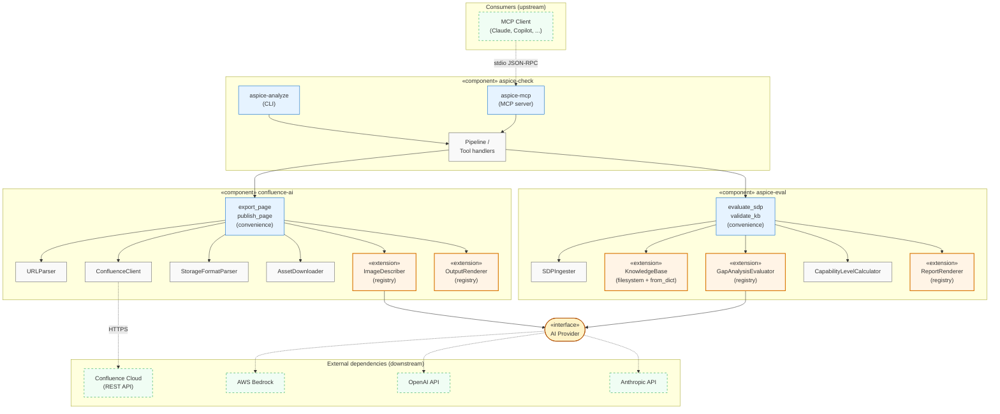
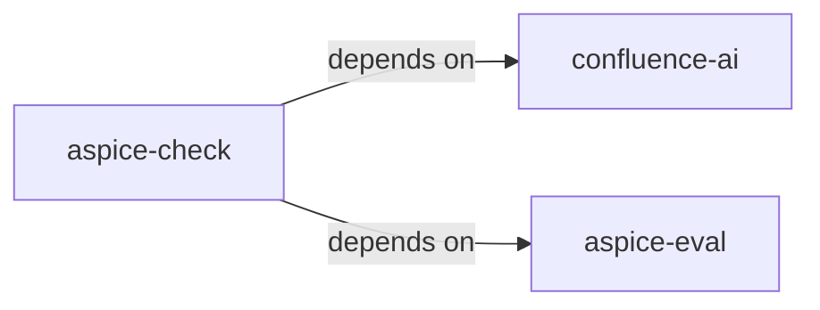
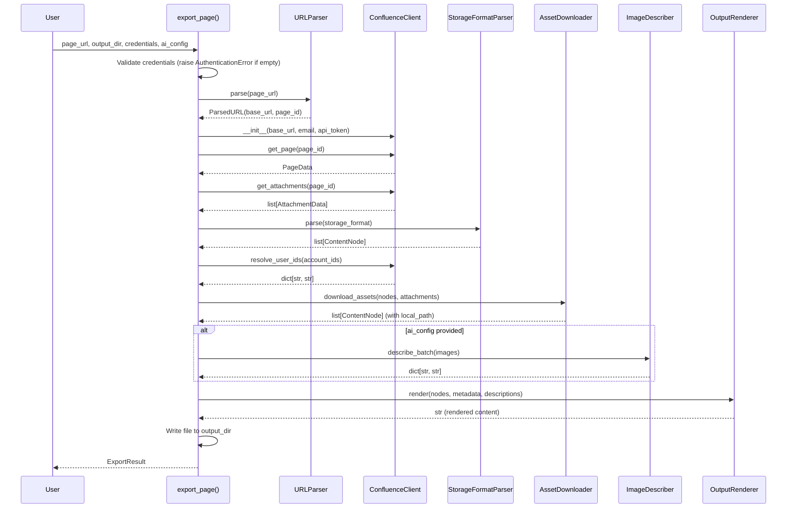
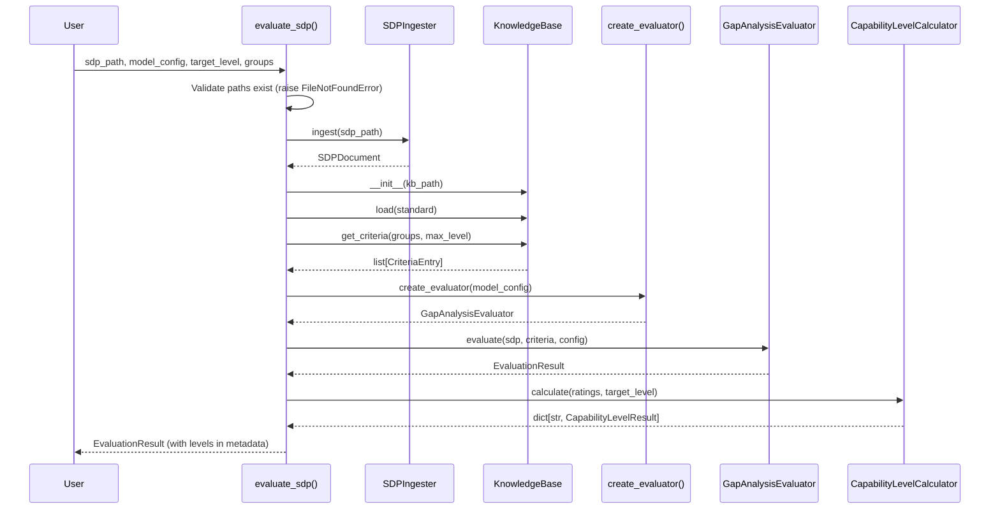
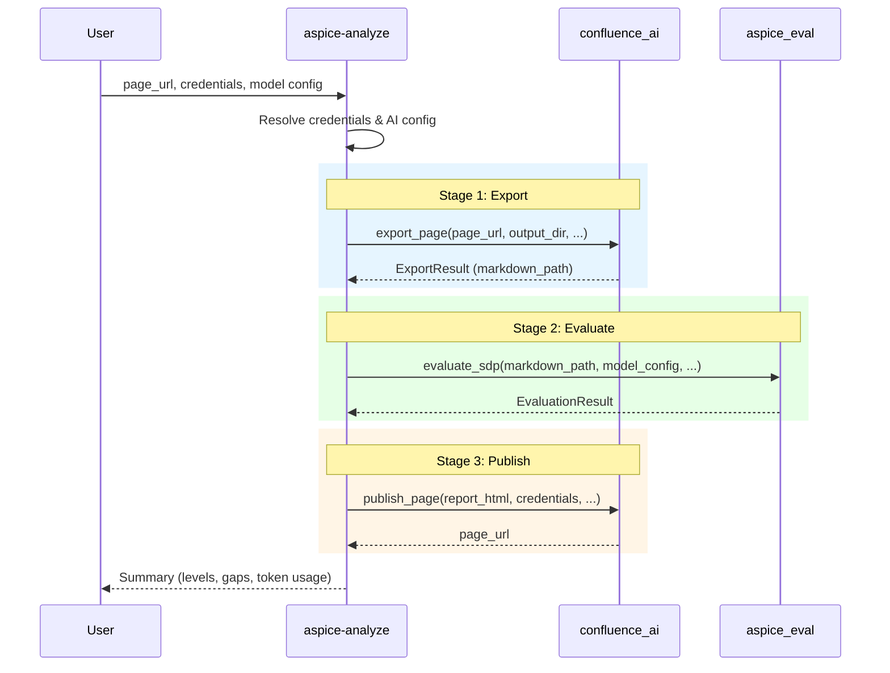

# Design Document: Library API Surface

## Overview

This design defines the public API surface, package boundaries, and extension points for a three-package monorepo architecture:

| Package | PyPI Name | Import Name | Role |
|---------|-----------|-------------|------|
| `confluence-ai/` | `confluence-ai` | `confluence_ai` | AI-powered Confluence toolkit (export, publish, image description) |
| `aspice-eval/` | `aspice-eval` | `aspice_eval` | ASPICE evaluation engine (KB, evaluator, reports) — standalone |
| `aspice-check/` | `aspice-check` | `aspice_check` | Orchestrator: pipeline CLI + MCP server |

The key design principle is **library-first identity**: each package exposes a clean programmatic API via top-level re-exports, convenience functions, and extension point registries. CLI commands are thin wrappers over the library API.

### Design Decisions

1. **Strict dependency direction**: `aspice-check` depends on both `confluence-ai` and `aspice-eval`. Neither `confluence-ai` nor `aspice-eval` depends on the other or on `aspice-check`.
2. **Registry + factory pattern**: Both packages use a provider registry (dict mapping names to class paths) with lazy imports. Extension points use `register_*` functions that mutate the registry.
3. **Convenience functions over classes**: High-level workflows are exposed as module-level functions (`export_page`, `evaluate_sdp`, `publish_page`) rather than requiring users to instantiate and wire together multiple classes.
4. **Abstract base classes for extension**: `ImageDescriber`, `OutputRenderer`, `GapAnalysisEvaluator`, and `ReportRenderer` define the override contracts.
5. **Dataclasses for all models**: No Pydantic or attrs — plain `@dataclass` classes with type annotations.

## Architecture

### High-Level Component Diagram

UML-style component diagram showing each package with its internal components, extension points, and external dependencies. Extension points are marked with the «extension» stereotype — these are the ABCs that users can subclass.



**Legend:**
- **Blue boxes** — public API entry points (convenience functions, CLI, MCP)
- **Orange boxes (`«extension»`)** — extension points users can customize or subclass
- **Grey boxes** — internal components, not part of the public API
- **Yellow pill (`«interface»`)** — abstract contract; the connected components don't know which concrete provider is used
- **Green dashed boxes** — external systems (AI providers, Confluence, MCP clients)
- **Solid arrows** — internal function calls
- **Dashed arrows** — calls over the network / IPC

### Extension Points Summary

| Component | Extension mechanism | What users can do |
|---|---|---|
| `ImageDescriber` | Subclass + `register_describer()` | Add custom vision AI providers (local models, Azure Vision, etc.) |
| `OutputRenderer` (confluence-ai) | Subclass + `register_renderer()` | Output Confluence pages as reStructuredText, AsciiDoc, JSON, etc. |
| `KnowledgeBase` | Subclass + `register_kb_loader()`, or use `from_dict()` | Support non-ASPICE-shaped standards (NIST CSF, CMMI, ISO 26262) or load from databases/APIs |
| `GapAnalysisEvaluator` | Subclass + `register_evaluator()` | Plug in custom LLM providers or rule-based evaluators |
| `ReportRenderer` (aspice-eval) | Subclass + `register_renderer()` | Output evaluation reports as JSON, SARIF, CSV, PDF, etc. |

### KnowledgeBase Extensibility

The `KnowledgeBase` supports three levels of extension:

**Level 1: Custom YAML files (no code required)**
Drop a new subdirectory under `kb_path/` (e.g., `kb_path/iso26262/`) with YAML files conforming to the ASPICE-shaped JSON Schema. Point `evaluate_sdp(standard="iso26262")` at it. Good for standards that fit the process-group / process / base-practice / generic-practice structure.

**Level 2: In-memory construction**
Use `KnowledgeBase.from_dict(data)` to build a KB from a Python dictionary. Useful for loading criteria from databases, REST APIs, or generating them programmatically. Still constrained to the ASPICE-shaped schema.

**Level 3: Custom KB loader (pluggable schema)**
For standards with fundamentally different structures (e.g., NIST CSF's Functions → Categories → Subcategories, or CMMI's Maturity Levels), subclass `KnowledgeBase` and register via `register_kb_loader(standard_name, loader_class)`. This allows full custom schemas as long as the loader produces the internal `CriteriaEntry` flat representation that the evaluator consumes.

```python
from aspice_eval import KnowledgeBase, register_kb_loader, CriteriaEntry

class NISTCSFKnowledgeBase(KnowledgeBase):
    """Custom loader for NIST Cybersecurity Framework."""
    def load(self, standard: str) -> None:
        # Read NIST-shaped YAML/JSON, convert to CriteriaEntry list
        ...

    def get_criteria(self, groups, max_level) -> list[CriteriaEntry]:
        # Return entries filtered by NIST "Functions" instead of ASPICE groups
        ...

register_kb_loader("nist-csf", NISTCSFKnowledgeBase)
```

The common contract is: a `KnowledgeBase` must produce a list of `CriteriaEntry` objects that the evaluator can reason about. The *how* is up to the subclass.

### Dependency Rules (Enforced)



## Components and Interfaces

### Package Directory Structure

```
aspice-check/                          # Repository root (monorepo)
├── confluence-ai/                     # Package 1: AI-powered Confluence toolkit
│   ├── src/confluence_ai/
│   │   ├── __init__.py                # Public API re-exports + __all__
│   │   ├── py.typed                   # PEP 561 marker
│   │   ├── client.py                  # ConfluenceClient
│   │   ├── url_parser.py              # URLParser
│   │   ├── parser.py                  # StorageFormatParser (XHTML → IR)
│   │   ├── downloader.py             # AssetDownloader
│   │   ├── describer.py              # ImageDescriber ABC
│   │   ├── renderer.py               # MarkdownRenderer (OutputRenderer subclass)
│   │   ├── json_renderer.py          # JSONRenderer (OutputRenderer subclass)
│   │   ├── output_renderer.py        # OutputRenderer ABC + registry
│   │   ├── export.py                 # export_page() convenience function
│   │   ├── publish.py                # publish_page() convenience function
│   │   ├── models.py                 # IR nodes, config models, result models
│   │   ├── exceptions.py             # Exception hierarchy
│   │   └── providers/
│   │       ├── __init__.py            # create_describer(), register_describer()
│   │       ├── anthropic_describer.py
│   │       ├── openai_describer.py
│   │       └── bedrock_describer.py
│   ├── tests/
│   │   ├── conftest.py
│   │   ├── unit/
│   │   ├── property/
│   │   └── integration/
│   ├── pyproject.toml
│   └── README.md
│
├── aspice-eval/                       # Package 2: ASPICE evaluation engine
│   ├── src/aspice_eval/
│   │   ├── __init__.py                # Public API re-exports + __all__
│   │   ├── py.typed                   # PEP 561 marker
│   │   ├── models.py                 # Core dataclasses
│   │   ├── exceptions.py             # Exception hierarchy
│   │   ├── knowledge_base.py         # KnowledgeBase (+ from_dict constructor)
│   │   ├── kb_validator.py           # Schema + completeness validation
│   │   ├── evaluator.py              # GapAnalysisEvaluator base + MockEvaluator
│   │   ├── level_calculator.py       # CapabilityLevelCalculator
│   │   ├── report_generator.py       # ReportGenerator (delegates to renderers)
│   │   ├── report_renderer.py        # ReportRenderer ABC + registry
│   │   ├── sdp_ingester.py           # SDPIngester
│   │   ├── convenience.py            # evaluate_sdp(), validate_kb()
│   │   └── providers/
│   │       ├── __init__.py            # create_evaluator(), register_evaluator()
│   │       ├── bedrock.py
│   │       ├── openai_provider.py
│   │       └── anthropic_provider.py
│   ├── knowledge_base/
│   │   ├── aspice/
│   │   └── schema/
│   ├── tests/
│   ├── pyproject.toml
│   └── README.md
│
├── aspice-check/                      # Package 3: Orchestrator
│   ├── src/aspice_check/
│   │   ├── __init__.py                # Package init
│   │   ├── py.typed                   # PEP 561 marker
│   │   ├── pipeline.py               # aspice-analyze CLI command
│   │   ├── mcp_server.py             # MCP server implementation
│   │   └── mcp_tools.py              # MCP tool definitions
│   ├── tests/
│   ├── pyproject.toml
│   └── README.md
```


### confluence-ai Public API (`confluence_ai/__init__.py`)

```python
"""AI-powered Confluence toolkit — export, publish, and describe pages."""

from __future__ import annotations

__version__ = "0.1.0"

# --- Core classes ---
from confluence_ai.client import ConfluenceClient
from confluence_ai.parser import StorageFormatParser
from confluence_ai.renderer import MarkdownRenderer
from confluence_ai.downloader import AssetDownloader
from confluence_ai.describer import ImageDescriber
from confluence_ai.url_parser import URLParser
from confluence_ai.output_renderer import OutputRenderer

# --- Factory & registry functions ---
from confluence_ai.providers import create_describer, register_describer
from confluence_ai.output_renderer import register_renderer

# --- Convenience functions ---
from confluence_ai.export import export_page
from confluence_ai.publish import publish_page

# --- Config & result models ---
from confluence_ai.models import ImageDescriberConfig, ImageContext, PageMetadata, ExportResult

# --- Exceptions ---
from confluence_ai.exceptions import (
    ExporterError,
    InvalidURLError,
    AuthenticationError,
    ConfluenceConnectionError,
    PageNotFoundError,
    ParseError,
    DownloadError,
    ImageDescriptionError,
    FileSystemError,
)

__all__ = [
    # Core classes
    "ConfluenceClient",
    "StorageFormatParser",
    "MarkdownRenderer",
    "AssetDownloader",
    "ImageDescriber",
    "URLParser",
    "OutputRenderer",
    # Factory & registry
    "create_describer",
    "register_describer",
    "register_renderer",
    # Convenience functions
    "export_page",
    "publish_page",
    # Models
    "ImageDescriberConfig",
    "ImageContext",
    "PageMetadata",
    "ExportResult",
    # Exceptions
    "ExporterError",
    "InvalidURLError",
    "AuthenticationError",
    "ConfluenceConnectionError",
    "PageNotFoundError",
    "ParseError",
    "DownloadError",
    "ImageDescriptionError",
    "FileSystemError",
]
```

### aspice-eval Public API (`aspice_eval/__init__.py`)

```python
"""ASPICE evaluation engine — knowledge base, evaluator, and reports."""

from __future__ import annotations

__version__ = "0.1.0"

# --- Core classes ---
from aspice_eval.knowledge_base import KnowledgeBase
from aspice_eval.evaluator import GapAnalysisEvaluator
from aspice_eval.report_renderer import ReportRenderer

# --- Factory & registry functions ---
from aspice_eval.providers import create_evaluator, register_evaluator
from aspice_eval.report_renderer import register_renderer

# --- Convenience functions ---
from aspice_eval.convenience import evaluate_sdp, validate_kb

# --- Models ---
from aspice_eval.models import (
    ModelConfig,
    EvaluationConfig,
    EvaluationResult,
    CriteriaEntry,
    CriteriaRating,
    SDPDocument,
    CapabilityLevelResult,
    ValidationResult,
)

# --- Exceptions ---
from aspice_eval.exceptions import (
    KBValidationError,
    UnsupportedFormatError,
    InvalidConfigError,
    AIModelError,
    AIResponseParseError,
)

__all__ = [
    # Core classes
    "KnowledgeBase",
    "GapAnalysisEvaluator",
    "ReportRenderer",
    # Factory & registry
    "create_evaluator",
    "register_evaluator",
    "register_renderer",
    # Convenience functions
    "evaluate_sdp",
    "validate_kb",
    # Models
    "ModelConfig",
    "EvaluationConfig",
    "EvaluationResult",
    "CriteriaEntry",
    "CriteriaRating",
    "SDPDocument",
    "CapabilityLevelResult",
    "ValidationResult",
    # Exceptions
    "KBValidationError",
    "UnsupportedFormatError",
    "InvalidConfigError",
    "AIModelError",
    "AIResponseParseError",
]
```

### Convenience Function Signatures

#### `confluence_ai.export_page`

```python
def export_page(
    page_url: str,
    output_dir: str,
    *,
    email: str,
    api_token: str,
    confluence_base_url: str | None = None,
    ai_config: ImageDescriberConfig | None = None,
    output_format: str = "markdown",
) -> ExportResult:
    """Export a Confluence Cloud page to a local file.

    Orchestrates the full export pipeline: URL parsing → page retrieval →
    XHTML parsing → asset downloading → AI image description → rendering.

    Parameters
    ----------
    page_url:
        Full Confluence Cloud page URL.
    output_dir:
        Directory where the output file and images will be written.
    email:
        Confluence account email for authentication.
    api_token:
        Confluence Cloud API token.
    confluence_base_url:
        Override the base URL extracted from page_url. Useful for
        custom Confluence domains.
    ai_config:
        Configuration for AI image description. If None, image
        descriptions are skipped.
    output_format:
        Output format name. Defaults to "markdown". Use "json" for
        structured IR output. Custom formats can be registered via
        register_renderer().

    Returns
    -------
    ExportResult
        Contains output file path, image count, description count,
        and any warnings.

    Raises
    ------
    InvalidURLError
        If page_url doesn't match Confluence Cloud URL patterns.
    AuthenticationError
        If email or api_token is empty/None.
    ConfluenceConnectionError
        If the Confluence server is unreachable.
    PageNotFoundError
        If the page doesn't exist or user lacks access.
    ValueError
        If output_format is not a registered renderer name.

    Examples
    --------
    >>> from confluence_ai import export_page, ImageDescriberConfig
    >>> result = export_page(
    ...     "https://acme.atlassian.net/wiki/spaces/ENG/pages/123456/My-SDP",
    ...     "./output",
    ...     email="user@acme.com",
    ...     api_token="secret",
    ...     ai_config=ImageDescriberConfig(provider="bedrock", model="us.anthropic.claude-sonnet-4-20250514-v1:0"),
    ... )
    >>> print(result.markdown_path)
    """
```

#### `confluence_ai.publish_page`

```python
def publish_page(
    html_content: str,
    *,
    email: str,
    api_token: str,
    base_url: str,
    space_key: str,
    title: str,
    parent_page_id: str | None = None,
) -> str:
    """Publish HTML content to Confluence Cloud as a page.

    Handles HTML-to-storage-format conversion via the Confluence API,
    emoji sanitization, and page deduplication (updates existing pages
    with the same title rather than creating duplicates).

    Parameters
    ----------
    html_content:
        HTML string to publish as page body.
    email:
        Confluence account email for authentication.
    api_token:
        Confluence Cloud API token.
    base_url:
        Confluence Cloud base URL (e.g., "https://acme.atlassian.net/wiki").
    space_key:
        Confluence space key where the page will be created/updated.
    title:
        Page title. Used for deduplication — if a page with this title
        exists in the space, it will be updated.
    parent_page_id:
        Optional parent page ID. If provided, the page is created as
        a child of this page.

    Returns
    -------
    str
        URL of the created or updated Confluence page.

    Raises
    ------
    AuthenticationError
        If email or api_token is empty/None.
    ConfluenceConnectionError
        If the Confluence server is unreachable.

    Examples
    --------
    >>> from confluence_ai import publish_page
    >>> url = publish_page(
    ...     "<h1>Gap Analysis Report</h1><p>Results...</p>",
    ...     email="user@acme.com",
    ...     api_token="secret",
    ...     base_url="https://acme.atlassian.net/wiki",
    ...     space_key="ENG",
    ...     title="SDP Gap Analysis - 2024-01-15",
    ...     parent_page_id="123456",
    ... )
    >>> print(url)
    """
```

#### `aspice_eval.evaluate_sdp`

```python
def evaluate_sdp(
    sdp_path: str,
    model_config: ModelConfig,
    *,
    target_level: int = 3,
    process_groups: list[str] | None = None,
    kb_path: str | None = None,
    standard: str = "aspice",
) -> EvaluationResult:
    """Evaluate an SDP document against knowledge base criteria.

    Orchestrates the full evaluation pipeline: SDP ingestion → KB loading →
    criteria filtering → AI evaluation → capability level calculation.

    Parameters
    ----------
    sdp_path:
        Path to the SDP Markdown file.
    model_config:
        AI model configuration (provider, model name, temperature, etc.).
    target_level:
        Target ASPICE capability level (1–5). Defaults to 3 (Established).
    process_groups:
        Process groups to evaluate. Defaults to ["SWE", "SYS", "MAN", "SUP"].
    kb_path:
        Path to the knowledge base directory. Defaults to the bundled KB.
    standard:
        Standard identifier (subdirectory name under kb_path).
        Defaults to "aspice".

    Returns
    -------
    EvaluationResult
        Contains per-criteria ratings, capability levels, and token usage.

    Raises
    ------
    FileNotFoundError
        If sdp_path or kb_path does not exist.
    UnsupportedFormatError
        If the SDP file is not Markdown format.
    InvalidConfigError
        If target_level is outside 1–5 or process_groups contains
        unknown codes.
    AIModelError
        If the AI model call fails after retries.

    Examples
    --------
    >>> from aspice_eval import evaluate_sdp, ModelConfig
    >>> result = evaluate_sdp(
    ...     "docs/sdp.md",
    ...     ModelConfig(provider="bedrock", model_name="us.anthropic.claude-sonnet-4-20250514-v1:0", region="us-east-1"),
    ...     target_level=3,
    ...     process_groups=["SWE", "SYS"],
    ... )
    >>> print(f"Gaps found: {len([r for r in result.ratings if r.gaps])}")
    """
```

#### `aspice_eval.validate_kb`

```python
def validate_kb(
    kb_path: str,
    *,
    standard: str = "aspice",
) -> ValidationResult:
    """Validate a knowledge base directory for schema and completeness.

    Parameters
    ----------
    kb_path:
        Path to the knowledge base root directory.
    standard:
        Standard identifier to validate. Defaults to "aspice".

    Returns
    -------
    ValidationResult
        Contains is_valid flag, schema_errors, completeness_gaps,
        and warnings.

    Raises
    ------
    FileNotFoundError
        If kb_path does not exist.

    Examples
    --------
    >>> from aspice_eval import validate_kb
    >>> result = validate_kb("knowledge_base")
    >>> if not result.is_valid:
    ...     for error in result.schema_errors:
    ...         print(f"Schema error: {error}")
    """
```

### Extension Point Interfaces

#### `OutputRenderer` (confluence-ai)

```python
from __future__ import annotations

from abc import ABC, abstractmethod

from confluence_ai.models import ContentNode, PageMetadata


class OutputRenderer(ABC):
    """Abstract base class for output format renderers.

    Subclass this to add custom output formats (e.g., reStructuredText,
    AsciiDoc). Register implementations via ``register_renderer()``.
    """

    @abstractmethod
    def render(
        self,
        nodes: list[ContentNode],
        metadata: PageMetadata,
        descriptions: dict[str, str] | None = None,
    ) -> str:
        """Render content nodes to the target format.

        Parameters
        ----------
        nodes:
            Ordered list of content nodes from the parser.
        metadata:
            Page metadata for front-matter or header generation.
        descriptions:
            Optional mapping of image local paths to AI descriptions.

        Returns
        -------
        str
            Rendered document content.
        """


# --- Registry ---

_RENDERERS: dict[str, type[OutputRenderer]] = {}


def register_renderer(format_name: str, renderer_class: type[OutputRenderer]) -> None:
    """Register a custom output renderer.

    Parameters
    ----------
    format_name:
        Format identifier (e.g., "rst", "asciidoc").
    renderer_class:
        A class that subclasses OutputRenderer.

    Raises
    ------
    TypeError
        If renderer_class is not a subclass of OutputRenderer.
    """
    if not (isinstance(renderer_class, type) and issubclass(renderer_class, OutputRenderer)):
        raise TypeError(
            f"renderer_class must be a subclass of OutputRenderer, "
            f"got {renderer_class!r}"
        )
    if format_name in _RENDERERS:
        import logging
        logging.getLogger(__name__).warning(
            "Overwriting existing renderer for format %r", format_name
        )
    _RENDERERS[format_name] = renderer_class
```

#### `ImageDescriber` (confluence-ai) — Extension Point

```python
from __future__ import annotations

from abc import ABC, abstractmethod

from confluence_ai.models import ImageContext, ImageDescriberConfig


class ImageDescriber(ABC):
    """Abstract base class for AI-powered image description providers.

    Override ``describe()`` to integrate a custom vision model.
    Register implementations via ``register_describer()``.
    """

    def __init__(self, config: ImageDescriberConfig) -> None:
        self._config = config

    @abstractmethod
    def describe(self, image_path: str, context: ImageContext) -> str:
        """Generate a textual description of a single image.

        This is the single override point for custom providers.

        Parameters
        ----------
        image_path:
            Local filesystem path to the image file.
        context:
            Additional context (is_gliffy, alt_text, page_title).

        Returns
        -------
        str
            Textual description of the image content.

        Raises
        ------
        ImageDescriptionError
            If the provider fails after retries.
        """

    def describe_batch(
        self, images: list[tuple[str, ImageContext]]
    ) -> dict[str, str]:
        """Generate descriptions for multiple images (default: sequential)."""
        ...
```

#### `register_describer` (confluence-ai)

```python
def register_describer(
    provider_name: str,
    describer_class: type[ImageDescriber] | str,
) -> None:
    """Register a custom image description provider.

    Parameters
    ----------
    provider_name:
        Provider identifier (e.g., "local-llava", "azure-vision").
    describer_class:
        A class that subclasses ImageDescriber, or a fully-qualified
        class path string for lazy loading.

    Raises
    ------
    TypeError
        If describer_class is a class but not a subclass of ImageDescriber.
    """
```

#### `create_describer` (confluence-ai)

```python
def create_describer(config: ImageDescriberConfig) -> ImageDescriber:
    """Create an image describer instance for the configured provider.

    Parameters
    ----------
    config:
        Configuration specifying provider name and model parameters.

    Returns
    -------
    ImageDescriber
        An instance of the appropriate describer class.

    Raises
    ------
    ImageDescriptionError
        If config.provider is not a registered provider name.
        Error message lists all valid provider names.
    """
```

#### `ReportRenderer` (aspice-eval)

```python
from __future__ import annotations

from abc import ABC, abstractmethod
from typing import Any

from aspice_eval.models import (
    CapabilityLevelResult,
    EvaluationConfig,
    EvaluationResult,
    KBMetadata,
)


class ReportRenderer(ABC):
    """Abstract base class for evaluation report renderers.

    Subclass this to add custom report formats (JSON, SARIF, CSV, etc.).
    Register implementations via ``register_renderer()``.
    """

    @abstractmethod
    def render(
        self,
        evaluation: EvaluationResult,
        levels: dict[str, CapabilityLevelResult],
        config: EvaluationConfig,
        kb_metadata: KBMetadata,
    ) -> str:
        """Render evaluation results to the target format.

        Parameters
        ----------
        evaluation:
            Per-criteria evaluation results.
        levels:
            Per-group capability level results.
        config:
            The evaluation configuration used.
        kb_metadata:
            Knowledge base metadata.

        Returns
        -------
        str
            Rendered report content.
        """


# --- Registry ---

_RENDERERS: dict[str, type[ReportRenderer]] = {}


def register_renderer(format_name: str, renderer_class: type[ReportRenderer]) -> None:
    """Register a custom report renderer.

    Parameters
    ----------
    format_name:
        Format identifier (e.g., "json", "sarif", "csv").
    renderer_class:
        A class that subclasses ReportRenderer.

    Raises
    ------
    TypeError
        If renderer_class is not a subclass of ReportRenderer.
    """
    if not (isinstance(renderer_class, type) and issubclass(renderer_class, ReportRenderer)):
        raise TypeError(
            f"renderer_class must be a subclass of ReportRenderer, "
            f"got {renderer_class!r}"
        )
    _RENDERERS[format_name] = renderer_class
```

#### `GapAnalysisEvaluator` — Extension Point (aspice-eval)

```python
from __future__ import annotations

from aspice_eval.models import ModelConfig


class GapAnalysisEvaluator:
    """Base class for AI-powered SDP compliance evaluators.

    Override ``_call_model()`` to integrate a custom LLM provider
    or rule-based evaluation engine. Register implementations via
    ``register_evaluator()``.
    """

    def __init__(self, model_config: ModelConfig) -> None:
        self._model_config = model_config

    def evaluate(self, sdp, criteria, config) -> "EvaluationResult":
        """Evaluate SDP against criteria (orchestration logic)."""
        ...

    def _call_model(self, prompt: str) -> str:
        """Call the AI model with the given prompt.

        This is the single override point for custom providers.
        Subclasses MUST implement this method.

        Parameters
        ----------
        prompt:
            The fully-constructed evaluation prompt.

        Returns
        -------
        str
            Raw model response text (JSON expected).

        Raises
        ------
        AIModelError
            If the model call fails.
        """
        raise NotImplementedError("Subclasses must implement _call_model")
```

#### `register_evaluator` (aspice-eval)

```python
def register_evaluator(
    provider_name: str,
    evaluator_class: type[GapAnalysisEvaluator] | str,
) -> None:
    """Register a custom evaluator provider.

    Parameters
    ----------
    provider_name:
        Provider identifier (e.g., "local-llama", "rule-based").
    evaluator_class:
        A class that subclasses GapAnalysisEvaluator, or a
        fully-qualified class path string for lazy loading.

    Raises
    ------
    TypeError
        If evaluator_class is a class but not a subclass of
        GapAnalysisEvaluator.
    """
```

#### `KnowledgeBase.from_dict` (aspice-eval)

```python
class KnowledgeBase:
    """Loads, validates, and queries criteria from YAML files."""

    def __init__(self, kb_path: str | pathlib.Path) -> None:
        """Load from filesystem."""
        ...

    @classmethod
    def from_dict(
        cls,
        data: dict[str, Any],
        *,
        standard: str = "custom",
    ) -> "KnowledgeBase":
        """Create a KnowledgeBase from pre-loaded criteria data.

        Enables in-memory KB construction without filesystem access.
        Validates the data against the criteria JSON Schema.

        Parameters
        ----------
        data:
            Dictionary containing criteria data in the same structure
            as the YAML files (list of process entries with criteria).
        standard:
            Standard identifier for this KB instance.

        Returns
        -------
        KnowledgeBase
            A fully-initialized KB ready for querying.

        Raises
        ------
        KBValidationError
            If data fails schema validation.

        Examples
        --------
        >>> from aspice_eval import KnowledgeBase
        >>> kb = KnowledgeBase.from_dict({
        ...     "processes": [{"process_id": "SWE.1", ...}]
        ... })
        >>> criteria = kb.get_criteria(groups=["SWE"], max_level=3)
        """
```


## Data Models

### confluence-ai Models

```python
from __future__ import annotations
from dataclasses import dataclass, field


@dataclass
class ImageDescriberConfig:
    """Configuration for the image description AI provider."""
    provider: str          # "anthropic", "openai", "bedrock", or custom
    model: str             # Model identifier
    api_key: str = ""      # API key (not needed for Bedrock)
    max_tokens: int = 4096
    temperature: float = 0.2
    region: str = ""       # AWS region for Bedrock


@dataclass
class ImageContext:
    """Context passed to the image describer for prompt construction."""
    is_gliffy: bool = False
    alt_text: str = ""
    page_title: str = ""
    filename: str = ""


@dataclass
class PageMetadata:
    """Metadata for the YAML front-matter block."""
    source_url: str
    page_id: str
    page_title: str
    export_timestamp: str   # ISO 8601
    exporter_version: str
    space_key: str = ""
    labels: list[str] = field(default_factory=list)


@dataclass
class ExportResult:
    """Summary of an export operation."""
    markdown_path: str
    images_downloaded: int
    descriptions_generated: int
    warnings: list[str] = field(default_factory=list)


@dataclass
class ParsedURL:
    """Result of parsing a Confluence Cloud page URL."""
    base_url: str   # e.g., "https://acme.atlassian.net/wiki"
    page_id: str    # e.g., "123456789"
```

### aspice-eval Models

```python
from __future__ import annotations
from dataclasses import dataclass, field
from typing import Any


@dataclass
class ModelConfig:
    """Configuration for the AI model used by the evaluator."""
    provider: str = ""
    model_name: str = ""
    temperature: float = 0.0
    max_tokens: int = 8192
    api_key: str | None = None
    region: str = ""
    max_context_tokens: int = 100_000


@dataclass
class EvaluationConfig:
    """Configuration for an evaluation run."""
    sdp_path: str = ""
    target_capability_level: int = 3
    process_groups: list[str] = field(
        default_factory=lambda: ["SWE", "SYS", "MAN", "SUP"]
    )
    kb_path: str = "knowledge_base"
    standard: str = "aspice"
    output_path: str | None = None


@dataclass
class CriteriaEntry:
    """A single evaluable criterion in the knowledge base."""
    process_group: str
    process_id: str
    process_name: str
    capability_level: int
    process_attribute: str
    process_attribute_name: str
    criteria_id: str
    description: str
    expected_evidence: list[dict[str, str]]
    evaluation_guidance: str
    example_evidence: list[str] = field(default_factory=list)


@dataclass
class CriteriaRating:
    """Result of evaluating a single criteria entry against the SDP."""
    criteria_id: str
    process_group: str
    process_attribute: str
    capability_level: int
    rating: str  # One of VALID_RATINGS
    evidence_found: list[str] = field(default_factory=list)
    gaps: list[str] = field(default_factory=list)
    recommendations: list[str] = field(default_factory=list)
    sdp_sections_assessed: list[str] = field(default_factory=list)


@dataclass
class EvaluationResult:
    """Complete result of an evaluation run."""
    ratings: list[CriteriaRating] = field(default_factory=list)
    sdp_metadata: dict[str, Any] = field(default_factory=dict)
    evaluation_timestamp: str = ""
    config: EvaluationConfig = field(default_factory=EvaluationConfig)
    token_usage: dict[str, int] = field(default_factory=lambda: {
        "input_tokens": 0,
        "output_tokens": 0,
        "total_tokens": 0,
        "num_batches": 0,
    })


@dataclass
class CapabilityLevelResult:
    """Capability level determination for a single process group."""
    process_group: str
    achieved_level: int
    target_level: int
    attribute_ratings: dict[str, str] = field(default_factory=dict)
    blocking_attributes: list[str] = field(default_factory=list)


@dataclass
class SDPDocument:
    """A parsed SDP document ready for evaluation."""
    content: str = ""
    file_path: str = ""
    section_headers: list[str] = field(default_factory=list)
    metadata: dict[str, Any] = field(default_factory=dict)


@dataclass
class ValidationResult:
    """Result of KB validation."""
    is_valid: bool = True
    schema_errors: list[str] = field(default_factory=list)
    completeness_gaps: list[str] = field(default_factory=list)
    warnings: list[str] = field(default_factory=list)
```

## Data Flow Diagrams

### Export Workflow (`export_page`)



### Evaluate Workflow (`evaluate_sdp`)



### Full Pipeline Workflow (`aspice-analyze` CLI)



### MCP Server Tool Dispatch

```mermaid
flowchart LR
    subgraph "MCP Client (AI Assistant)"
        A[Tool Call Request]
    end

    subgraph "aspice-check MCP Server"
        B[Tool Router]
        B --> C[evaluate_sdp]
        B --> D[validate_kb]
        B --> E[list_standards]
        B --> F[export_page]
        B --> G[describe_image]
    end

    subgraph "aspice_eval"
        C --> H[evaluate_sdp()]
        D --> I[validate_kb()]
        E --> J[KnowledgeBase]
    end

    subgraph "confluence_ai"
        F --> K[export_page()]
        G --> L[create_describer()]
    end

    A -->|stdio JSON-RPC| B
```

## MCP Server Tool Definitions

The MCP server (`aspice-mcp`) exposes the following tools via the Model Context Protocol:

### Tool: `evaluate_sdp`

```python
EVALUATE_SDP_SCHEMA = {
    "name": "evaluate_sdp",
    "description": "Evaluate an SDP document against ASPICE knowledge base criteria",
    "inputSchema": {
        "type": "object",
        "properties": {
            "sdp_content": {
                "type": "string",
                "description": "SDP document content as Markdown text"
            },
            "sdp_path": {
                "type": "string",
                "description": "Path to SDP Markdown file (alternative to sdp_content)"
            },
            "provider": {
                "type": "string",
                "enum": ["bedrock", "openai", "anthropic"],
                "description": "AI provider for evaluation"
            },
            "model": {
                "type": "string",
                "description": "Model identifier"
            },
            "target_level": {
                "type": "integer",
                "minimum": 1,
                "maximum": 5,
                "default": 3,
                "description": "Target ASPICE capability level"
            },
            "process_groups": {
                "type": "array",
                "items": {"type": "string"},
                "description": "Process groups to evaluate (default: SWE, SYS, MAN, SUP)"
            },
            "standard": {
                "type": "string",
                "default": "aspice",
                "description": "Knowledge base standard identifier"
            }
        },
        "required": ["provider", "model"]
    }
}
```

### Tool: `validate_kb`

```python
VALIDATE_KB_SCHEMA = {
    "name": "validate_kb",
    "description": "Validate a knowledge base directory for schema compliance and completeness",
    "inputSchema": {
        "type": "object",
        "properties": {
            "kb_path": {
                "type": "string",
                "description": "Path to knowledge base directory"
            },
            "standard": {
                "type": "string",
                "default": "aspice",
                "description": "Standard identifier to validate"
            }
        },
        "required": ["kb_path"]
    }
}
```

### Tool: `list_standards`

```python
LIST_STANDARDS_SCHEMA = {
    "name": "list_standards",
    "description": "List available knowledge base standards and their process groups",
    "inputSchema": {
        "type": "object",
        "properties": {
            "kb_path": {
                "type": "string",
                "description": "Path to knowledge base directory (uses bundled KB if omitted)"
            }
        }
    }
}
```

### Tool: `export_page`

```python
EXPORT_PAGE_SCHEMA = {
    "name": "export_page",
    "description": "Export a Confluence Cloud page to Markdown with AI image descriptions",
    "inputSchema": {
        "type": "object",
        "properties": {
            "page_url": {
                "type": "string",
                "description": "Full Confluence Cloud page URL"
            },
            "output_dir": {
                "type": "string",
                "description": "Output directory path"
            },
            "email": {
                "type": "string",
                "description": "Confluence account email"
            },
            "api_token": {
                "type": "string",
                "description": "Confluence API token"
            },
            "ai_provider": {
                "type": "string",
                "enum": ["bedrock", "openai", "anthropic"],
                "description": "AI provider for image descriptions (optional)"
            },
            "ai_model": {
                "type": "string",
                "description": "AI model for image descriptions (optional)"
            },
            "output_format": {
                "type": "string",
                "default": "markdown",
                "description": "Output format (markdown, json, or custom)"
            }
        },
        "required": ["page_url", "output_dir", "email", "api_token"]
    }
}
```

### Tool: `describe_image`

```python
DESCRIBE_IMAGE_SCHEMA = {
    "name": "describe_image",
    "description": "Generate an AI description of an image file",
    "inputSchema": {
        "type": "object",
        "properties": {
            "image_path": {
                "type": "string",
                "description": "Path to the image file"
            },
            "provider": {
                "type": "string",
                "enum": ["bedrock", "openai", "anthropic"],
                "description": "AI provider for description"
            },
            "model": {
                "type": "string",
                "description": "Model identifier"
            },
            "is_gliffy": {
                "type": "boolean",
                "default": false,
                "description": "Whether the image is a Gliffy diagram"
            },
            "page_title": {
                "type": "string",
                "default": "",
                "description": "Page title for context"
            }
        },
        "required": ["image_path", "provider", "model"]
    }
}
```

### MCP Server Implementation Pattern

```python
"""MCP server for ASPICE evaluation and Confluence AI tools."""

from __future__ import annotations

import json
import logging
import sys

import confluence_ai
import aspice_eval

logger = logging.getLogger(__name__)


class AspiceMCPServer:
    """Model Context Protocol server exposing evaluation and export tools.

    Communicates via stdio transport using JSON-RPC 2.0 messages.
    """

    def __init__(self) -> None:
        self._tools = {
            "evaluate_sdp": self._handle_evaluate_sdp,
            "validate_kb": self._handle_validate_kb,
            "list_standards": self._handle_list_standards,
            "export_page": self._handle_export_page,
            "describe_image": self._handle_describe_image,
        }

    def run(self) -> None:
        """Start the MCP server on stdio transport."""
        logger.info(
            "Starting aspice-mcp server with tools: %s",
            ", ".join(sorted(self._tools.keys())),
        )
        # ... stdio JSON-RPC loop ...

    def _handle_evaluate_sdp(self, params: dict) -> dict:
        """Handle evaluate_sdp tool call."""
        result = aspice_eval.evaluate_sdp(
            sdp_path=params.get("sdp_path", ""),
            model_config=aspice_eval.ModelConfig(
                provider=params["provider"],
                model_name=params["model"],
                region=params.get("region", ""),
            ),
            target_level=params.get("target_level", 3),
            process_groups=params.get("process_groups"),
            standard=params.get("standard", "aspice"),
        )
        return _serialize_result(result)

    def _handle_export_page(self, params: dict) -> dict:
        """Handle export_page tool call."""
        ai_config = None
        if params.get("ai_provider"):
            ai_config = confluence_ai.ImageDescriberConfig(
                provider=params["ai_provider"],
                model=params.get("ai_model", ""),
            )
        result = confluence_ai.export_page(
            page_url=params["page_url"],
            output_dir=params["output_dir"],
            email=params["email"],
            api_token=params["api_token"],
            ai_config=ai_config,
            output_format=params.get("output_format", "markdown"),
        )
        return {"markdown_path": result.markdown_path, "images": result.images_downloaded}
```


## Correctness Properties

*A property is a characteristic or behavior that should hold true across all valid executions of a system — essentially, a formal statement about what the system should do. Properties serve as the bridge between human-readable specifications and machine-verifiable correctness guarantees.*

### Property 1: Package Isolation

*For any* symbol in `confluence_ai.__all__` or `aspice_eval.__all__`, importing that symbol shall not cause the other package (or `aspice_check`) to appear in `sys.modules`.

**Validates: Requirements 1.1, 1.2, 1.3, 1.4**

### Property 2: confluence-ai Public API Completeness

*For any* symbol in the required public API list (ConfluenceClient, StorageFormatParser, MarkdownRenderer, AssetDownloader, ImageDescriber, create_describer, register_describer, export_page, publish_page, URLParser, ImageDescriberConfig, PageMetadata, ExportResult, and all exception classes), that symbol shall be present in `confluence_ai.__all__` and importable from `confluence_ai` without raising `ImportError`.

**Validates: Requirements 4.1, 4.2, 4.3, 4.4**

### Property 3: aspice-eval Public API Completeness

*For any* symbol in the required public API list (KnowledgeBase, GapAnalysisEvaluator, ReportRenderer, create_evaluator, register_evaluator, register_renderer, evaluate_sdp, validate_kb, ModelConfig, EvaluationConfig, EvaluationResult, CriteriaEntry, CriteriaRating, SDPDocument, CapabilityLevelResult, ValidationResult, and all exception classes), that symbol shall be present in `aspice_eval.__all__` and importable from `aspice_eval` without raising `ImportError`.

**Validates: Requirements 5.1, 5.2, 5.3, 5.4**

### Property 4: aspice-check Uses Only Top-Level Imports

*For any* import statement in `aspice_check` source code that references `confluence_ai` or `aspice_eval`, the import path shall be the top-level package only (not submodules like `confluence_ai.client` or `aspice_eval.evaluator`).

**Validates: Requirements 3.4, 3.5**

### Property 5: Credential Validation

*For any* combination of `email` and `api_token` where either value is empty string or None, calling `export_page()` or `publish_page()` shall raise `AuthenticationError` with a message indicating which credential is missing.

**Validates: Requirements 6.6, 6.7, 7.7**

### Property 6: Invalid URL Rejection

*For any* string that does not match the Confluence Cloud URL pattern (`https://{domain}.atlassian.net/wiki/spaces/{space}/pages/{page_id}/...`), calling `export_page()` shall raise `InvalidURLError`.

**Validates: Requirements 6.7**

### Property 7: Describer Registration Round-Trip

*For any* valid provider name string and any class that is a subclass of `ImageDescriber`, calling `register_describer(name, cls)` followed by `create_describer(ImageDescriberConfig(provider=name, ...))` shall return an instance of `cls`.

**Validates: Requirements 9.2, 9.4**

### Property 8: Describer Type Validation

*For any* class that is NOT a subclass of `ImageDescriber`, calling `register_describer(name, cls)` shall raise `TypeError` with a message naming `ImageDescriber` as the expected base class.

**Validates: Requirements 9.6, 20.5**

### Property 9: Evaluator Registration Round-Trip

*For any* valid provider name string and any class that is a subclass of `GapAnalysisEvaluator`, calling `register_evaluator(name, cls)` followed by `create_evaluator(ModelConfig(provider=name))` shall return an instance of `cls`.

**Validates: Requirements 13.2, 13.4**

### Property 10: Evaluator Type Validation

*For any* class that is NOT a subclass of `GapAnalysisEvaluator`, calling `register_evaluator(name, cls)` shall raise `TypeError` with a message naming `GapAnalysisEvaluator` as the expected base class.

**Validates: Requirements 13.6, 20.4**

### Property 11: OutputRenderer Type Validation

*For any* class that is NOT a subclass of `OutputRenderer`, calling `register_renderer(name, cls)` shall raise `TypeError` with a message naming `OutputRenderer` as the expected base class.

**Validates: Requirements 8.4**

### Property 12: Unregistered Format Error Lists Available Formats

*For any* format name string that is not in the output renderer registry, calling `export_page(..., output_format=name)` shall raise an error whose message contains all registered format names.

**Validates: Requirements 8.5**

### Property 13: Non-Existent Path Raises FileNotFoundError

*For any* file path that does not exist on the filesystem, calling `evaluate_sdp(path, ...)` or `validate_kb(path)` shall raise `FileNotFoundError` with a message identifying the missing path.

**Validates: Requirements 11.5, 11.6, 12.5**

### Property 14: KnowledgeBase.from_dict Round-Trip

*For any* valid criteria dictionary (conforming to the criteria JSON Schema), `KnowledgeBase.from_dict(data)` shall produce a KnowledgeBase instance where `get_criteria()` returns entries matching the input data. Conversely, for any dictionary that violates the schema, `from_dict` shall raise `KBValidationError`.

**Validates: Requirements 14.3, 14.4, 14.5**

### Property 15: Report Renderer Delegation

*For any* format name and `ReportRenderer` subclass registered via `register_renderer(name, cls)`, calling `ReportGenerator.generate(..., output_format=name)` shall delegate to that renderer's `render()` method. For any unregistered format name, it shall raise `UnsupportedFormatError` listing all registered formats.

**Validates: Requirements 15.3, 15.5**

### Property 16: Unsupported File Format Error Message

*For any* file path with an extension other than `.md`, calling the SDP ingester shall raise `UnsupportedFormatError` with a message containing the actual file extension and the list of supported formats.

**Validates: Requirements 20.1**

### Property 17: Unknown Evaluator Provider Error Message

*For any* provider name string not in the evaluator registry, calling `create_evaluator(ModelConfig(provider=name))` shall raise `InvalidConfigError` with a message listing all valid provider names (including any registered custom providers).

**Validates: Requirements 20.2**

### Property 18: Unknown Describer Provider Error Message

*For any* provider name string not in the describer registry, calling `create_describer(ImageDescriberConfig(provider=name, ...))` shall raise `ImageDescriptionError` with a message listing all valid provider names (including any registered custom providers).

**Validates: Requirements 20.3**

### Property 19: MCP Invalid Parameter Error Response

*For any* MCP tool call with missing required parameters or parameters that violate the declared JSON Schema, the MCP server shall return a structured error response containing actionable details about which parameters are invalid.

**Validates: Requirements 18.7**

## Error Handling

### Error Handling Strategy

The error handling strategy follows these principles:

1. **Structured exceptions with context**: Every custom exception carries structured fields (file paths, parameter names, actual/expected values) enabling programmatic error handling.
2. **Actionable messages**: Error messages tell the user what went wrong, what's valid, and how to fix it.
3. **Fail-fast on configuration**: Invalid configuration (missing credentials, unknown providers, bad paths) raises immediately rather than failing deep in the pipeline.
4. **Graceful degradation for non-critical failures**: Image description failures produce placeholder text and warnings rather than aborting the export.
5. **Stage-aware pipeline errors**: The `aspice-analyze` CLI identifies which stage failed and provides stage-specific recovery suggestions.

### Exception Hierarchy — confluence-ai

```
ExporterError (base)
├── InvalidURLError          — URL doesn't match Confluence Cloud pattern
├── AuthenticationError      — Missing or invalid credentials
├── ConfluenceConnectionError — Server unreachable
├── PageNotFoundError        — Page doesn't exist or no access
├── ParseError               — Malformed XHTML storage format
├── DownloadError            — Image/attachment download failed
├── ImageDescriptionError    — AI description generation failed
└── FileSystemError          — Cannot create directory or write file
```

### Exception Hierarchy — aspice-eval

```
KBValidationError            — KB file fails schema validation
UnsupportedFormatError       — SDP file is not Markdown
InvalidConfigError           — Bad target level, unknown group, unknown provider
AIModelError                 — AI model API call failed after retries
AIResponseParseError         — AI response cannot be parsed into ratings
```

### Error Propagation in aspice-check

The orchestrator (`aspice-check`) does NOT define its own exception classes. It catches exceptions from `confluence_ai` and `aspice_eval` and translates them into user-friendly CLI output:

```python
try:
    result = confluence_ai.export_page(...)
except confluence_ai.AuthenticationError as e:
    click.echo(f"Export stage failed: {e}", err=True)
    click.echo("Suggestion: Check CONFLUENCE_EMAIL and CONFLUENCE_API_TOKEN", err=True)
    sys.exit(1)
except confluence_ai.PageNotFoundError as e:
    click.echo(f"Export stage failed: {e}", err=True)
    sys.exit(1)
```

### MCP Server Error Responses

MCP tool errors return structured JSON:

```json
{
    "error": {
        "code": -32602,
        "message": "Invalid params",
        "data": {
            "tool": "evaluate_sdp",
            "parameter": "provider",
            "actual_value": "unknown",
            "valid_values": ["bedrock", "openai", "anthropic"],
            "suggestion": "Use one of the listed providers"
        }
    }
}
```

## Testing Strategy

### Dual Testing Approach

- **Property-based tests** (Hypothesis): Verify universal properties across randomized inputs. Minimum 100 iterations per property in CI.
- **Unit tests** (pytest): Verify specific examples, edge cases, and integration points.
- **Integration tests**: Verify end-to-end workflows with mocked external services.

### Property-Based Testing Configuration

- **Library**: Hypothesis (already in use across both packages)
- **CI profile**: 100 examples per property (`settings(max_examples=100)`)
- **Dev profile**: 50 examples per property (`settings(max_examples=50)`)
- **Tag format**: `# Feature: library-api-surface, Property N: <property text>`

### Test Organization

```
confluence-ai/tests/
├── conftest.py                          # Hypothesis profiles
├── unit/
│   ├── test_export.py                   # export_page unit tests
│   ├── test_publish.py                  # publish_page unit tests
│   ├── test_output_renderer.py          # OutputRenderer registry tests
│   └── test_providers.py                # create_describer, register_describer
├── property/
│   ├── test_prop01_package_isolation.py # Property 1: Package isolation
│   ├── test_prop02_api_completeness.py  # Property 2: __all__ completeness
│   ├── test_prop05_credential_validation.py  # Property 5
│   ├── test_prop06_invalid_url.py       # Property 6
│   ├── test_prop07_describer_roundtrip.py   # Property 7
│   ├── test_prop08_describer_type.py    # Property 8
│   ├── test_prop11_renderer_type.py     # Property 11
│   ├── test_prop12_unregistered_format.py   # Property 12
│   └── test_prop18_describer_error.py   # Property 18
└── integration/
    └── test_cli_export.py

aspice-eval/tests/
├── conftest.py
├── unit/
│   ├── test_convenience.py              # evaluate_sdp, validate_kb
│   ├── test_report_renderer.py          # ReportRenderer registry
│   └── test_knowledge_base_from_dict.py # from_dict constructor
├── property/
│   ├── test_prop01_package_isolation.py # Property 1 (aspice_eval side)
│   ├── test_prop03_api_completeness.py  # Property 3
│   ├── test_prop09_evaluator_roundtrip.py   # Property 9
│   ├── test_prop10_evaluator_type.py    # Property 10
│   ├── test_prop13_path_not_found.py    # Property 13
│   ├── test_prop14_kb_from_dict.py      # Property 14
│   ├── test_prop15_renderer_delegation.py   # Property 15
│   ├── test_prop16_unsupported_format.py    # Property 16
│   └── test_prop17_unknown_provider.py  # Property 17
└── integration/
    └── test_cli_evaluate.py

aspice-check/tests/
├── conftest.py
├── unit/
│   ├── test_pipeline.py                 # Pipeline stage orchestration
│   └── test_mcp_tools.py               # MCP tool handlers
├── property/
│   ├── test_prop04_top_level_imports.py # Property 4
│   └── test_prop19_mcp_errors.py        # Property 19
└── integration/
    └── test_cli_analyze.py
```

### What Property Tests Cover vs Unit Tests

| Aspect | Property Tests | Unit Tests |
|--------|---------------|------------|
| Import isolation | All symbols × all packages | — |
| Registry round-trips | Random provider names × valid classes | Specific built-in providers |
| Type validation | Random non-subclass types | Specific common mistakes |
| Error messages | Random invalid inputs | Specific known-bad inputs |
| Credential validation | All empty/None combinations | Specific missing-email case |
| Path validation | Random non-existent paths | Specific test fixtures |

### Integration Test Strategy

Integration tests use mocked external services:
- **Confluence API**: Mocked via `unittest.mock.patch` on `ConfluenceClient`
- **AI providers**: Use `MockEvaluator` (built-in) for evaluation tests
- **Filesystem**: Use `tmp_path` pytest fixture for isolated file operations
- **MCP transport**: Test tool handlers directly without stdio transport

