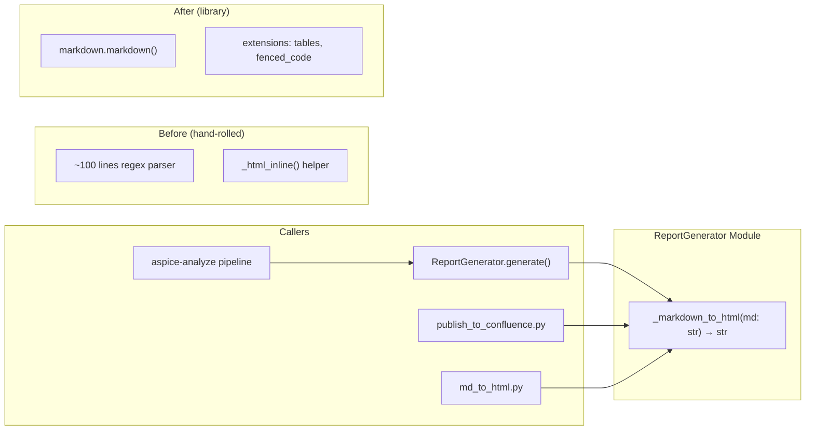

# Design Document — Markdown Library Migration

## Overview

This design describes the migration of the `_markdown_to_html` static method in `ReportGenerator` from a hand-rolled, regex-based Markdown parser (~100 lines) to the well-maintained Python [`markdown`](https://python-markdown.github.io/) library (v3.5.0+).

The current implementation handles only a narrow subset of Markdown: headings, pipe-delimited tables, unordered/ordered lists with nesting, bold text, and paragraphs. It fails on fenced code blocks, blockquotes, inline code, Mermaid diagram blocks, and other standard Markdown features. This causes breakage when `publish_to_confluence.py` is used to publish arbitrary Markdown files (e.g., Kiro spec documents containing Mermaid diagrams).

The `markdown` library is a pure-Python, zero-compiled-dependency package that supports the full CommonMark specification plus extensions. By enabling the `tables` and `fenced_code` extensions, the new implementation covers all features the hand-rolled parser handled plus all the missing features — in roughly 5 lines of code instead of 100.

### Design Decisions

| Decision | Rationale |
|---|---|
| **Use the `markdown` library (not `markdown2`, `mistune`, etc.)** | `markdown` is the most widely used pure-Python Markdown converter, actively maintained, and supports a rich extension ecosystem. It has no compiled dependencies, keeping the install lightweight. |
| **Enable `tables` and `fenced_code` extensions** | These two extensions cover the specific features the hand-rolled parser supported (tables) and the most-requested missing feature (fenced code blocks for code and Mermaid diagrams). Both are bundled with the library — no extra packages needed. |
| **Keep `_markdown_to_html` as a static method with the same signature** | Three callers depend on this method: `ReportGenerator.generate()`, `publish_to_confluence.py`, and `md_to_html.py`. Preserving the `(str) -> str` signature means zero changes to callers. |
| **Remove `_html_inline` helper entirely** | The `markdown` library handles all inline formatting (bold, italic, inline code, etc.) internally. The helper is no longer needed. |
| **Pin `markdown>=3.5.0`** | Version 3.5.0 introduced stability improvements and is the minimum version that reliably supports the `fenced_code` language class output format (`class="language-xxx"`). |

---

## Architecture

The migration is a localized replacement within a single module. No architectural changes are needed — the component boundaries, data flow, and caller interfaces remain identical.



### Change Scope

| File | Change |
|---|---|
| `aspice-eval/src/aspice_eval/report_generator.py` | Replace `_markdown_to_html` body; remove `_html_inline` function |
| `aspice-eval/pyproject.toml` | Add `markdown>=3.5.0` to `dependencies` |
| No changes needed | `publish_to_confluence.py`, `md_to_html.py`, `analyze.py` |

---

## Components and Interfaces

### Modified Component: `ReportGenerator._markdown_to_html`

**Before (hand-rolled):**

```python
@staticmethod
def _markdown_to_html(md: str) -> str:
    """~100 lines: regex-based line-by-line parser handling headers,
    tables, lists, bold, paragraphs. Calls _html_inline() for inline formatting."""
    ...
```

**After (library-based):**

```python
@staticmethod
def _markdown_to_html(md: str) -> str:
    """Convert Markdown to HTML using the markdown library.

    Configured with 'tables' and 'fenced_code' extensions to support
    pipe-delimited tables and fenced code blocks (including Mermaid diagrams).
    """
    import markdown
    return markdown.markdown(md, extensions=["tables", "fenced_code"])
```

The method signature is unchanged: `(str) -> str`. The `@staticmethod` decorator is preserved. The import is kept inside the method body to match the existing pattern in the codebase (the hand-rolled version also imports `re` inside the method).

### Removed Component: `_html_inline`

The module-level `_html_inline(text: str) -> str` function is deleted. It only handled `**bold**` → `<strong>` conversion, which the `markdown` library handles natively along with all other inline formatting (italic, inline code, links, etc.).

### Unchanged Callers

| Caller | How it calls | Impact |
|---|---|---|
| `ReportGenerator.generate()` | `self._markdown_to_html(md_report)` when `output_format="html"` | None — same method, same signature |
| `publish_to_confluence.py` | `ReportGenerator._markdown_to_html(md_content)` | None — same static method call |
| `md_to_html.py` | `ReportGenerator._markdown_to_html(md_content)` | None — same static method call |
| `analyze.py` | Calls `ReportGenerator.generate(output_format="html")` which internally calls `_markdown_to_html` | None — indirect caller |

---

## Data Models

No new data models are introduced. The migration is purely a behavioral change within an existing method. The input and output types remain `str` → `str`.

### Dependency Addition

**File:** `aspice-eval/pyproject.toml`

```toml
dependencies = [
    "pyyaml>=6.0",
    "jsonschema>=4.20.0",
    "click>=8.1.0",
    "atlassian-python-api>=3.41.0",
    "requests>=2.31.0",
    "markdown>=3.5.0",
]
```

### HTML Output Differences

The `markdown` library produces slightly different HTML than the hand-rolled parser. Key differences:

| Feature | Hand-rolled output | Library output |
|---|---|---|
| Headings | `<h1>text</h1>` | `<h1>text</h1>` (same) |
| Bold | `<strong>text</strong>` | `<strong>text</strong>` (same) |
| Tables | `<table><thead>...<tbody>...` | `<table>\n<thead>...\n<tbody>...` (same structure, minor whitespace) |
| Unordered lists | `<ul><li>text</li></ul>` | `<ul>\n<li>text</li>\n</ul>` (same structure) |
| Paragraphs | `<p>text</p>` | `<p>text</p>` (same) |
| Fenced code blocks | ❌ Not supported | `<pre><code class="language-xxx">...</code></pre>` ✅ |
| Blockquotes | ❌ Not supported | `<blockquote><p>...</p></blockquote>` ✅ |
| Inline code | ❌ Not supported | `<code>text</code>` ✅ |
| Mermaid blocks | ❌ Corrupted | `<pre><code class="language-mermaid">...</code></pre>` ✅ |
| Italic | ❌ Not supported | `<em>text</em>` ✅ |
| Links | ❌ Not supported | `<a href="...">text</a>` ✅ |

The whitespace differences in the HTML output are inconsequential — Confluence and browsers normalize whitespace during rendering.


## Correctness Properties

*A property is a characteristic or behavior that should hold true across all valid executions of a system — essentially, a formal statement about what the system should do. Properties serve as the bridge between human-readable specifications and machine-verifiable correctness guarantees.*

### Property 1: Robustness — no exceptions for any well-formed Markdown

*For any* well-formed Markdown string (including combinations of headings, paragraphs, lists, tables, code blocks, blockquotes, bold, italic, links, and plain text), calling `_markdown_to_html` SHALL return a non-empty string without raising any exception.

**Validates: Requirements 5.2, 5.3, 5.4**

### Property 2: Table conversion preserves structure

*For any* pipe-delimited Markdown table with N columns (N ≥ 1) and M data rows (M ≥ 1), the HTML output of `_markdown_to_html` SHALL contain a `<table>` element with a `<thead>` section containing `<th>` elements and a `<tbody>` section containing `<td>` elements.

**Validates: Requirements 1.2, 3.2**

### Property 3: Fenced code block conversion with language class

*For any* fenced code block with a language identifier (e.g., ` ```python `), the HTML output of `_markdown_to_html` SHALL contain a `<code` element with a `class` attribute containing the language identifier, wrapped in a `<pre>` element.

**Validates: Requirements 1.3, 2.1**

### Property 4: Heading level preservation

*For any* Markdown heading at level L (where 1 ≤ L ≤ 6) with text content T, the HTML output of `_markdown_to_html` SHALL contain an `<hL>` element whose text content includes T.

**Validates: Requirements 1.4**

### Property 5: List element conversion

*For any* Markdown unordered list with N items (N ≥ 1), the HTML output SHALL contain a `<ul>` element with `<li>` child elements. *For any* Markdown ordered list with N items (N ≥ 1), the HTML output SHALL contain an `<ol>` element with `<li>` child elements.

**Validates: Requirements 1.5, 3.3**

### Property 6: Blockquote conversion

*For any* Markdown blockquote (lines prefixed with `>`), the HTML output of `_markdown_to_html` SHALL contain a `<blockquote>` element.

**Validates: Requirements 2.3**

---

## Error Handling

The migration simplifies error handling significantly. The `markdown` library is robust and does not raise exceptions for malformed input — it degrades gracefully by treating unrecognized syntax as plain text.

### Error Scenarios

| Scenario | Behavior |
|---|---|
| Empty string input | Returns empty string (library handles gracefully) |
| Input with no Markdown syntax | Returns the text wrapped in `<p>` tags |
| Malformed Markdown (unclosed bold, broken tables) | Library produces best-effort HTML; no exceptions raised |
| Very large input | Library processes without issues; no artificial limits |
| Non-UTF-8 characters | Python string handling applies; the library works with any valid Python `str` |
| `None` input | Raises `TypeError` (same as before — caller's responsibility to pass `str`) |

### Removed Error Paths

The hand-rolled parser had implicit error paths in its regex matching and state machine (e.g., unclosed table state, mismatched list nesting). These are eliminated by delegating to the library.

---

## Testing Strategy

### Testing Approach

This migration is well-suited for property-based testing because the core change is a pure function (`str → str`) with clear input/output behavior and a large input space (all possible Markdown strings).

**Dual Testing Approach:**
- **Property tests**: Verify universal properties across randomly generated Markdown inputs (robustness, element conversion)
- **Unit tests**: Verify specific examples, edge cases, and structural requirements (Mermaid preservation, `_html_inline` removal, dependency declaration)

### Property-Based Testing

**Library:** Hypothesis (already in dev dependencies)
**Configuration:** Minimum 100 iterations per property test (ci profile)

Each property test references its design document property:

| Property | Test File | What It Tests |
|---|---|---|
| Property 1 | `test_prop27_md_robustness.py` | `_markdown_to_html` never raises for well-formed Markdown |
| Property 2 | `test_prop28_md_table_conversion.py` | Pipe-delimited tables produce `<table>` with `<thead>`/`<tbody>` |
| Property 3 | `test_prop29_md_code_block_lang.py` | Fenced code blocks with language produce `class="language-xxx"` |
| Property 4 | `test_prop30_md_heading_level.py` | Heading levels 1–6 produce corresponding `<hN>` tags |
| Property 5 | `test_prop31_md_list_conversion.py` | Ordered/unordered lists produce `<ol>`/`<ul>` with `<li>` |
| Property 6 | `test_prop32_md_blockquote.py` | Blockquotes produce `<blockquote>` elements |

Tag format: `Feature: markdown-library-migration, Property N: {property_text}`

### Unit Tests

| Test Area | What It Covers |
|---|---|
| Mermaid diagram preservation | ` ```mermaid ` blocks produce `<pre><code class="language-mermaid">` with content intact |
| Inline code conversion | Backtick-delimited text produces `<code>` elements |
| Bold text conversion | `**text**` produces `<strong>` elements |
| `_html_inline` removal | Verify `_html_inline` is not defined in the module |
| Static method signature | `_markdown_to_html` is a `@staticmethod` accepting `str`, returning `str` |
| Dependency declaration | `pyproject.toml` contains `markdown>=3.5.0` in dependencies |
| Existing dependencies preserved | All pre-existing dependencies remain in `pyproject.toml` |
| Report HTML integration | `ReportGenerator.generate(output_format="html")` produces HTML with all sections |

### Test Organization

```
aspice-eval/tests/
├── property/
│   ├── test_prop27_md_robustness.py
│   ├── test_prop28_md_table_conversion.py
│   ├── test_prop29_md_code_block_lang.py
│   ├── test_prop30_md_heading_level.py
│   ├── test_prop31_md_list_conversion.py
│   └── test_prop32_md_blockquote.py
└── unit/
    └── test_markdown_migration.py      # All unit/example/edge-case tests
```
