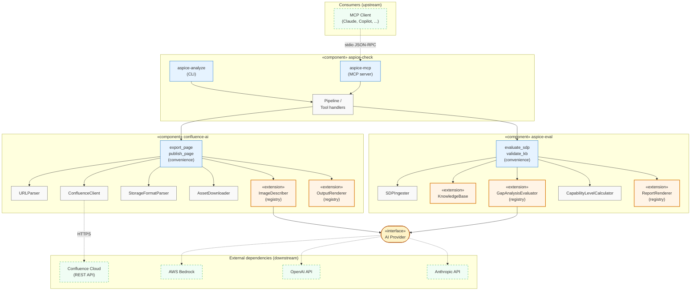

# aspice-check

An AI-powered toolkit for Automotive SPICE (ASPICE) compliance self-assessment, with a Confluence Cloud integration and an MCP (Model Context Protocol) server. Published as three independent Python packages so you can use only the parts you need.

## Repository Layout

This monorepo ships three packages with a strict dependency direction:

| Package | Role | Depends on |
|---|---|---|
| **`confluence-ai/`** | General-purpose AI-powered Confluence toolkit (export, publish, AI image/diagram transcription) | standalone |
| **`aspice-eval/`** | ASPICE evaluation engine (knowledge base, gap analysis, reports) | standalone |
| **`aspice-check/`** | Orchestrator: `aspice-analyze` pipeline CLI + `aspice-mcp` MCP server | both above |

`confluence-ai` and `aspice-eval` are independent libraries. `aspice-check` composes them.

## Architecture



**Legend:**
- Blue boxes — public API entry points
- Orange boxes (`«extension»`) — extension points users can subclass
- Grey boxes — internal components
- Yellow pill (`«interface»`) — abstract contract
- Green dashed boxes — external systems
- Solid arrows — internal function calls
- Dashed arrows — network / IPC calls

## Extension Points

| Component | Mechanism | Use case |
|---|---|---|
| `ImageDescriber` | Subclass + `register_describer()` | Custom vision AI providers (local models, Azure Vision) |
| `OutputRenderer` (confluence-ai) | Subclass + `register_renderer()` | Export as reStructuredText, AsciiDoc, JSON, etc. |
| `KnowledgeBase` | Subclass + `register_kb_loader()`, or `from_dict()` | Non-ASPICE standards (NIST CSF, CMMI, ISO 26262), DB-backed KBs |
| `GapAnalysisEvaluator` | Subclass + `register_evaluator()` | Custom LLM providers or rule-based evaluators |
| `ReportRenderer` (aspice-eval) | Subclass + `register_renderer()` | Output reports as JSON, SARIF, CSV, PDF |

## Usage Scenarios

**Export a Confluence page to Markdown** — use `confluence-ai` alone:

```python
from confluence_ai import export_page, ImageDescriberConfig

result = export_page(
    "https://acme.atlassian.net/wiki/spaces/ENG/pages/123/My-Page",
    "./output",
    email="user@example.com",
    api_token="secret",
    ai_config=ImageDescriberConfig(provider="bedrock", model="us.anthropic.claude-sonnet-4-20250514-v1:0"),
)
print(result.markdown_path)
```

**Evaluate an SDP locally against ASPICE** — use `aspice-eval` alone:

```python
from aspice_eval import evaluate_sdp, ModelConfig

result = evaluate_sdp(
    "docs/sdp.md",
    ModelConfig(provider="bedrock", model_name="us.anthropic.claude-sonnet-4-20250514-v1:0"),
    target_level=3,
    process_groups=["SWE", "SYS"],
)
```

**Full pipeline (export + evaluate + publish)** — use `aspice-check`:

```bash
aspice-analyze \
  "https://acme.atlassian.net/wiki/spaces/ENG/pages/123/SDP" \
  --target-level 3 \
  --groups SWE,SYS
```

**AI agent integration** — run the MCP server:

```bash
aspice-mcp
```

The server exposes `evaluate_sdp`, `validate_kb`, `list_standards`, `export_page`, and `describe_image` as MCP tools.

## Quick Start

```bash
# Install everything from GitHub
pip install "confluence-ai[bedrock] @ git+https://github.com/oddisej/aspice-check.git#subdirectory=confluence-ai"
pip install "aspice-eval[bedrock] @ git+https://github.com/oddisej/aspice-check.git#subdirectory=aspice-eval"
pip install "aspice-check @ git+https://github.com/oddisej/aspice-check.git#subdirectory=aspice-check"

# Credentials
export CONFLUENCE_EMAIL="your.email@company.com"
export CONFLUENCE_API_TOKEN="your-token"
export AWS_DEFAULT_REGION="eu-west-1"

# Run the full pipeline
aspice-analyze \
  "https://your-instance.atlassian.net/wiki/spaces/SPACE/pages/12345/Your+SDP+Page" \
  --target-level 1 \
  --groups SWE
```

## AI Provider Support

All AI-powered features go through a pluggable provider interface. Built-in providers:

- **Amazon Bedrock** (default) — Claude Sonnet via AWS credential chain
- **OpenAI** — GPT-4o via API key
- **Anthropic** — Claude via API key

Register your own provider by subclassing the relevant ABC and calling `register_describer()` or `register_evaluator()`.

## MCP Server Setup

The `aspice-mcp` server exposes 6 tools to any MCP-compatible AI assistant:

| Tool | Description |
|------|-------------|
| `export_page` | Export a Confluence page to Markdown with AI image descriptions |
| `evaluate_sdp` | Run ASPICE gap analysis and generate a report (saves locally) |
| `publish_page` | Publish a local file or HTML to Confluence |
| `validate_kb` | Validate a knowledge base for schema/completeness |
| `list_standards` | List available KB standards |
| `describe_image` | Generate an AI description of an image |

### Install

```bash
pip install -e ./confluence-ai
pip install -e ./aspice-eval
pip install -e ./aspice-check
```

### Configure your MCP client

Add to your client's MCP config (paths vary by client):

**Kiro** (`.kiro/settings/mcp.json`):
```json
{
  "mcpServers": {
    "aspice": {
      "command": "/path/to/venv/bin/aspice-mcp",
      "args": [],
      "env": {
        "CONFLUENCE_EMAIL": "user@company.com",
        "CONFLUENCE_API_TOKEN": "your-token",
        "AWS_DEFAULT_REGION": "us-west-2"
      }
    }
  }
}
```

**Claude Desktop** (`claude_desktop_config.json`):
```json
{
  "mcpServers": {
    "aspice": {
      "command": "/path/to/venv/bin/aspice-mcp",
      "args": []
    }
  }
}
```

Find the path with `which aspice-mcp` after installing.

### Typical workflow

1. **Export** a Confluence page → get local Markdown with AI-described diagrams
2. **Evaluate** the exported page → get a gap analysis report saved locally
3. **Review** the report file
4. **Publish** the report back to Confluence as a child page

## Key Capabilities

- **ASPICE v4.0 knowledge base** with criteria for SWE, SYS, MAN, SUP process groups across capability levels 0–5
- **Deterministic knowledge base** — ASPICE criteria are structured YAML, not AI-generated
- **Visual content understanding** — Gliffy process flow diagrams are transcribed to text so AI evaluators can reason about them
- **Structured reports** — executive summary, per-criteria ratings (ASPICE 4-point scale), evidence citations, gap identification, remediation roadmap, traceability matrix
- **Bidirectional Confluence integration** — reads SDP, publishes gap analysis back as a child page
- **MCP server** — expose all capabilities to AI agents (Claude Desktop, Copilot, etc.)
- **Custom standards** — use the evaluation engine with non-ASPICE compliance frameworks via `KnowledgeBase.from_dict()` or custom loaders

## Documentation

- [confluence-ai README](confluence-ai/README.md) — Confluence toolkit library and CLI
- [aspice-eval README](aspice-eval/README.md) — ASPICE evaluation engine library and CLI
- [aspice-check README](aspice-check/README.md) — Orchestrator pipeline and MCP server

## Specs

Feature specifications live in `.kiro/specs/`:
- [library-api-surface](.kiro/specs/library-api-surface/) — Three-package architecture and public API design

## License

MIT — see [LICENSE](LICENSE).
